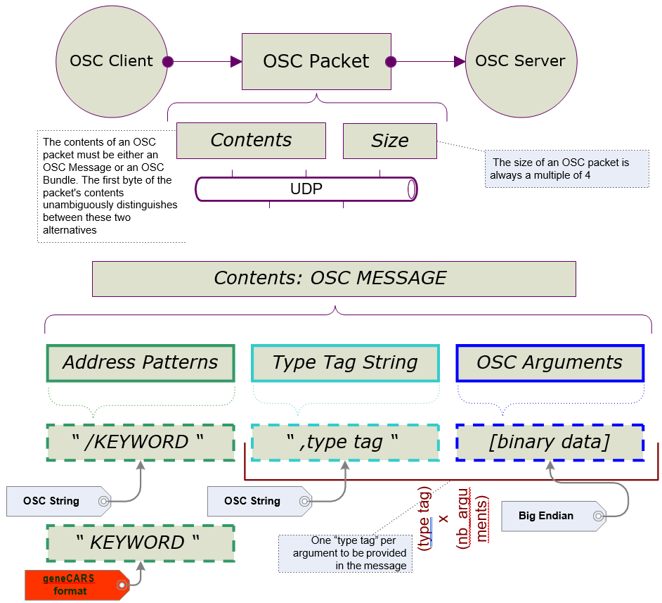

# OSC Protocol

## OSC standard

Open Sound Control \(OSC\) is a protocol for communication among computers, sound synthesizers, and other multimedia devices that is optimized for modern networking technology and has been used in [many application areas](https://cnmat.org/OpenSoundControl/).

OSC was defined and is supported by CNMAT of Berkeley University \([http://cnmat.berkeley.edu/](http://cnmat.berkeley.edu/)\)

From the CNMAT OSC documentation:

> The unit of transmission of OSC is an OSC Packet. Any application that sends OSC Packets is an OSC Client; any application that receives OSC Packets is an OSC Server.

## OSC for Car Sound Simulator

The application connected to the simulation manager \(simulation data provider\) is an OSC client. Car Sound Simulator, receiver of the simulation data is an OSC server.

OSC packets are sent through Ethernet network using UDP protocol.

An OSC packet consists of its contents, a contiguous block of binary data, and its size, the number of 8-bit bytes that comprise the contents. The size of an OSC packet is always a multiple of 4.

The contents of an OSC packet must be either an OSC Message or an OSC Bundle. The first byte of the packet's contents unambiguously distinguishes between these two alternatives.

**Note:** Car Sound Simulator communication uses only the "OSC MESSAGE".

*"OSC STRING" is a sequence of non-null ASCII characters followed by a null, followed by 0-3 additional null characters to make the total number of bits a multiple of 32.*

Example\_1: the string "OSC" is coded as follows:

```
     [O]+[S]+[C]+[\0]
```

Example\_2: the string "DATA" is coded as follows:

```
     [D]+[A]+[T]+[A]+[\0]+[\0]+[\0]+[\0]
```

Example\_3: the string "SPEED" is coded:

```
     [S]+[P]+[E]+[E]+[D]+[\0]+[\0]+[\0]
```

An "OSC MESSAGE" contains:

```
{ADDRESS_PATTERN}{TYPE_TAG_STRING}[binary data]
```

1.  A block "ADDRESS PATTERN": \{\['/'\]KEYWORD\}

    it is an OSC STRING that starts with the character slash \("/"\). Following the slash character, use a KEYWORD explaining the type of audio processing applied on the data passed in argument...

    Warning: for Car Sound Simulator, the slash \("/"\) character must NOT appear!

2.  A block "TYPE\_TAG\_STRING" : \{','\[TYPE\_TAG\]\}

    it is an OSC STRING beginning with a comma \(","\) and followed by as many "type tags" as the count of following data.

    A TYPE TAG is a set of letter coding the binary data type following.

    These types used by Car Sound Simulator are: \{‘i','f','s'\}

    ***i***
    :   integer 32 bits

    ***f***
    :   for single precision floating point values \(32 bits\)

    ***s***
    :   OSC String




## References

OpenSound Control Specification \(cnmat.org\) : [http://cnmat.org/OpenSoundControl/OSC-spec.html](http://cnmat.org/OpenSoundControl/OSC-spec.html)
