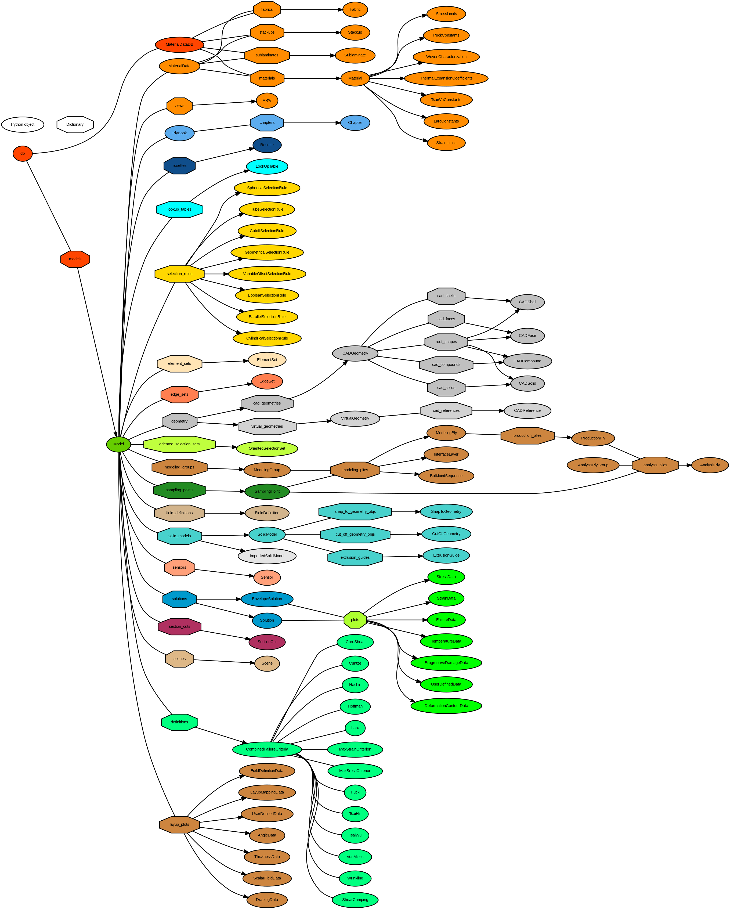
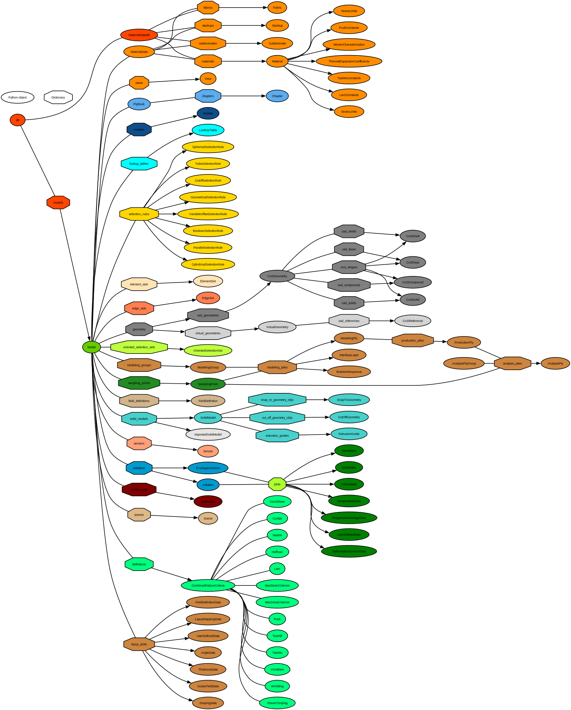

# The Python object tree

The ACP scripting interface is organized as a static python object tree.
This tree contains all loaded models, solutions, definitions, views and scenes.
Access to the actually loaded object tree is always provided through the root object [`compolyx.DB`](db_database.md#compolyx.DB) in the embedded Python shell.

For better legibility of the image below, right-click and open it in a new tab.

svg image

svg image

