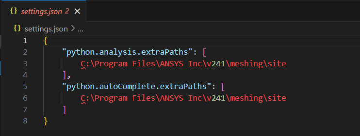

# Getting started

Ansys Prime Mesh Python client library 2024 R1 SP1 is a modified version of the PyPrimeMesh. You can access Ansys Prime Mesh Python client library 2024 R1 SP1 from Ansys 2024 R1 SP1 package.
For more information on getting a licensed copy of Ansys, visit the [Ansys website](https://www.ansys.com/).


## Installation

Ansys Prime Mesh Python client library 2024 R1 SP1 can be installed as follows:


### Run a Python script in batch

You can run a Python script directly on the server from a Linux or Windows console.
 
Here is a Windows code example for running a Python script directly from the command line:
 
```shell-session
"%AWP_ROOT241%\meshing\Prime\runPrime.bat" my_script.py
```

###  Run a python script in batch on SLURM Server

You can run the python script using SLURM server as follows:

```shell-session
import ansys.meshing.prime as prime
client = prime.launch_prime(scheduler='slurm', n_procs = 4)
model = client.model

```

You can run Ansys PrimeMesh client library on SLURM directly from the command line as follows:

```shell-session
"%AWP_ROOT241%\meshing\Prime\runPrime.bat" my_slurm_script.py
```


### Accessing Ansys Prime Mesh Client Library through Visual Studio Code (VS Code)

You can access Ansys Prime Mesh client through VS code and work on it as follows:


1. Install the latest 2024R1 SP1 package from the Artifactory.

2. Close all instances of VS Code. 

3. Create a new folder in your machine for your work. 

4. Open VS Code. 

5. Click File > Open Folder and select the newly created folder from the location. 

6. Install Microsoft Python Extension in VS Code if you have not installed it. 

7. In the VS Code, click the Search bar and select Show and Run Commands > Python: Select 
   Interpreter. 

8. For Windows users, Click Enter Interpreter Path and click Find to select runPrime.bat as 
   interpreter from the 2024R1 SP1 package installed location. 

    

   Example: C:\Program Files\ANSYS Inc\v241\meshing\Prime\runPrime.bat 

   For Linux users, press Ctrl + Shift + P to view the search bar and select Python: Select 
   Interpreter.

    Example: C:\Program Files\ANSYS Inc\v241\meshing\Prime\runPrime.sh

9. In VS Code, Create a new folder with name .vscode. 
 
10. Create a settings.json file with the following content: 

    

    You should use your local installation path. 

    **Note:** Environment variables do not work in the above file. Hence, provide full paths. 

11. Run a simple test file to ensure that the installed build works. 
