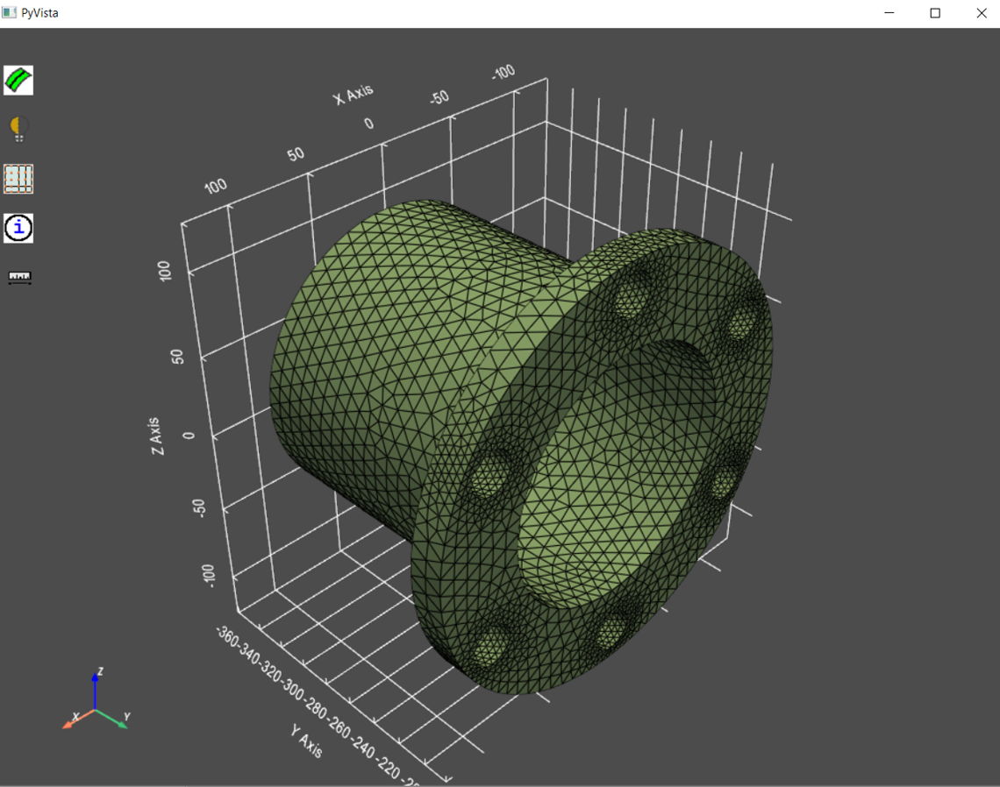

# Interactive graphics using PyVista

PyPrimeMesh provides support for interactive graphical visualisation using [PyVista](https://docs.pyvista.org/) if this package is installed as a dependency.

This code shows how to display the model using the `Graphics` class:

```pycon
>>> from ansys.meshing.prime.graphics import Graphics
>>> import ansys.meshing.prime as prime
>>> display = Graphics(model)
>>> display()
```


**Entire model displayed**

Using the [`ScopeDefinition`](../api/_autosummary/ansys.meshing.prime.ScopeDefinition.md#ansys.meshing.prime.ScopeDefinition) class allows you to limit the display to particular regions of the model:

```pycon
>>> # display the first part only
>>> display(scope=prime.ScopeDefinition(model, part_expression=model.parts[0].name))
```



**Single part displayed**

Selections can be made of displayed objects. If selections in the window are made,
information about them can be printed to the console. Selections can also be hidden.

These graphics buttons are provided to help navigate the model and to
carry out basic verifications:

.png)

**Graphics buttons**