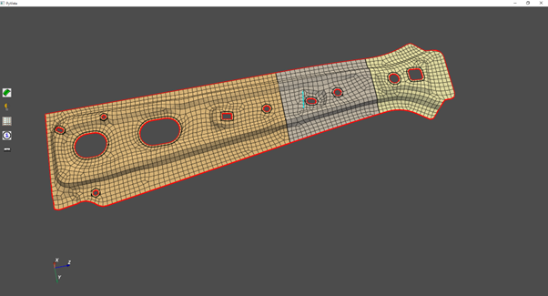

# Isogeometric analysis

> *This is a Beta feature. API Behavior and Implementation may change in future.*

Isogeometric Analysis (IGA) is a new approach using NURBS to capture the CAD geometry accurately than the FE analysis.
The FE analysis discretize the CAD geometry approximately into smaller elements to capture the features.
This approximation may affect the accuracy of the result and increase the computational cost.
IGA uses spline to exactly represent the  CAD geometry to analyse the geometry and solver solves on the splines.

In PyPrimeMesh, IGA-Quad to Spline allows you to extract control points and splines based on the input quadrilateral surface mesh and export it as LS-DYNA IGA K file for the IGA solver.

The prerequisites required for preparing Input CAD Model for Quad to Spline conversion:

* Clean up the input geometry in PyPrimeMesh.
* Generates full quad mesh on the input geometry.
* Perform mesh edit operations to reduce the triangles.

IGA Quad to Spline performs the following:

1. Execute quad to spline operation using any of the following options:

> - When you provide Ignore Features, ignores all the features while converting the input geometry to spline.
> - When you provide Use Angle, captures the provided angle while creating the spline for the input geometry.
> - When you provide Use Edges, uses the provided edges while creating spline for the input geometry.
1. Checks if any Negative Jacobian values are present while creating splines.
2. Export Splines as LS-DYNA IGA K file if no Negative Jacobian values are present in the input geometry.
3. Provides the file to the LS-DYNA IGA solver.

The below example shows IGA Quad to spline conversion:

1. Import the geometry.

```python
file_io = prime.FileIO(model)
res = file_io.read_pmdat(r"pillar.pmdat", prime.FileReadParams(model=model))
g = Graphics(model)
g()
```


2. Check whether the model is a topology or mesh part.

```python
cad_mesh_part = model.parts
for part in cad_mesh_part:
    if part.get_topo_faces():
        geom_part_name = part.name
        print(geom_part_name)
        summary_res = part.get_summary(
            prime.PartSummaryParams(
                model=model,
                print_id=False,
                print_mesh=True,
            )
        )
        print("Geometry Part")
    else:
        mesh_part_name = part.name
        print(mesh_part_name)
        summary_res = part.get_summary(
            prime.PartSummaryParams(
                model=model,
                print_id=False,
                print_mesh=True,
            )
        )
        print("Mesh Part")
```

**Output:**

```pycon
Geometry Part
```

3. Define the input scope for the geometry or mesh part.

```python
input_scope = prime.ScopeDefinition(model, part_expression=mesh_part.name)
geom_topofaces = geom_part.get_topo_faces()
geom_topoedges = geom_part.get_topo_edges()
```

4. Initialize QuadToSpline and provide the required parameters in QuadToSplineParams to perform the quad to spline conversion.

```python
zone_name_1 = "zone1_thk_0.8"
zone_name_2 = "zone2_thk_1.0"
zone_name_3 = "zone3_thk_1.2"
shell_thickness_zone_1 = 0.8
shell_thickness_zone_2 = 1.0
shell_thickness_zone_3 = 1.2
QuadToSpline = prime.QuadToSpline(model)
quad_to_spline_params = prime.QuadToSplineParams(model)
quad_to_spline_params.feature_capture_type = prime.SplineFeatureCaptureType.BYANGLE
quad_to_spline_params.corner_angle = 40
quad_to_spline_params.project_on_geometry = False
quad_to_spline_params.separate_by_zone = True
quad_to_spline_params.zone_name_shell_thickness_pairs = {
    zone_name_1: shell_thickness_zone_1,
    zone_name_2: shell_thickness_zone_2,
    zone_name_3: shell_thickness_zone_3,
}
unstructured_spline_fitting = QuadToSpline.convert_quad_to_spline(
    input_scope, quad_to_spline_params
)
print("Quad to Spline fitting status: ", unstructured_spline_fitting)
```

**Output:**

```pycon
This API convert_quad_to_spline is a Beta. API Behavior and implementation may change in future.
Quad to Spline fitting status:  error_code :  ErrorCode.NOERROR
warning_code :  WarningCode.NOWARNING
spline_ids :  []
```

5. Get the unstructured spline created.

```python
spline1 = unstructured_spline_fitting.spline_ids
unstructured_spline_surface = mesh_part.get_unstructured_spline_surface()
print(unstructured_spline_surface)
```

**Output:**

```pycon
This API get_unstructured_spline_surface is a Beta. API Behavior and implementation may change in future.
id :  2
spline_refinement_level :  5
control_points :  [-60.7216    -0.598581 428.905    ... -47.2185    87.6738    23.852   ]
spline_points :  [-60.6697    -0.566523 428.971    ... -47.0478     9.97661   58.3805  ]
bad_spline_points_indices :  []
deviation_array :  [0.00214125 0.0150002  0.017894   ... 0.00113307 0.0106386  0.0104887 ]
invalid_jacobian_elements_count :  0
average_mesh_size :  4.21427
elements_count :  2194
shell_thickness :  0.0001
```

6. Check the quality of the created spline.

```python
negative_jacobian = unstructured_spline_surface.invalid_jacobian_elements_count
deviation_array = unstructured_spline_surface.deviation_array
max_abs_deviation = max(deviation_array)
control_points_count = len(unstructured_spline_surface.control_points) / 3
spline_points_count = len(unstructured_spline_surface.spline_points) / 3
print("Invalid/Negative Jacobian count: ", negative_jacobian)
print("Control points count: ", control_points_count)
print("Spline points count: ", spline_points_count)
print("Max Deviation: ", max_abs_deviation)
```

**Output:**

```pycon
Invalid/Negative Jacobian count:  0
Control points count:  5585.0
Spline points count:  78984.0
Max Deviation:  1.27418
```

7. Write the created .k file to the specified location and export to LS-DYNA.

```python
lsdyna_iga_export_result = prime.FileIO(model).export_lsdyna_iga_keyword_file(
    r"E:\Test\newspline.k", prime.ExportLSDynaIgaKeywordFileParams(model)
)
```
