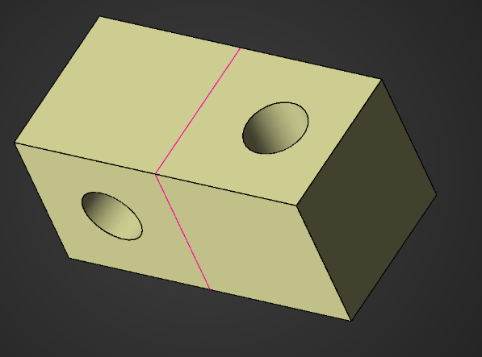
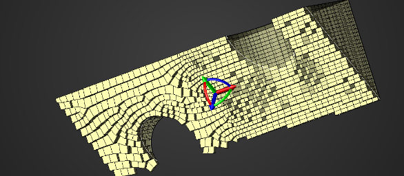
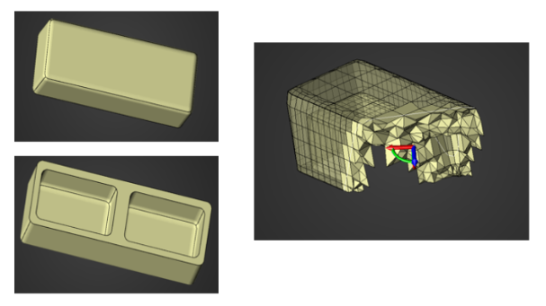

# MultiZone controls

*This is a Beta feature. API Behavior and Implementation  may change in future.*

[`MultiZoneControl`](../api/_autosummary/ansys.meshing.prime.MultiZoneControl.md#ansys.meshing.prime.MultiZoneControl) class provides automatic decomposition of geometry into mapped (sweepable) regions and free regions.
Mapped (sweepable) regions are filled with hexahedral elements and free regions are filled with non-hexahedral elements.
When you perform MultiZone Method meshing, all regions are meshed with a pure hexahedral mesh if possible.

`AutoMesh` class enables you to automatically create the hex mesh on the scoped bodies using multizone meshing algorithms.
[`AutoMesh.mesh()`](../api/_autosummary/ansys.meshing.prime.AutoMesh.mesh.md#ansys.meshing.prime.AutoMesh.mesh) method allows you to perform MultiZone meshing with given MultiZone control.

The below example shows how MultiZone control can be applied on a body:

1. Read the model.

```python
file_io = prime.FileIO(model)
res = file_io.read_pmdat(
    r"E:\Test\2Boxes_2Holes.pmdat", prime.FileReadParams(model=model)
)
print(model)
```

**Output:**

```pycon
Part Summary:

Part Name: zone2boxes_2holes
Part ID: 2
 24 Topo Edges
 13 Topo Faces
 2 Topo Volumes

 0 Edge Zones
     Edge Zone Name(s) : []
 0 Face Zones
     Face Zone Name(s) : []
 2 Volume Zones
     Volume Zone Name(s) : [solid1, solid]

 2 Label(s)
     Names: [solid, solid1]

 Bounding box (-10 -10 0)
              (30 10 20)

 error_code :  ErrorCode.NOERROR
```


2. Initialize the MultiZone control. MultiZone control sets the parameters and controls used for MultiZone meshing.

```python
multizone_control = model.control_data.create_multi_zone_control()
```

3. Define the volume scope and surface scope for the model to apply MultiZone control on the same.

```python
MZVolParams = prime.ScopeDefinition(
    model=model,
    entity_type=prime.ScopeEntity.VOLUME,
    evaluation_type=prime.ScopeEvaluationType.ZONES,
    part_expression="*",
    label_expression="*",
    zone_expression="solid1",
)

multizone_control.set_volume_scope(MZVolParams)

MZSurfParams = prime.ScopeDefinition(
    model=model,
    entity_type=prime.ScopeEntity.FACEZONELETS,
    evaluation_type=prime.ScopeEvaluationType.ZONES,
    part_expression="*",
    label_expression="*",
    zone_expression="*",
)

multizone_control.set_surface_scope(MZSurfParams)
```

4. Sets the MultiZone sizing parameters to initialize MultiZone sizing control parameters.

#### NOTE
When you provide the sizefield, MultiZone consumes sizefield and impacts the MultiZone mesh.

```python
MZParams = prime.MultiZoneSizingParams(model)
MZParams.max_size = params.max
MZParams.min_size = params.min
MZParams.growth_rate = params.growth_rate
multizone_control.set_multi_zone_sizing_params(MZParams)
print(MZParams)
parts = model.parts
autoMesher = prime.AutoMesh(model)
autoMeshParams = prime.AutoMeshParams(model)
autoMeshParams.multi_zone_control_ids = [multizone_control.id]

for p in parts:
    result = autoMesher.mesh(p.id, autoMeshParams)
    print(result)
```

**Output:**

```pycon
# This API set_multi_zone_sizing_params is a Beta. API Behavior and implementation may change in future.
max_size :  1
min_size :  0.039063
growth_rate :  1.2
use_volumetric_size_field :  False
error_code :  ErrorCode.NOERROR
warning_codes :  []
error_locations :  []
```




Some points to remember while performing MultiZone Meshing:

* MultiZone Meshing supports only topology.
* If the MultiZone meshing scopes only a few bodies of a multibody part, the remaining bodies of the part are auto meshed conformally.
* After creating the MultiZone control, you should specify its id in the automesh params for it to be considered for MultiZone meshing.
* When you use the MultiZone mesh method in combination with other mesh methods in a multibody part, the bodies are meshed with conformally. For example, in the model below, the multibody part meshes with the MultiZone Method and AutoMesh.


* Sometimes MultiZone is not automatically able to decompose a geometry into sweepable regions, though such decomposition may be possible. For example, in the model below the MultiZone mesh produces free mesh.



* When you scope the source and target faces to MultiZone, MultiZone automates the geometry decomposition and generates the pure hex mesh into sweepable regions to produce a purely hex mesh. In the below images, if the faces highlighted in green color are scoped as source and target faces, MultiZone produces a purely hex mesh on the source and target faces.
