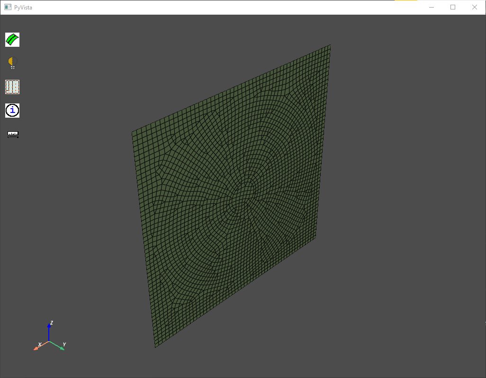
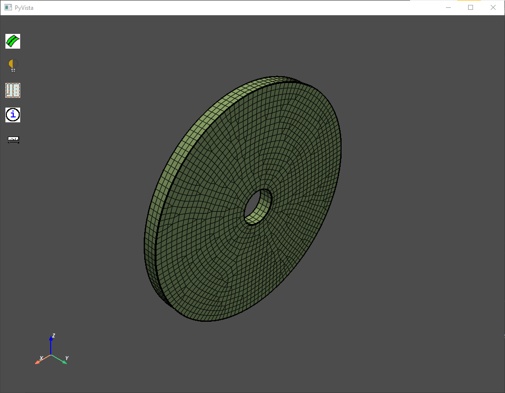

# Volume sweeping

The [`VolumeSweeper`](../api/_autosummary/ansys.meshing.prime.VolumeSweeper.md#ansys.meshing.prime.VolumeSweeper) class creates a volume mesh on 2.5D models, stacking faces
or edge zonelets one above the other in layers. This volume sweeping technology stacks each of the input topovolumes individually.

#### NOTE
A 2.5D or stackable geometry is any closed volume or set of closed volumes that can be obtained by successive extrusion of a series of 2D geometries, along the area normal of the 2D geometries.

A geometry is stackable only when there is a direction called stacking direction, to which all surfaces are either perpendicular or parallel.

#### WARNING
The hex-dominant mesh created by volume sweeper can only be applied to 2.5D models. Only conformal mesh within a part is supported.

Volume sweeping workflow involves the following:

> - Create imprints of model edges on the base face.
> - Surface mesh the imprinted base face.
> - Extrude the base face mesh at the selected origin by stacking the face layer by layer along the specified direction to generate a volume mesh.


**Example of Volume Sweeping Workflow**

## Hex-dominant meshing for 2.5D geometry

The following example shows how to mesh a thin disc using volume sweeper:

```python
# Set the global sizing parameters after importing the model
model.set_global_sizing_params(
    prime.GlobalSizingParams(model=model, min=0.15, max=0.5, growth_rate=1.2)
)
model.delete_volumetric_size_fields(model.get_active_volumetric_size_fields())
part = model.parts[0]
```

Define stacking parameters:

* Set origin and direction vector for stacking orientation
* Option to set defeaturing tolerance for edge imprints
* Option to set maximum stack size allowed for stacking
* Option to delete base face after stacking

#### NOTE
Default global max size is used for stacking parameters if you are not providing the max size.

Default [`lateral_defeature_tolerance`](../api/_autosummary/ansys.meshing.prime.MeshStackerParams.lateral_defeature_tolerance.md#ansys.meshing.prime.MeshStackerParams.lateral_defeature_tolerance) and [`stacking_defeature_tolerance`](../api/_autosummary/ansys.meshing.prime.MeshStackerParams.stacking_defeature_tolerance.md#ansys.meshing.prime.MeshStackerParams.stacking_defeature_tolerance) are set to (global min size/4).

```python
sweeper = prime.VolumeSweeper(model)
stacker_params = prime.MeshStackerParams(
    model=model, direction=[0.0, 1.0, 0.0], max_offset_size=0.5, delete_base=True
)
```

Print the results of stacking parameters so that you can review them:

```pycon
>>> print(stacker_params)

origin :  [0. 0. 0.]
direction :  [0. 1. 0.]
lateral_defeature_tolerance :  0.0375
stacking_defeature_tolerance :  0.0375
max_offset_size :  0.5
size_control_ids :  []
delete_base :  True
```

Create base face:

```python
createbase_results = sweeper.create_base_face(
    part_id=part.id, topo_volume_ids=part.get_topo_volumes(), params=stacker_params
)

base_faces = createbase_results.base_face_ids
```

#### WARNING
The topovolume cannot have meshed topofaces.

Compute volumetric size field and perform surface meshing on the base face:

```python
size_field = prime.SizeField(model)
res = size_field.compute_volumetric(
    size_control_ids=createbase_results.size_control_ids,
    volumetric_sizefield_params=prime.VolumetricSizeFieldComputeParams(model),
)
surfer_params = prime.SurferParams(
    model=model, size_field_type=prime.SizeFieldType.VOLUMETRIC, generate_quads=True
)
meshbase_result = prime.Surfer(model).mesh_topo_faces(
    part_id=part.id, topo_faces=base_faces, params=surfer_params
)
```



**Base face meshed**

Stack the base face:

```python
stackbase_results = sweeper.stack_base_face(
    part_id=part.id,
    base_face_ids=base_faces,
    topo_volume_ids=part.get_topo_volumes(),
    params=stacker_params,
)
```



**Stack base meshed**
