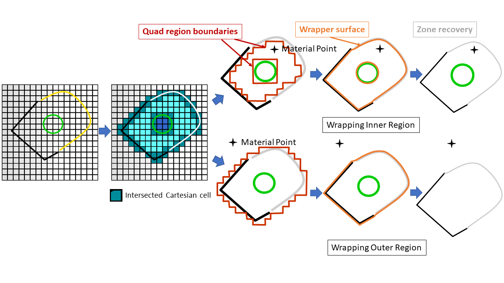

# Surface wrapping

Geometries migrated from various CAD packages often contain gaps and overlaps between the surfaces due to algorithm and tolerance differences of the CAD packages.
Surface wrapping provides the ability to create reliable meshes for such geometries without extensive manual clean up and reduces the time required for preprocessing.

The [`Wrapper`](../api/_autosummary/ansys.meshing.prime.Wrapper.md#ansys.meshing.prime.Wrapper) class allows you to extract a closed watertight surface used to create a volume mesh from geometry where the inputs:

- Are not connected with overlaps
- Have holes, leaks, or gaps
- Have small features that need to be ignored or walked over

The wrapping operation uses an appropriate material point to identify the relevant surfaces of the selected objects. A coarse Cartesian grid is overlaid on the selected objects
to create a contiguous region. This Cartesian grid is used to automatically clean the input geometry and to create the watertight representation. The Cartesian grid is then refined
based on the size functions to better represent the selected objects. The intersection between the Cartesian grid and the input geometry is calculated and the intersecting cells are
identified and marked.

A watertight faceted representation (defined by quad faces of the Cartesian mesh) is created of the boundaries between the regions of interest (identified
via material points) and all other regions. The nodes on the faceted representation are then projected back to the input geometry, resulting into a wrapper surface closely
representing the input geometry. The edges are imprinted on the wrapped zones, and individual zones are recovered and rezoned based on the original geometry objects.

The wrapper surface quality is improved by post-wrapping operations. Surfaces are remeshed based on size functions/size field.



The basic PyPrimeMesh wrapper-based workflow follows these steps:

1. Import the geometry.

```python
model = prime_client.model
input_file = r"D:/PyPrimeMesh/cylinder_with_flange.pmdat"
file_io = prime.FileIO(model)
file_io.read_pmdat(input_file, prime.FileReadParams(model=model))
```

2. Define global sizing parameters and size controls with curvature refinement. Sizes are used for wrapper Octree construction.

```python
model.set_global_sizing_params(
    prime.GlobalSizingParams(model=model, min=0.2, max=3.0, growth_rate=1.2)
)

size_control = model.control_data.create_size_control(
    sizing_type=prime.SizingType.CURVATURE
)
size_control.set_curvature_sizing_params(
    prime.CurvatureSizingParams(model=model, min=0.2, max=1.0, normal_angle=18.0)
)
size_control.set_suggested_name("curv_global")
size_control.set_scope(prime.ScopeDefinition(model=model, part_expression="*"))
```

3. Define the material points. Material points are used to define fluid regions or seal regions
   depending on whether the status is `LIVE` or `DEAD`. A 3D coordinate describes the
   position of the material point.

```python
model.material_point_data.create_material_point(
    suggested_name="Mpt",
    coords=[20.0, -76.0, -6.0],
    params=prime.CreateMaterialPointParams(
        model=model, type=prime.MaterialPointType.LIVE
    ),
)
```

4. Create the wrapper control. The scope refers to which entities should be wrapped.

```python
wrapper_control = model.control_data.create_wrapper_control()
wrapper_control.set_suggested_name("cyl_flange_control")
wrapper_control.set_suggested_wrapper_part_name("Wrap_cyl_flange")
wrapper_control.set_geometry_scope(
    prime.ScopeDefinition(
        model=model,
        part_expression="flange,pipe",
        entity_type=prime.ScopeEntity.FACEANDEDGEZONELETS,
    )
)
wrapper_control.set_live_material_points(["Mpt"])
```

5. Extract features with angle and face zonelets boundary for feature capture.

```python
features = prime.FeatureExtraction(model)
feature_scope = prime.ScopeDefinition(model=model, part_expression="*")
face_zonelets_prime_array = model.control_data.get_part_zonelets(scope=feature_scope)
for item in face_zonelets_prime_array:
    features.extract_features_on_face_zonelets(
        part_id=item.part_id,
        face_zonelets=item.face_zonelets,
        params=prime.ExtractFeatureParams(
            model=model,
            feature_angle=40.0,
            label_name="extracted_features",
            replace=True,
        ),
    )
```

6. Add feature recovery control.

```python
feature_params = prime.FeatureRecoveryParams(
    model=model,
    scope=prime.ScopeDefinition(
        model=model, part_expression="*", label_expression="extracted_features"
    ),
)
wrapper_control.set_feature_recoveries([feature_params])
```

7. Wrap the model.

```python
wrapper = prime.Wrapper(model=model)
wrap_params = prime.WrapParams(model, size_control_ids=[size_control.id])
res = wrapper.wrap(wrapper_control_id=wrapper_control.id, params=wrap_params)
wrapper_part = model.get_part(res.id)
```

8. Apply diagnostics to compute free edges, multi edges, self-intersections,
   and duplicate faces after wrap. For more information, see [Mesh diagnostics](mesh_diagnostics.md#ref-index-mesh-diagnostics).
9. Remesh the model. For more information, see [Surface meshing](surfer.md#ref-index-surfer).

#### NOTE
You can import Fluent Meshing’s size field file for remesh. For more information, see [Reading and writing files](fileio.md#ref-index-reading-writing).

```python
size_control2 = model.control_data.create_size_control(
    sizing_type=prime.SizingType.HARD
)
size_control2.set_hard_sizing_params(prime.HardSizingParams(model=model, min=0.8))
size_control2.set_scope(
    prime.ScopeDefinition(
        model=model,
        part_expression="*",
        entity_type=prime.ScopeEntity.FACEANDEDGEZONELETS,
    )
)

SF1 = prime.SizeField(model)
SF1.compute_volumetric(
    [size_control2.id],
    prime.VolumetricSizeFieldComputeParams(model=model, enable_multi_threading=False),
)

fz1 = wrapper_part.get_face_zonelets()
ez1 = wrapper_part.get_edge_zonelets_of_label_name_pattern(
    label_name_pattern="___wrapper_feature_path___",
    name_pattern_params=prime.NamePatternParams(model=model),
)
rem1 = prime.Surfer(model)
surfer_params = rem1.initialize_surfer_params_for_wrapper()
surfer_params.size_field_type = prime.SizeFieldType.VOLUMETRIC

rem1.remesh_face_zonelets(
    wrapper_part.id, face_zonelets=fz1, edge_zonelets=ez1, params=surfer_params
)
```

10. Improve surface quality and resolve connectivity issues.

```python
wrapper.improve_quality(
    part_id=wrapper_part.id,
    params=prime.WrapperImproveQualityParams(model=model, target_skewness=0.9),
)
```
