# Colors

## Color palettes and their usage

Details for all color palettes (including Hex and RGB info) are included in a separate Excel file ([Ansys Design Language Color Palettes]([href="https://github.com/ansys/DevRelPublic/raw/main/Downloads/Discovery/2024R2/Ansys%20Design%20Language%20Color%20Palettes%20-%20Discovery.xlsx])). Guidelines for using the palettes are as follows:

| **Application**                                                                                    | **Palette usage**                                                                                                                                                                                                                                                                                                                                                                                                                                                      |
|----------------------------------------------------------------------------------------------------|------------------------------------------------------------------------------------------------------------------------------------------------------------------------------------------------------------------------------------------------------------------------------------------------------------------------------------------------------------------------------------------------------------------------------------------------------------------------|
| UI elements such as buttons panel backgrounds indicators of status and state  NOT icons or cursors | Main UI Control Colors per Theme All UI Control Colors  The “Main UI Control Colors per Theme” palette includes the main colors that are used in each theme and how they are used (see also Figures 1-4 below).  If you need more colors, choose from the “All UI Control Colors” palette. For guidance on colors with specific meanings, see the semantic colors in Figure 5 below.                                                                                   |
| Icons and cursors                                                                                  | Theme-Dependent Icon Colors Additional Colors  Use the “Theme-Dependent Icon Colors” palette for icon colors that should change with the theme, as described in [Theme-Dependent Coloring](#theme-dependent-coloring) If you need more colors, choose them from the “Additional Colors” palette.                                                                                                                                                                       |
| Predefined colors the user can assign                                                              | User-Assignable Colors Additional Colors  Use the “User-Assignable Colors” palette as the predefined colors in the color picker that appears in a product when a user has the option to choose a color explicitly (e.g., for a chart line). See [Assignable Colors](#_Assignable_Colors) for details.  There is a vivid palette and a muted palette.  If you need to include more colors for the user to choose from, use colors from the “Additional Colors” palette. |
| Colormaps and legends for data visualization                                                       | 3D Data Visualization Colors Default: Turbo,  Alternate: Cool-warm                                                                                                                                                                                                                                                                                                                                                                                                   |

Figure 1: Main Colors Used in the Dark Theme

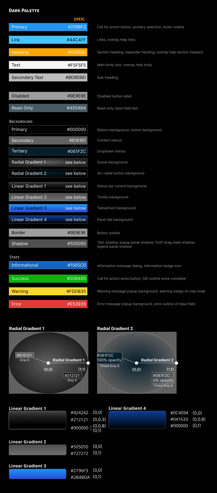

Figure 2: Main Color Gradients Used in the Dark Theme

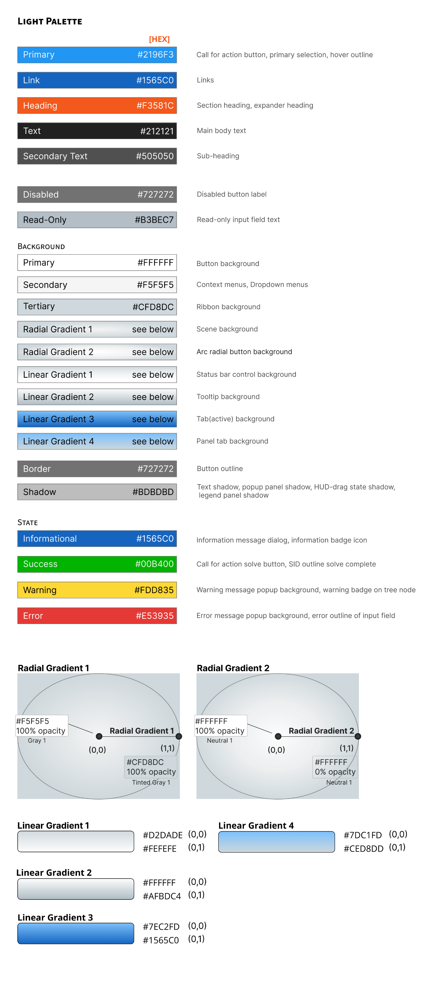

Figure 3: Main Colors Used in the Light Theme

Figure 4: Main Color Gradients Used in the Light Theme

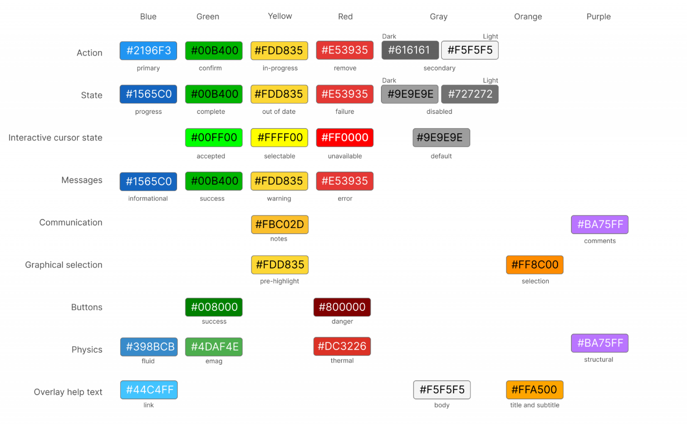

Figure 5: Semantic Colors Used in All Themes

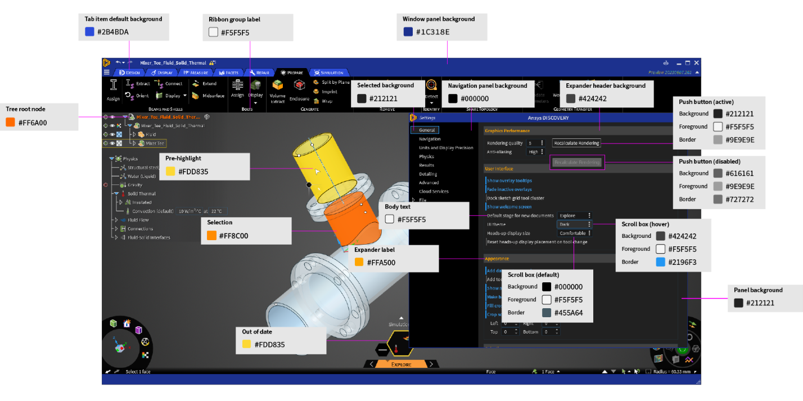

Figure 6: Example of Color Usage in a Product UI (Dark Theme)

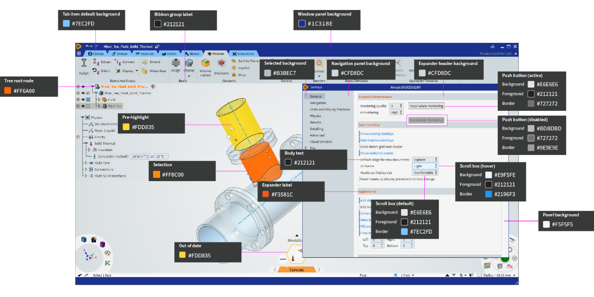

Figure 7: Example of Color Usage in a Product UI (Light Theme)

## Font colors

-   For the main UI font colors, see Figures 1 and 3 in [Color palettes and their usage](#color-palettes-and-their-usage).
-   For console/scripting text, use the corresponding colors in the dark and light themes of Microsoft Visual Studio.
-   For overlay help text, see Figures 1 and 5 in [Color palettes and their usage](#color-palettes-and-their-usage).

## Icon and cursor colors

### Icon colors

Some of the colors used for icons are constant across themes, while others [change between themes](#theme-dependent-coloring) to better match the altered palette. Certain colors used in the icons have assigned meanings, which are discussed in detail in the [Icons section](#themes-and-icon-colors). See [Color palettes and their usage](#color-palettes-and-their-usage) for details about which colors are to be used in icons.

Figure 8: Shades of Green and White as Examples of Icon Colors.

### Cursor colors

The cursor must always be visible, no matter the color of the UI element below it. Unlike stationary icons, cursors move about the screen and are designed to maintain good contrast against any possible background.

In most cases, the cursor is white with a black outline. The white stands out strongly on dark backgrounds, while the black outline ensures that the cursor will remain visible in a light setting. In certain situations where there’s a need to distinguish between a pair of tools that are similar in functionality and use the same shape cursor (e.g., Pull and Move tools for geometry modeling), you can reverse the cursor color treatment, so the fill color is black, and the outline is white. This change to the cursor reminds the user of the tool they are using as they make their selection.

Cursors can also have a thin outline of a static color that maintains the cursor’s shape against varying backgrounds or UI elements. The outline alone might not be visible against backgrounds of similar color, but the infill of a contrasting color makes the cursor visible.

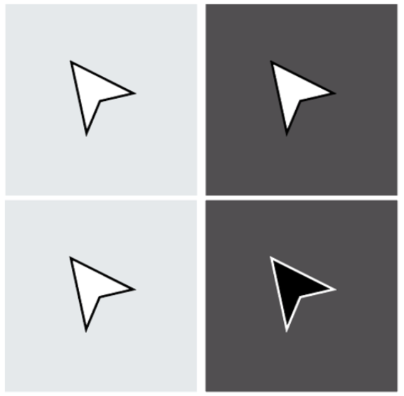

Figure 9: Cursor Outline Ensures Visibility on Different Backgrounds

### Theme-dependent coloring

An icon may need to use different colors based on the selected theme. To ensure that the icons are rendered appropriately in all themes, the designer must create a separate version of the icon for each theme. Based on the active theme, the appropriate version of the icon is used.

The following example shows how the light and dark versions of an icon would look:

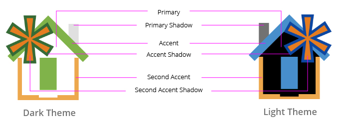

Figure 10: Example of Theme-Dependent Coloring in an Icon

The theme-dependent colors for icons are shown below.

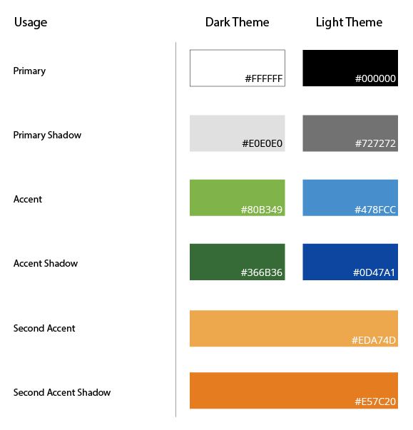

Figure 11: Theme-Dependent Colors for Icons

## Status colors

These are colors that have been assigned meanings corresponding to the type of information being conveyed in a message or other UI element. As specified in the Main UI Control Colors per Theme palette described in [Color palettes and their usage](#color-palettes-and-their-usage):

-   blue for information
-   green for good
-   red for errors
-   yellow for warnings

Note that these colors reinforce a message, but they should not be the only cue conveying information since a portion of the population has some form of color vision deficiency.

Figure 12: Red for Errors, Yellow for Warnings, Blue for Information

## Background colors

Background colors vary by theme (see [Color palettes and their usage](#color-palettes-and-their-usage)), and they may include transparency or gradient effects. They cover most of the UI and strongly influence the rest of the palette, as other elements must adjust to maintain proper contrast against the theme’s base colors.

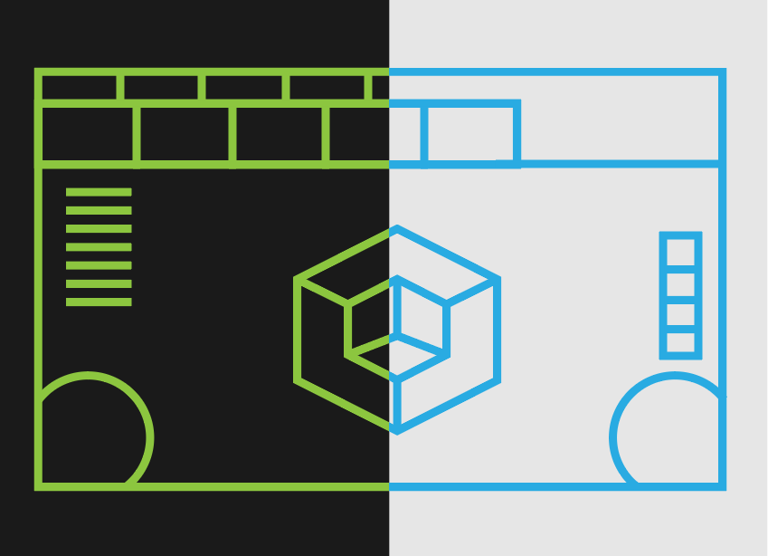

Figure 13: Background Colors are Theme-Dependent

## Assignable colors

In most products, there are situations where the user can choose colors as part of their workflow. Examples include the colors of chart lines representing different data series and the colors of the bodies of a 3D geometric model. There are two color palettes offered for these situations: the user can choose from a vivid color palette or a muted color palette. See [Color palettes and their usage](#color-palettes-and-their-usage) for details.

*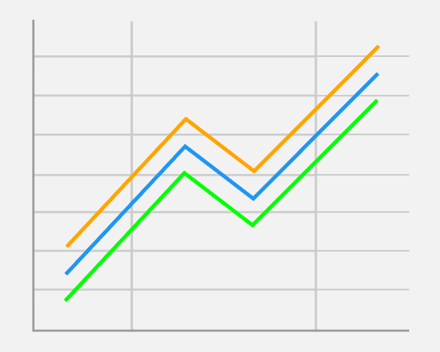*

Figure 14: Chart Lines with Colors Assigned by the User

Note that 3D geometry models also have colors assigned to their bodies based on their defined materials; the user can choose whether to view the material-based colors or the user-specified colors. In either case, colors on the 3D model change to indicate what the user has selected, as indicated in the Graphical Selection row of Figure 5.

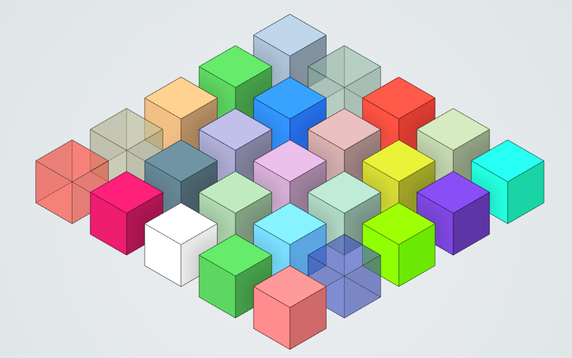

Figure 15: Body Colors Assigned by the User

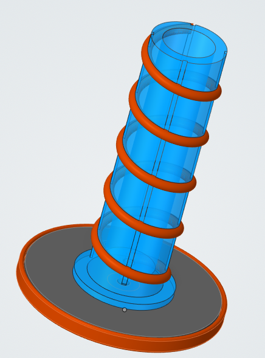

Figure 16: Body Colors Based on Assigned Materials

## 3D data visualization colors

Colormaps are used to graphically represent numerical data, such as simulation results displayed using streamlines, contours, or vectors. Alternate colormap options are provided for users with different preferences and needs. These colormaps can be visualized as continuous or discrete rendering (see images below).

Default colormap: Turbo   
Alternate colormap: Cool-warm

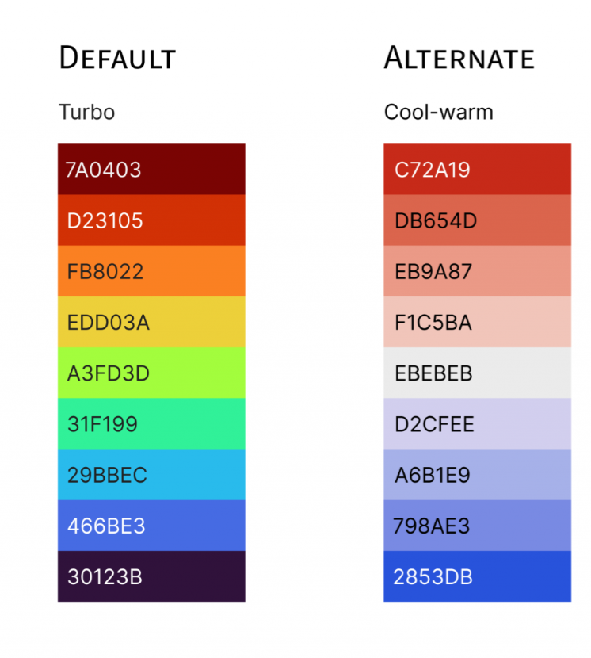  
*Default and alternate colormaps (see the Color Palettes Excel File for RGB values)*

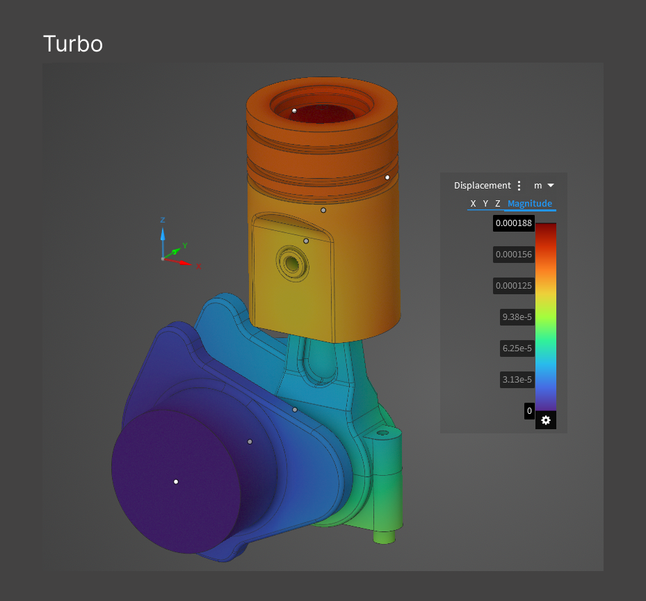

*Turbo colormap: continuous rendering example*

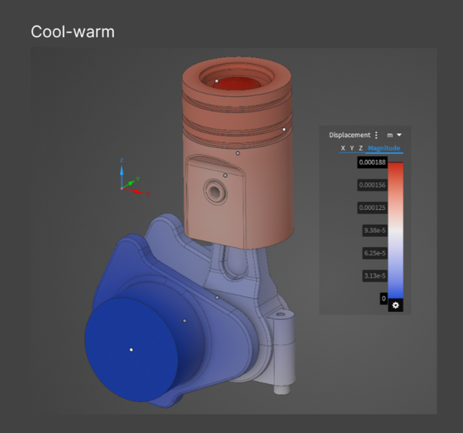

*Cool-warm colormap: continuous rendering example*

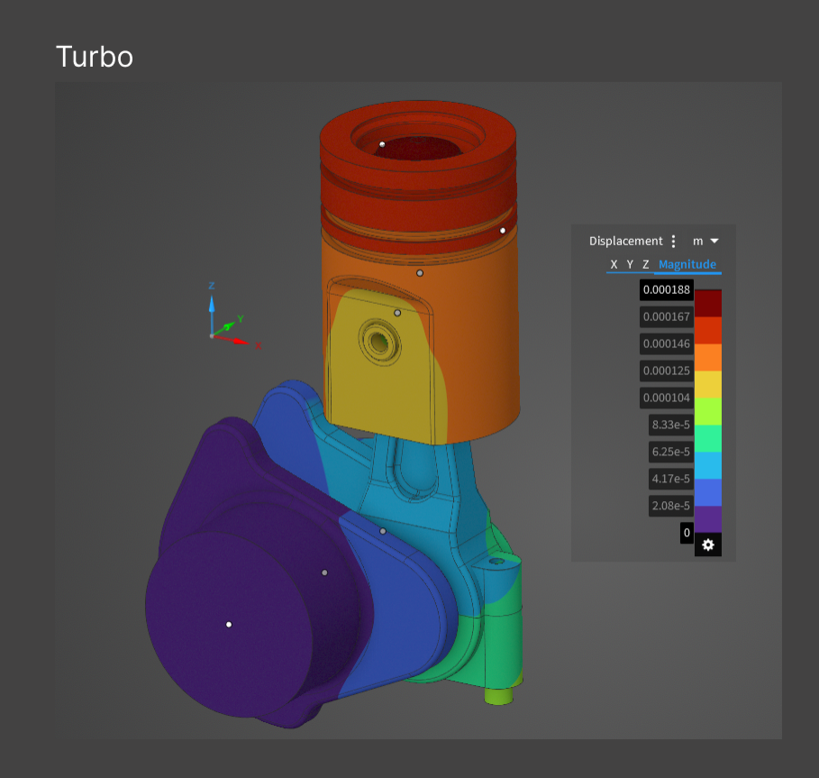

*Turbo colormap: discrete rendering example*

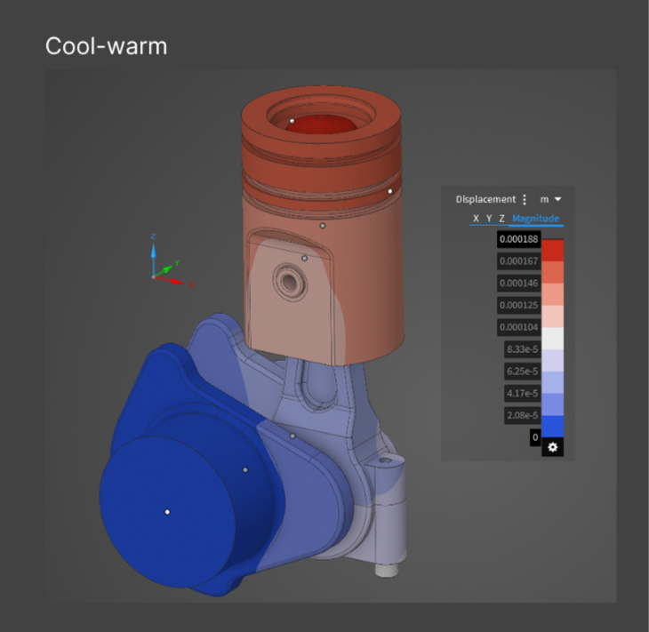

*Cool-warm colormap: discrete rendering example*

## Lighting and gradients

The shading of 3D icons and other 3D elements in the UI (including a 3D model, if relevant) are dictated by an imaginary light source placed at the top left. This position is based on the [historical convention](https://www.frontiersin.org/articles/10.3389/fpsyg.2018.00454/full) followed in Western art and [studies](https://pubmed.ncbi.nlm.nih.gov/15729910/) in human perception.

The highlights are cast on the top and left-side features of the icons and shadows are cast on the bottom and right-side features of the icons. It is imperative to be consistent with the shading of 3D elements; otherwise, the user will be confused by the inconsistent visual perception of the scene.

*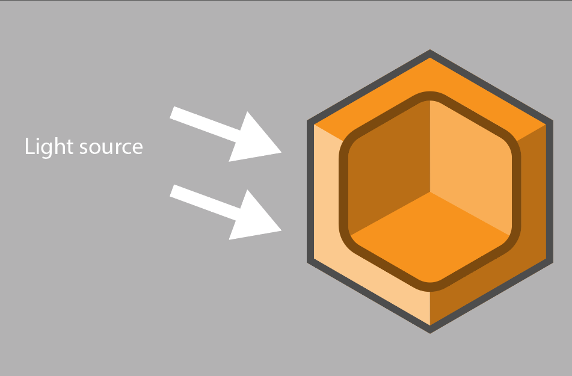*

Figure 17: Effect of Light Source on Highlights and Shadows

*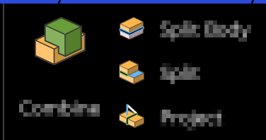*

Figure 18: Consistent Highlight and Shadows Across a Group of Icons

In a 3D model-based application, slight gradient background coloring should be used for the scene in order to provide the necessary depth for an immersive experience. In other types of applications, a flat background color that contrasts well with the foreground UI elements should be used. (See [Color palettes and their usage](#color-palettes-and-their-usage) for gradient and flat background colors.)

Figure 19: Gradient Background for 3D Model-Based Application

