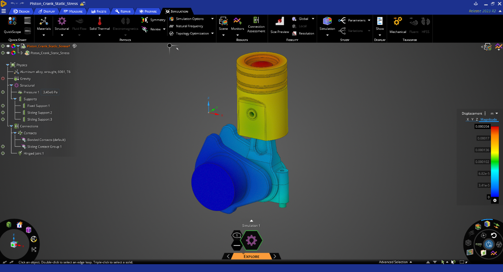
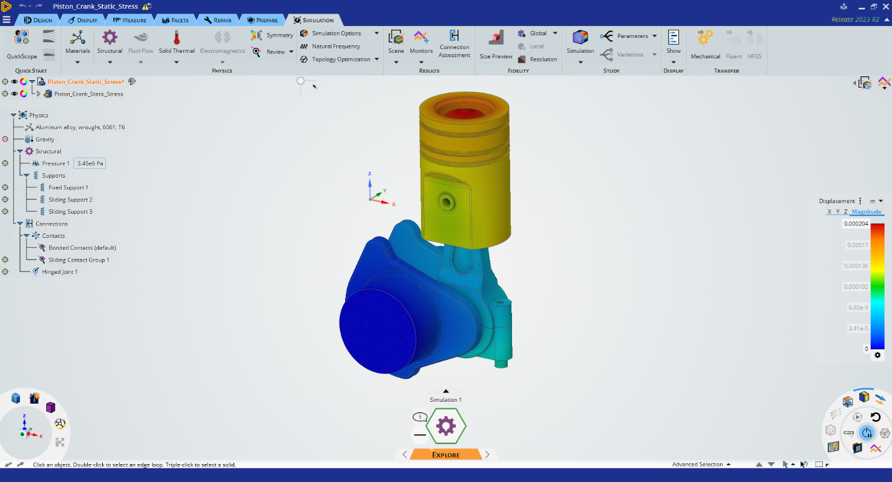

# Themes

Theme options allow the user to choose the application-wide coloring (dark or light) best suited to their tastes or needs. Since this change affects the entire application, the choice of default theme should be part of the initial preference setup (user onboarding) on first usage of the product. If a product does not offer a user onboarding process, then the dark theme should be used by default. The theme selector also is typically found with other user preferences in the software’s settings options. See [Color Palettes and Their Usage](#_Color_Palettes_1) for details about the dark and light theme palettes.

## Dark Theme

In the dark theme, interface controls are subdued and elegant, allowing the content in the main viewing area, such as results of a 3D simulation, to stand out boldly as the application’s centerpiece. This option is also easier on the eyes when viewing an application for a long period of time. The dark theme, however, does not lend itself to screen captures for use in printed documents.

Figure 20: UI in the Dark Theme

## Light Theme

Some users may prefer a brighter alternative. The light theme evokes the legacy interfaces of Ansys’ products, offering a sense of familiarity to our users who are used to those applications and their coloration. It is also suitable for screen captures intended for use in printed documents. The light theme, however, can be harder on the eyes when viewing an application for a long period of time.

Figure 21: UI in the Light Theme
