# **Typography**

## Typefaces and Fonts

### Typefaces

The following three typefaces are used in Discovery:

| **Typeface**                                      | **Usage**                                                                                       | **Reason**                                                                                                                                                          | **Example**                                                                                                           |
|---------------------------------------------------|-------------------------------------------------------------------------------------------------|---------------------------------------------------------------------------------------------------------------------------------------------------------------------|-----------------------------------------------------------------------------------------------------------------------|
| Source Sans 3 (latest version of Source Sans Pro) | Everything except scripting user inputs, code consoles, and overlay help                        | As a sans-serif typeface, it sets the tone for modernity and clean design. It is in line with Ansys branding guidelines and is an excellent digital interface type. | 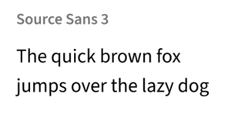                                                                       |
| Source Code Pro                                   | Scripting user input panels and consoles (except auto-suggest prompts, which use Source Sans 3) | This is an open-source monospaced typeface that has tried and tested symbol and glyph coverage for programming languages.                                           | 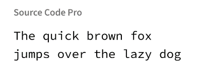 |
| Comic Neue                                        | Overlay help                                                                                    | It is intentionally distinct to stand out from UI text in the background. The tone of this typeface is friendly and credible.                                       | 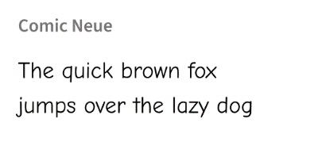                                                                       |

Avoid using multiple typefaces within the same UI element, such as a panel. One exception is where user inputs appear in Source Code Pro, while related labels and headers are in Source Sans 3.

### Font Treatments

#### Small Caps

Small caps is a font treatment where all letters take the form of capital letters, but the height is taller for those that are capitalized and shorter for those that are not. [Capitalization styles](#_Capitalization) apply equally to small caps.

Small caps usage is limited to just a few places in the user interface, where the text is no more than two words:

-   Ribbon group labels
-   Ribbon tab labels
-   Tool names (on the left side of the HUD and in super tooltips)
-   Stage navigator control labels

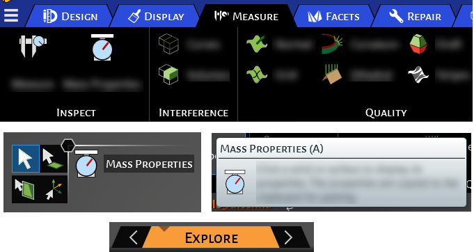

Figure 22: Examples of Small Caps Usage

#### Italic and Underline

Font treatments such as italic and underline should be used sparingly and intentionally. Typically, underline is used to denote hyperlinks, and italic is used to denote emphasis or an in-progress state of displayed information. The meaning assigned to these special treatments should be clearly communicated to the user and consistently followed across the application.

#### Strikethrough

If it is not possible or sufficient to use icons to convey that a displayed value is out-of-date or has been overridden or deleted, the use of strikethrough treatment is acceptable on that text.

#### Subscript and Superscript

Subscript and superscript can be used as needed, such as in equations or names of chemical elements (e.g., CO2).

#### Truncation

Truncation can be used for labels that may be longer than the allocated space (e.g., user inputs or text that appears in a user-resizable window or panel). The truncation treatment will insert ellipses (…) at the end of the truncated text.

### Main UI Fonts

For font colors in the main UI, see [Font Colors](#font-colors).

|              | **Font**      | **Size (Default)** | **Weight** | **Treatment** | **Examples**                                                                                                        |
|--------------|---------------|--------------------|------------|---------------|---------------------------------------------------------------------------------------------------------------------|
| **Body**     | Source Sans 3 | 14px  (0.87 rem)   | Regular    |               | Body text and button labels                                                                                         |
|              |               |                    | Semi-bold  |               | Labels for toggle check buttons that are “on”                                                                       |
| **Heading**  | Source Sans 3 | 14px  (0.87 rem)   | Regular    |               | Expander labels (collapsed)                                                                                         |
|              |               |                    | Semi-bold  |               | Expander labels (expanded), section headings, flyout headings                                                       |
| **Emphasis** | Source Sans 3 | 14px  (0.87 rem)   | Semi-bold  | Small caps    | Ribbon tab labels, ribbon group labels, HUD active tool name, stage navigator control labels, super tooltip heading |
| **Caption**  | Source Sans 3 | 12px  (0.75 rem)   | Regular    |               | Time and date stamps, status bar information text, footnotes, credits                                               |
| **Title**    | Source Sans 3 | 16px  (1 rem)      | Semi-bold  |               | Panel titles, window titles                                                                                         |

For special panels using larger text (e.g., welcome screen), increment each size to the next level while maintaining the hierarchy of fonts within the panel. It is advised that the size of text in special panels does not deviate too much from the sizes set for the application.

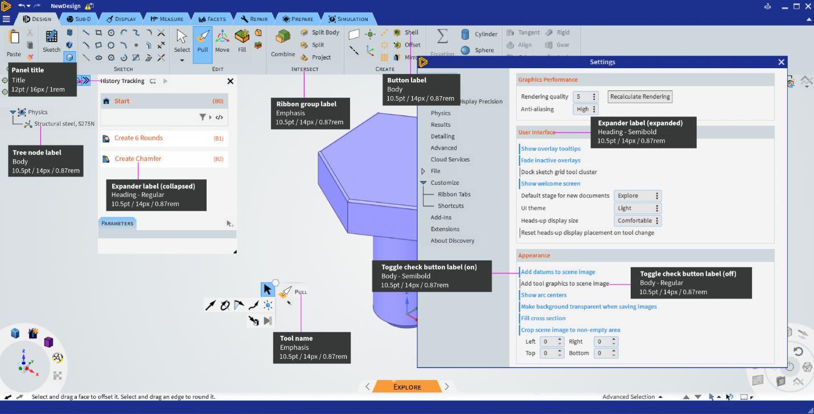

Figure 23: Font Specifications in the Main UI

### Help Overlay Fonts

For font colors in help, see [Font Colors](#font-colors).

|              | **Font**   | **Size**          | **Weight** | **Examples** |
|--------------|------------|-------------------|------------|--------------|
| **Body**     | Comic Neue | 14 px (0.87 rem)  | Regular    | Body text    |
| **Title**    | Comic Neue | 24 px  (1.5 rem)  | Bold       | Main heading |
| **Subtitle** | Comic Neue | 14 px  (0.87 rem) | Bold       | Sub-heading  |

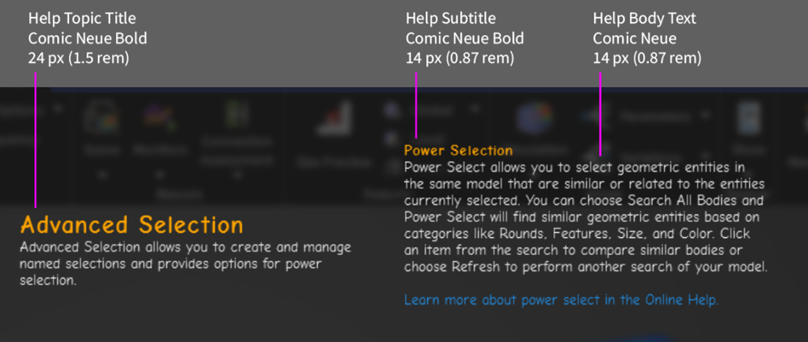

Figure 24: Font Specifications in the Overlay Help

## Capitalization

Capitalization styles can be used to aid in emphasis and clarity, but they can also slow comprehension if misapplied. There are three systems of capitalization commonly used for interface design:

-   Title-style capitalization
-   Sentence-style capitalization
-   All caps

Small caps is a font treatment rather than a capitalization style. See [Small Caps](#small-caps) for details.

### Title Style

When using title-style capitalization, the first letter of each word is capitalized. Unless they begin the text, articles (a, an, the) and small coordinating words (and, or, of) are left lower-case.

Title-style capitalization should be used for text that

-   Represents a name, title, or group heading (e.g., page titles, tabs, icon labels, form labels)
-   Labels a control that performs an action (e.g., context menus, drop-down menus, buttons)

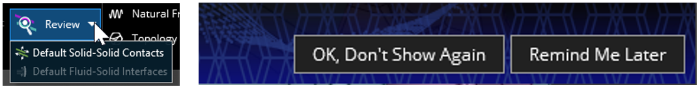

Figure 25: Examples of Title-Style Capitalization

### Sentence Style

As the name implies, sentence-style capitalization follows the typical rules of a sentence. The first letter is capitalized, along with proper nouns or acronyms.

Sentence-style capitalization is used for

-   Anything that is meant to be read as a sentence.
    -   Examples: body copy, tooltips, interface messages/notifications
-   Labels of settings/options/inputs that do not perform actions.
    -   Since there are often many of these shown together, and some are meant to be read as a sentence, using sentence-style capitalization ensures consistency within the group.
    -   Examples: drop-down list labels, options in Settings panel, inputs in HUD or HUD options panel, options in panels that open from the ribbon.

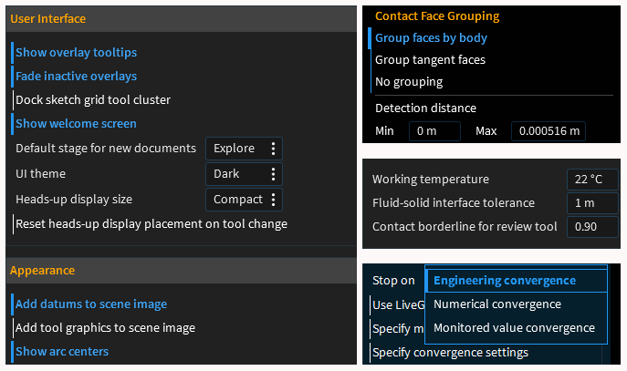

Figure 26: Examples of Sentence-Style Capitalization

### Dealing with Conflicting Guidelines

If one of the items in a menu does not strictly perform an action, the title-style guideline will take precedence over the sentence-style guideline to ensure consistency within the menu. An example is Select Components in the menu below:

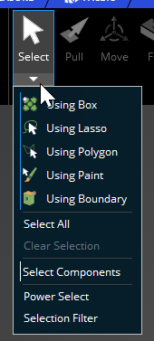

Figure 27: Ensuring Consistency in a Menu when Guidelines Conflict

### All Caps

Presenting text in all capital letters draws the eye and slows the reader.

All caps should be used for acronyms and on product names in the title bar (where appropriate based on branding). For other situations where all caps might be considered, use them sparingly and not for labels of more than a few words.

(Note that small caps differ from all caps; see [Small Caps](#small-caps) for details.)

### User Entries

When a user enters text, do not apply capitalization transformations. Honor the formatting that the user intended.

### Capitalization Based on Object Name

By default, object names are title case (e.g., Fixed Support 1, Max Displacement 3), but if the user changes the name, the capitalization for it will be whatever the user specifies (e.g., My distributed Force), regardless of where the name appears.

|                                                                                                                                                                                          |
|------------------------------------------------------------------------------------------------------------------------------------------------------------------------------------------|
| 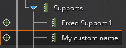  Figure 28: Capitalization of Tree Object with User-Edited Name |

### Capitalization Based on Outside Sources

Material assignments, for example, pick up capitalization from the material name, so capitalization will be dependent on the source of the material.

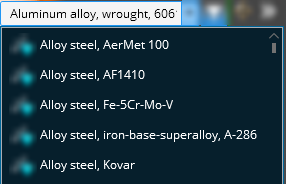

Figure 29: Capitalization of Material Names is Based on External Source

## Punctuation

Labels should not end with a colon (:). Omitting the colon helps to reduce clutter on the screen.

## Field Label Placement

The placement of labels for input fields depends on the context. The overall goal is to balance the competing goals of easy scanning, effective space usage, and internationalization.

|                                                    | For small input fields, such as in the HUD, labels are placed in front of the fields to make it easier to scan and identify the field of interest.  On the left side of the HUD bracket, the labels are left-justified, while on the right side they are right-justified. This keeps the HUD more compact, and less likely to get in the way of what the user is viewing.                                                                                                                                                                                                                                                                  |
|---------------------------------------------------------------------------------------------------|--------------------------------------------------------------------------------------------------------------------------------------------------------------------------------------------------------------------------------------------------------------------------------------------------------------------------------------------------------------------------------------------------------------------------------------------------------------------------------------------------------------------------------------------------------------------------------------------------------------------------------------------|
| 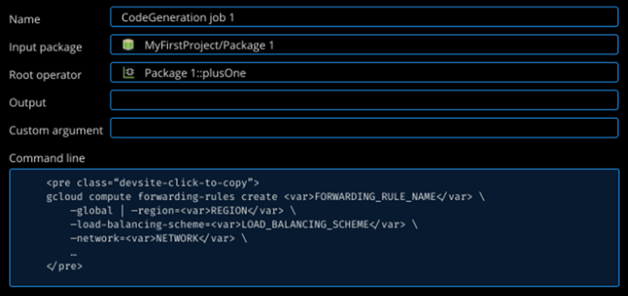   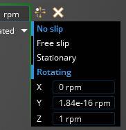 | For multi-line input fields, labels should be placed above the fields for better sizing and layout management of the form or panel.  In a form or panel, such as the HUD options, the labels and the corresponding fields should both be left-justified. Exceptions may be made if the labels in a group are of very different lengths, to avoid having any label in the group too far from its field.  In forms where the user must fill in all fields, the labels are placed above the fields because there is no need to scan them. In this case, the internationalization guideline of placing labels above the fields takes priority. |

## Wrapping for Long Labels

For groups of buttons (e.g., in a ribbon), wrap long labels to optimize space usage for the set of buttons.

| 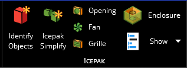 | The labels of the first two buttons here wrap to two lines because a single line would lead to extra blank horizontal space (if the other buttons shifted to the right) or cause the labels to touch other content (if the other buttons did not shift). |
|--------------------------------------------------------------------------------------------------------------------------|----------------------------------------------------------------------------------------------------------------------------------------------------------------------------------------------------------------------------------------------------------|
| 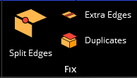          | Split Edges does not wrap because that would use too much vertical space, given that there are only two buttons stacked to the right of it, and there is adequate horizontal space between Split Edges and the adjacent buttons.                         |

**  
**
