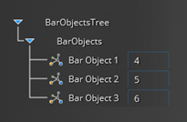
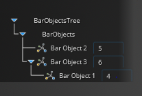

# Custom tree

Discovery uses trees to represent objects for geometry and physics. Add-ins can use the custom tree to display their own custom objects.

Within an add-in a custom tree is defined by implementing the *ITreeHierarchy*interface. The class that implements *ITreeHierarchy*interface must be marked with the attribute

```
[Export(typeof(ITreeHierarchy))] 
```

Using Managed Extensibility FrameWork \(MEF\), Discovery collects the classes that implement *ITreeHierarchy* and adds them to the application at the startup.

The interface has the properties below that a custom tree can define and modify.

-   **ID**: identifier for custom tree.
-   **TreeName**: user visible name for the custom tree.
-   **DefaultGroup**: default group for custom tree items.
-   **RootGroups**: list of the items that displayed as root nodes.
-   **SubGroupMapping**: dictionary to define the hierarchy in tree items. Key is the parent node, value is the list of child nodes.
-   **GroupsToDisplayName**: dictionary to match the tree groups and their display names on the tree.
-   **GroupsToImages**: dictionary to match the tree groups and their images.
-   **DefaultGroupThreshold**: minimum number of items required to form a group value of 0 or 1 groups immediately of -1 or lower never groups
-   **UseParentGroupingThresholds**: whether subgroups will use the same threshold and other rules as the parent group
-   **CountIndirectChildren**: if true, counts direct non-group children and counts each direct subgroup child as its indirect children, else counts each direct subgroup as 1
-   **IgnoreThresholdAfterFirstSubGroup**: when true, groups will ignore its threshold and will form immediately if it contains a subgroup and anything else
-   **UseDeepGrouping**: when true, grouping will be applied to the children of every node in the tree instead of just the root node
-   **GroupsToImageKeys**: when true, enables you to change the grouping of objects using drag and drop
-   **RootNodeImageKey**: image key for the root node.
-   **StageIdentifiers**: identifiers of stages where this tree will be displayed.
-   **IsDragEnabled**: when true, enables you to change the grouping of objects using drag and drop
-   **CanDrop**: allows add-in control on enabling/disabling the target of the drop

The *Custom tree* definition is flexible in terms of its hierarchy and how objects are represented with respect to each other. The drag and drop feature also enables changing the hierarchy during the session. As noted in the previous section, the specification of a *TreeParent* for a custom objects overrides the group definition.





By using the *StageIdentifer* property add-ins can control the visibility of the custom tree based upon the current stage. The *Custom Tree*will only show in the stages specified in the *StageIdentifers* list and won’t be displayed in the other stages. In the figures below, the tree is shown in the *CustomStage* that the add-in defined, but it is not shown in the *Refine* stage.

