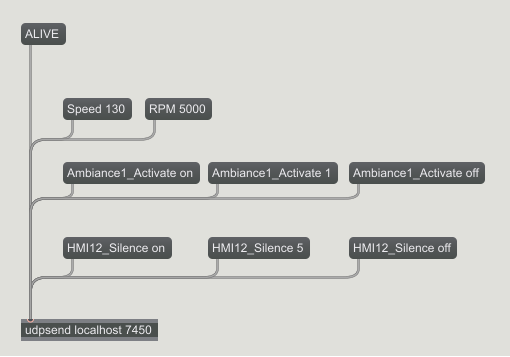

# Ansys Sound: ASDforEV API Messages

**Ansys Sound: ASDforEV** communicates using OSC MESSAGES sent over UDP: there is one action at a time associated to one message. Each message is composed of a KEYWORD, followed by a single DATA item \(float or string\); the only exception is the message "ACTIVE", for which only the KEYWORD is sent \(no data, cf. below\).

When using Ansys Sound: ASDforEV alongside an application for reading CAN data, most UDP communication is done from application reading or generating the vehicle data \(for example CAN data reading application\) towards ASDforEV, to command the parameters of the sounds produced \(see section **Sending messages to ASDforEV**\). However, ASDforEV also sends data via UDP to the application sending vehicle data \(see section**Receiving messages from ASDforEV**\).

The tables in the following sections specify the KEYWORDS and expected DATA that Ansys Sound: ASDforEV uses to communicate via UDP. In these tables \(except for Vehicle messages\), the ranges for the DATA values are not specified, as raw values can be transformed through a dedicated graphical interface in Ansys Sound: ASDforEV.

Note that **messages are case-sensitive**, both for KEYWORDS and string DATA.

A Max/MSP code example, to send data to ASDforEV, is given in the figure below.

- **[UDP Connection](SEV_API_UDP_connection.md)**  

- **[Sending Messages to ASDforEV](SEV_API_sending.md)**  
Here is the list of messages that can be sent to Ansys Sound: ASDforEV using this API.
- **[Receiving Messages from ASDforEV](SEV_API_receiving.md)**  
Here is the list of messages that can be received from ASDforEV using this API.
