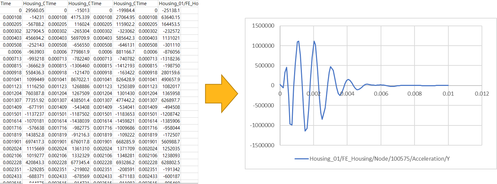

# Example

The following sample code illustrates how to create a simple example.

* The example was created using "Ansys installed path/Motion/Document/Drive Train Models.zip".

## Common settings

It's a good idea to add the Motion\bin directory to your PATH environment variable. You can do this in the Python code as follows:

```
# Using Python.NET
import clr, sys

# Add the Motion\bin directory to your PATH environment variable
sys.path.append('Ansys installed path/Motion/bin')

# Adding references from Ansys Motion Standalone Postprocessor
clr.AddReference('VM.Post.API.OutputReader') 

# Import the appropriate classes from the Ansys Motion Standalone Postprocessor C# library.
from VM.Post.API.OutputReader import *
from VM.Models.OutputReader import *
```

## Create Coordinate system

The Coordinate system can be created from various entities in the result as below, and this example describes how to create the Coordinate System.

* Rigid Body
* FE Node
* Marker

```
# newName - Specifies the name of the marker.
# parentFullName - Specifies the name of parent.
# Rigid Body
outputReader.CreateCoordinateSystem("RigidCSYS", "ShaftSet1st_Section_01_1")
# FE Node
outputReader.CreateCoordinateSystem("NodeCSYS", "Housing_01/FE_Housing/Node/100575")
# Marker
outputReader.CreateCoordinateSystem("MarkerCSYS", "ShaftSet1st_Section_01_1/CM")
```

## Plot

It is the simplest example of a Python script to print plot data.

* For combinations of paths(Characteristic, Component), refer to Notes in [Getting Started with the Python language](getting_started_operation_api_using_py.md).



```
# Import result file
outputReader = OutputReader("Result File Path")

# Get Curves
paths = List[str]() 
paths.Add("Acceleration/Y")

plotParameterex = PlotParameters()
plotParameterex.Target = "Housing_01/FE_Housing/Node/100575"
plotParameterex.Paths = paths

results = outputReader.GetCurves(plotParameterex)

# Close
outputReader.Close()
```

## Contour export

Export contour results to a file.??

* For combinations of paths(Characteristic, Component), refer to Note in [Result File Reader using Python language](getting_started_result_file_reader_using_py.md).

```
# resultpath - Specifies the file path to export
# mode - Specifies how the operating system should open a file.??
# stateids - Specifies the id list of the states to time.??
# fullName - Specifies the names of the entities.??
# type - Specifies the type of the target for displaying contour(None, FENode, FEElement, FEElementNode, FEMaterial, BeamGroup, Contact, ChainedSystem, Usersubroutine).  
# path - Specifies the path of result to save.??
# analysisResultType - Specifies the type of analysis result type for displaying contour.??
# formatType - Specifies a file format type.??

# State ID Array
stateids = outputReader.GetStateIDArray()
target = "Housing_01/FE_Housing"
path = "Velocity/X"

outputReader.ExportContourResultToFile(r'export file path', System.IO.FileMode.Create, stateids, target, ContourMappingType.FENode, path, analysisResultType = AnalysisResultType.Dynamics, formatType = FileFormatType.BINARY)
```

## Vector export

Export vector results to a file.

```
# filepath - Specifies the file path to export.??
# stateids - Specifies the id list of the state to time.??
# targets - Specifies the list of  the entity.??
# isIncludePosition - Included position.??
# includeVector - Included vector.??
# includeMagnitude - Included magnitude.??
# analysisResultType - Specifies the type of analysis result type.??

# State ID Array
stateids = outputReader.GetStateIDArray()
targets = ["GearSet_01"]

outputReader.ExportVectorDisplayToFile(r'export file path', stateids, targets, true, true, true, AnalysisResultType.Dynamics)
```

## Get Vector

Get results from the Vector.

* Refer to the Notes at location [Result File Reader using Python language](getting_started_result_file_reader_using_py.md) for the path(Characteristics) of the vector.

```
# target - Specifies the name of vector displayable entity
# path - Specifies characteristc on vector display
outputReader.GetVector("GContact_01", "Base Force")
```