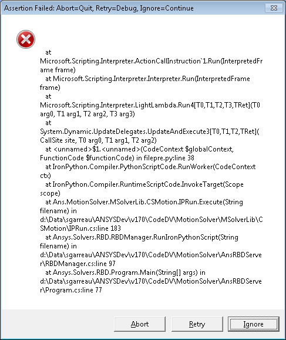
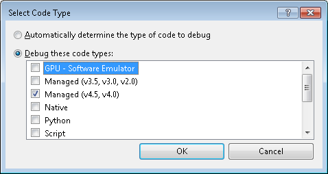
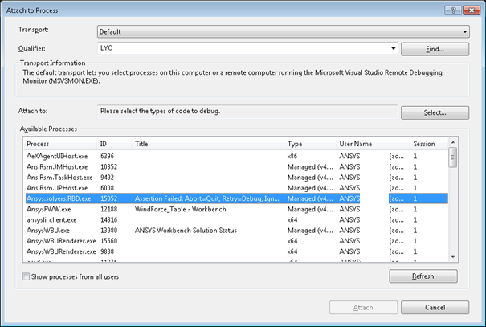
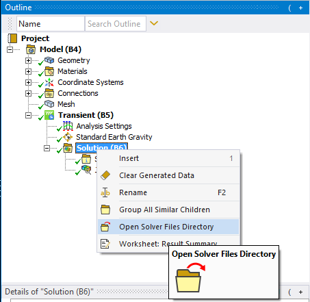

# Debugging RBD commands with Visual Studio

You can debug RBD command snippets Using Microsoft Visual Studio. This allows
you to execute commands line-by-line and review variable values.

1. To begin, insert the following lines before the command snippet you wish to debug. Note that if there are several command snippets, they are executed in the order they appear in the Mechanical tree.
  
    ```
    from System import Diagnostics
    Diagnostics.Debug.Assert(0)
    ```

2. Begin the solve. When the solution begins, the following warning dialog appears. Do not close this dialog. The dialog will pause the solver and allow you to attach the Visual Studio debugger and set breakpoints.

    

3. In Visual Studio, select Attach To Process... from the DEBUG menu. In the Select Code Type dialog, select Managed, then click OK.

    

4. In the Attach to Process dialog, select the RBD solver process (Ansys.solvers.RBD.exe), then click Attach.

    

5. Once Visual Studio is attached to the RBD solver, open the script file in Visual Studio. To locate script files, in Mechanical, right-click the Solution object and select Open Solver Files Directory.

    

6. In the solver files directory, commands are written to two python files: `filepre.py` and `filepost.py`. `filepre.py` contains the commands that are executed before solve (all command snippets except those at solution level). `filepost.py` is executed after the solve (only command snippets at solution level).

7. Open the desired file in Visual Studio. You can insert breakpoints as desired
  and click Ignore on the warning dialog to resume the solve.
