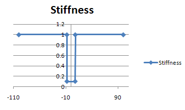

# PointsTable

Corresponding ID table: `CS_PointsTable`

### Member functions

`CS_PointsTable( tab )`

`tab` is a two dimensional array where the first column contains the input
values and the second column contains the corresponding output values.

Example:

    tab = System.Array.CreateInstance(float,6,2)
    tab[0,0]=-100.
    tab[1,0]=-8.
    tab[2,0]=-7.9
    tab[3,0]= 7.9
    tab[4,0]= 8.
    tab[5,0]= 100.
    
    tab[0,1]=1.0
    tab[1,1]=1.0
    tab[2,1]=0.1
    tab[3,1]=0.1
    tab[4,1]=1.0
    tab[5,1]=1.0
    Table = CS_PointsTable(tab);

Here, the output (shown as Stiffness in the chart above) varies in a linear,
piece-wise manner. For values of input less than -8.0 or greater than 8.0, the
output is equal to 1.0. For values between -7.9 and +7.9, the output is 0.1.
The transition is linear between -8.0 and -7.9, and as well between +7.9 and
+8.0.
