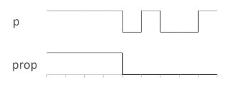

# Always

Returns true while the input property has never been false.

The following figure shows the output prop for the input p:

## Interface

|Name|Kind|Type|Comment|
|----|:--:|----|-------|
|p|I|bool|Input property|
|prop|O|bool|Output property|

**Constraint**: The ratio period / timeSample must be greater than 2.

**Parent topic:**[Check](../../libraries/check/check.md)

