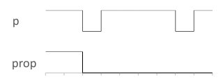

# AtLeastN

Returns true if the input property has been true for the first given number of cycles.

The following figure shows the output prop for the input p and 3 cycles:

## Interface

|Name|Kind|Type|Comment|
|----|:--:|----|-------|
|p|I|bool|Input property|
|n|I|unsigned|Number of cycles|
|prop|O|bool|Value of the property|

**Constraint**: The ratio period / timeSample must be greater than 2.

**Parent topic:**[Check](../../libraries/check/check.md)