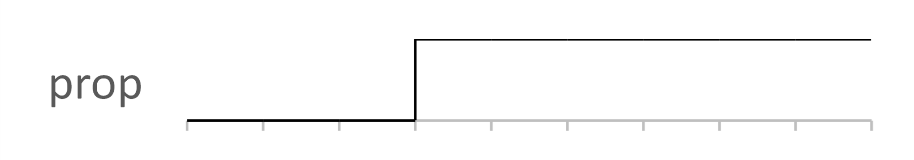

# Cycles

Returns true after a given number of cycles.

The following figure shows the output prop for 3 cycles.

## Interface

|Name|Kind|Type|Comment|
|----|:--:|----|-------|
|n|I|unsigned|Number of cycles|
|prop|O|bool|Output property|

**Constraint**: The ratio period / timeSample must be greater than 2.

**Parent topic:**[Check](../../libraries/check/check.md)

