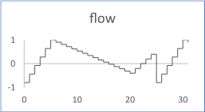

# Sequence

The flow is a sequence of ramps. Each ramp is defined by a number of cycles, a start and end value. The end value of a ramp is the start value for the next one.

The figure shows the output flow for a sequence of 3 ramps with the following inputs:

-   cycles: \[5, 15, 5\]
-   values: \[-0.8, 1, -0.4, 0.6\]

## Interface

|Name|Kind|Type|Comment|
|----|:--:|----|-------|
|SIZE|P|n/a|Number of ramps|
|cycles|I|unsigned ^ SIZE|Number of cycles for each ramp|
|values|I|float ^ \(SIZE+1\)|Input array of values defining the bounds of the ramps|
|flow|O|float|Output flow|

**Parent topic:**[Sources::N](../../libraries/sources/sources_n.md)

