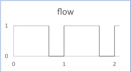

# Pwm

The flow of Pulse-Width Modulation is 1 during the first part of the period and 0 during the second one for every period. The length of the part is defined by the duty cycle, from 0% to 100% of the period.

The figure shows the output flow for a PWM with the following inputs:

-   cycles: 10
-   ts \(timesample\): 0.1
-   dutyCycle: 0.7 \(70%\)
-   amplitude: 1
-   offset: 0

## Interface

|Name|Kind|Type|Comment|
|----|:--:|----|-------|
|period|I|float|Value of the period Range: \>0|
|ts|I|float|Time sample during the period Range: \>0|
|dutyCycle|I|float|Switch reference value for on power, expressed in percent, 100% being fully on. Range: \[0, 1\]|
|amplitude|I|float|Gain to be applied to the output flow \(default 1\)|
|offset|I|float|Offset to be added to the output flow \(default 0\)|
|flow|O|float|Output flow|

**Constraint**: The ratio period / ts must be greater than 2.

**Parent topic:**[Sources::T](../../libraries/sources/sources_t.md)

