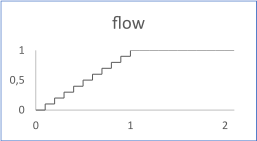

# Ramp

The flow varies linearly from 0 to 1 for a duration and then remains at 1.

The figure shows the output flow for a ramp with the following inputs:

-   duration: 1
-   ts \(timesample\): 0.1
-   amplitude: 1
-   offset: 0

## Interface

|Name|Kind|Type|Comment|
|----|:--:|----|-------|
|duration|I|float|Duration of the ramp Range: \>0|
|ts|I|float|Time sample during the ramp Range: \>0|
|amplitude|I|float|Gain to be applied to the output flow \(default 1\)|
|offset|I|float|Offset to be added to the output flow \(default 0\)|
|flow|O|float|Output flow|

**Constraint**: The ratio duration / ts must be greater than 2.

**Parent topic:**[Sources::T](../../libraries/sources/sources_t.md)

