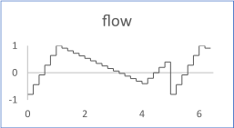

# Ramps

The flow is the sequence of an array of ramps. Each ramp is defined by a duration, an amplitude, and an offset. The time sample is common to all the ramps.

The figure shows the output flow for a sequence of 3 ramps with the following inputs:

-   durations: \[1., 3., 1.\]
-   ts \(timesample\): 0.2
-   amplitudes: \[1.8, -1.4, 1.0\]
-   offsets: \[-0.8, 1.0, -0.4\]

## Interface

|Name|Kind|Type|Comment|
|----|:--:|----|-------|
|SIZE|P|n/a|Number of ramps|
|durations|I|float ^ SIZE|Duration of each ramp Range: \> 0|
|ts|I|float|Time sample for the duration of each ramp Range: \>0|
|amplitudes|I|float ^ SIZE|Gain to be applied to the output flow of each ramp \(default 1 ^ SIZE\)|
|offsets|I|float ^ SIZE|Offset to be added to the output flow of each ramp \(default 0 ^ SIZE\)|
|flow|O|float|Output flow|

**Constraint**: The ratio durations\[i\] / ts must be greater than 2, for *0 <= i < SIZE*.

**Parent topic:**[Sources::T](../../libraries/sources/sources_t.md)

