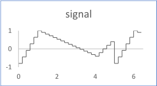

# Sequence

The flow is a sequence of ramps. Each ramp is defined by a duration, a start and end value. The end value of a ramp is the start value for the next one.

The figure shows the output flow for a sequence of 3 ramps with the following inputs:

-   durations: \[1., 3., 1.\]
-   ts \(timesample\): 0.2
-   values: \[-0.8, 1, -0.4, 0.6\]

## Interface

|Name|Kind|Type|Comment|
|----|:--:|----|-------|
|SIZE|P|n/a|Number of ramps|
|durations|I|float ^SIZE|Durations for each ramp|
|values|I|float ^\(SIZE+1\)|Input array of values defining the bounds of the ramps|
|ts|I|float|Time sample during the period Range: \>0|
|flow|O|float|Output flow|

**Parent topic:**[Sources::T](../../libraries/sources/sources_t.md)

