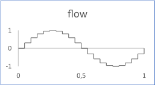

# Sine

The flow is a sinusoidal waveform with an optional delay, with a sample time.

The figure shows the output flow for a sine with the following inputs:

-   cycles: 10
-   ts \(timesample\): 0.05
-   delay: 0
-   amplitude: 1
-   offset: 0

## Interface

|Name|Kind|Type|Comment|
|----|:--:|----|-------|
|period|I|float|Value of the period Range: \>0|
|ts|I|float|Time sample during the period Range: \>0|
|delay|I|float|Delay of the signal Unit: time Range: \>=0|
|amplitude|I|float|Gain to be applied to the output flow \(default 1\)|
|offset|I|float|Offset to be added to the output flow \(default 0\)|
|flow|O|float|Output flow|

**Constraint**: The ratio period / ts must be greater than 2.

**Parent topic:**[Sources::T](../../libraries/sources/sources_t.md)

