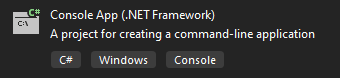

# Hello World (Start TD and create a node)

Let’s create a simple OpenTD program. Start by creating a `C#` console application in Visual Studio. Look for the template called “Console App (.NET Framework)”, not “.NET Core” or “.NET Standard”. It should look something like this:



Next, add a reference to the `OpenTDv242.dll` assembly, which you can find in the GAC. (Try looking under C:\\Windows\\Microsoft.NET\\assembly\\GAC_MSIL\\OpenTDv242.) If there are multiple directories, use the one with the highest Assembly Version, which you will see in the directory name, for example “…_24.2.0.0__...”.

Add the following code, then compile and run the program:

```csharp
using OpenTDv242;
namespace OpenTDv242GettingStarted
{
    class HelloWorld
    {
        public static void Main(string[] args)
        {
            var td = new ThermalDesktop();
            td.Connect();
            var n = td.CreateNode();
            n.Comment = "Hello World!";
            n.Update();
        }
    }
}
```

When you run the program, an instance of TD should open and a node should be created at (0, 0, 0). When you edit the node, the comment should be “Hello World!”. If any of these things are not true, check the [Troubleshooting](../troubleshooting.md) section at the end of this guide.

Assuming it worked, let’s examine how. First, we created a `ThermalDesktop` object called `td`. This object represents one instance of TD. It has hundreds of methods for interacting with TD models. A single OpenTD client program can create an arbitrary number of ThermalDesktop instances, allowing you to manipulate several models and communicate between them.

Next, we called the `ThermalDesktop.Connect()` method. By default, this will start a new instance of TD using the latest version of AutoCAD installed. You can control how it works using the `ThermalDesktop.ConnectConfig` property ([Control how OpenTD connects to Thermal Desktop section](../extras.md#control-how-opentd-connects-to-thermal-desktop)).

`Connect()`, like most ThermalDesktop commands, is called synchronously, so it will only return control to your program once it finishes. If there is a problem, it will throw an exception. All OpenTD methods throw exceptions if there is a problem; you do not need to check return values for success.

Once `Connect()` returned, we called `ThermalDesktop.CreateNode()` to create a node in TD with default settings. We put the return value in a variable called n. This variable is of type `Node` and represents the TD node in our client program.

Next, we updated the `Comment` member of n. This only updated the comment for the client-program Node. To send that update to TD, we called the `Node.Update()` method. This is an important concept to understand; when you work with objects in your client program that represent objects in TD, they do not automatically propagate their changes to TD. To do that, you need to call the `Update()` method. (Some objects also have`UpdateFromTD()` methods to get the latest changes from TD.)
