# **Icons**

Icons are a powerful visual communication medium in the UI: using graphical elements, they convey the meaning of a button and its function; and the active and changed status of the application. Icons also contribute to conservation of screen real estate, making sure that every pixel counts. They also help users visually process concepts faster by making them recognize them, rather than recall.

[Icon Guideline Cheat Sheet](#_Cheat_Sheet)

## For Designers: Creating Icons

We approach icon design by understanding why the user will look for an icon in the application, what it should represent, where it will display in the interface, and how it will render in different themes. Through our icons, we aim for consistency, legibility, and clarity.

Inspiration for icons may come from existing symbols and standards in simulation and physics software, mobile applications, games, and visual communication in the real world.

The process of icon design involves stakeholders at every stage:

1.  Brainstorm ideas and create drafts as physical and/or digital sketches.
2.  Select the best candidates and create mockups in different sizes and locations within the user interface. This helps us verify and validate our designs, in-context.
3.  Use the in-context mockup to obtain feedback and iterate on the design until it satisfies stakeholder requirements.
4.  Translate the final design to a vector-code format or image resource to be consumed by the product.

While the following rules and guidelines cater to most icons, thoughtful exceptions are allowed if they solve unique problems in visual communication.

To keep icons consistent, clear, flexible, and easily scalable, follow these rules, guidelines, and tips.

### Rules, Guidelines, and Tips

#### Rules

-   Icon content preparation
    -   All content must be within a square canvas of side 500px.
    -   The outer stroke must be 12px wide and the internal stroke 10px wide.
    -   Contents should touch at least two opposite edges of the bounding square canvas.
        -   Edge to edge allows the icons to be on the same scale and reduce variability in terms of different padding
-   Shape and color
    -   The final icon must consist of only closed vector paths and shapes.
        -   A closed path is continuous and has no beginning or end; for example, a circle is a closed path. In contrast, an open path has a beginning point that is not the same as the endpoint; for example, a straight line is an open path.
        -   It is always advisable to close your paths when creating shapes so there will be no problems with the fill being misinterpreted as you export the icons to other applications.
        -   [Learn more](https://graphicdesign.stackexchange.com/questions/86468/open-path-outlines-and-closed-path-outlines-adobe-illustrator) about this topic.
    -   Colors used must be from the appropriate [palette](#_Color_Palettes_1).
    -   Icons must have a [semi-flat](#semi-flat-styling) (2.5D) look; use gradients only as appropriate (for example, to show result contours or curved surfaces).
    -   [Symbols](#using-symbology) must be used consistently across icons.

#### Guidelines

-   Always design icons by keeping in mind the context of use, including whether it is important for an icon’s colors to be the same across themes (see [Themes and Icon Colors](#themes-and-icon-colors)).
-   Use the minimum number of colors needed to get the meaning across.
-   Constrain yourself to the smallest [size](#_Sizes) the icon will show up in the UI. It is always easy to scale up rather than down.
-   Be mindful of negative space and overlap.
-   Use a [design grid](#using-a-grid) for consistent sizing.
-   Use [glow](#adding-glow) to enhance visibility against dark backgrounds.

#### Tips

-   Try out the icons with exact/intended colors over samples of UI at the original button size using [pixel previewing](#pixel-pushing) in your design tool (e.g., the Pixel Preview feature in Adobe Illustrator).
-   Save different versions and iterations of the icon as changes occur.

### Additional Information

#### Semi-Flat Styling

Icons have a semi-flat look, which means that while lighting and shadows make them appear somewhat 3D, they do not follow the rules of rendering like a real physical object. So, multiple elements in these icons do not cast shadows upon each other. The styling of these icons is inspired from [marker rendering](https://www.youtube.com/watch?v=MCIBxTDJIp0&t=1s) and painting techniques.

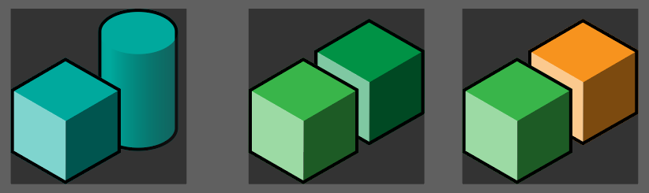

Figure 30: Examples Showing Effect of Semi-Flat Styling on Multiple Elements

#### Sizes

These are the sizes to use for icons in a product UI:

General sizes: **8px, 16px, 24px, 28px, 32px, 48px, 64px, 96px**

Cursor sizes: **12px, 24px, 32px**

#### Using a Grid

We use a grid (provided in the separate file named Grid for icon design.svg) for balance and visibility. But this is only to be used as a starting reference, and not as a strict outline for placing shapes within the square artboard.

Deviating from the grid may be necessary for clarity and context. Sometimes the aesthetics override the structure of the grid: the contents of the icon itself might not fit properly with the grid. The interplay of different elements in the icon is also important, as in the example below where the change in thickness of an element “breaks” the grid.

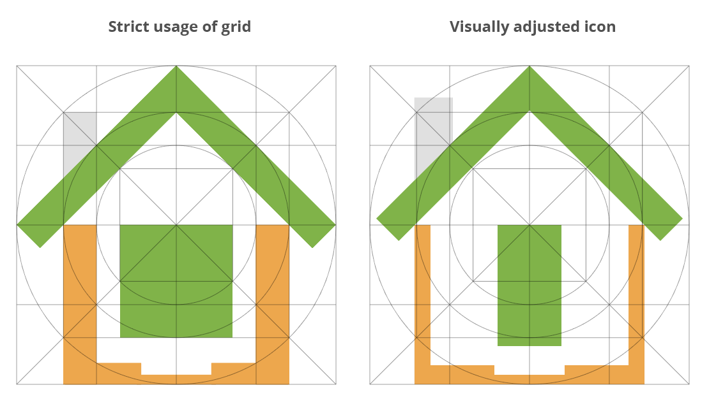

Figure 31: Example of Deviating from the Grid to Improve an Icon

#### Themes and Icon Colors

Theme-specific icons have some, or all, shapes that use different colors based on theme. (See [Theme-Dependent Coloring](#theme-dependent-coloring) for details.) There are six theme-dependent colors (refer to the [cheat sheet](#cheat-sheet) for more information) to be used.

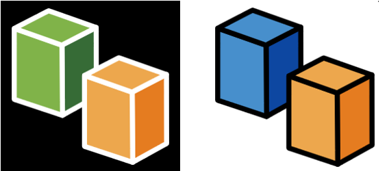

Figure 32: Theme-Specific Versions of an Icon Shown in Dark Theme (Left) and Light Theme (Right)

Static icons have shapes that must not change color based on theme. These icons must look consistent across the themes, just like branding icons. Static coloring is appropriate when the colors have some special significance in the product. In the example below, the magenta and orange colors are associated with different simulation modes.

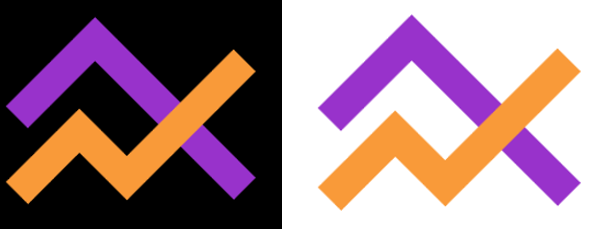

Figure 33: Same Static Icon Shown in Dark Theme (Left) and Light Theme (Right)

#### Adding Glow

Icons, particularly of small size, might have outlines with decreased visibility against dark backgrounds.

To make the icon outline legible against the dark background, add an additional offset outline of white (\#FFFFFF) set at 75% opacity. This renders a small “glow” around the icon when placed on a dark background, creating a visual boundary between its outline and the similar-colored background. The glow is not noticeable in the light background.

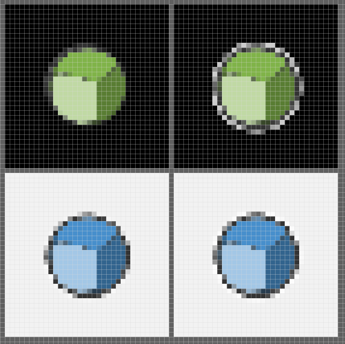

Figure 34: Pixel-Level View of Adding Glow on Dark and Light Backgrounds

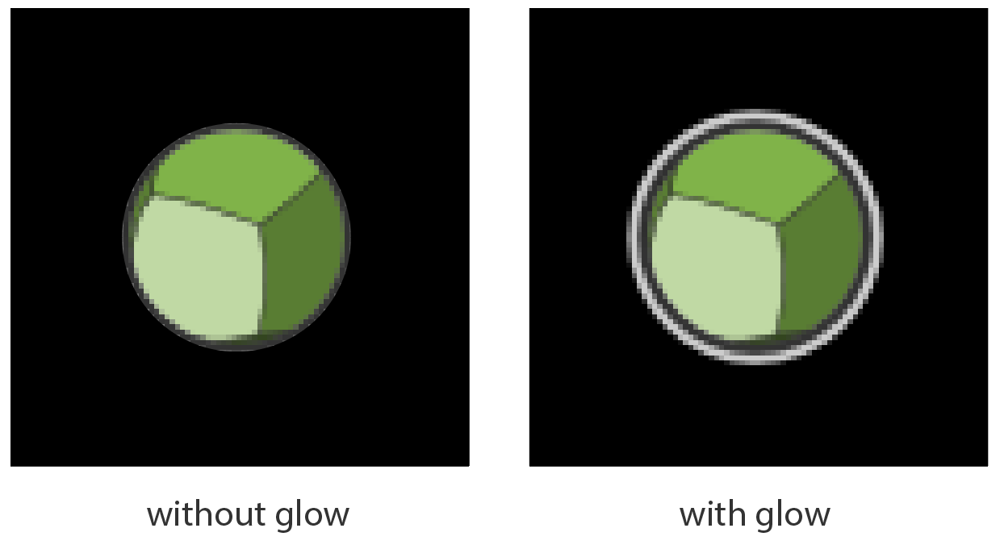

Figure 35: Dark Background: Icon with Glow Has a Visible Outline

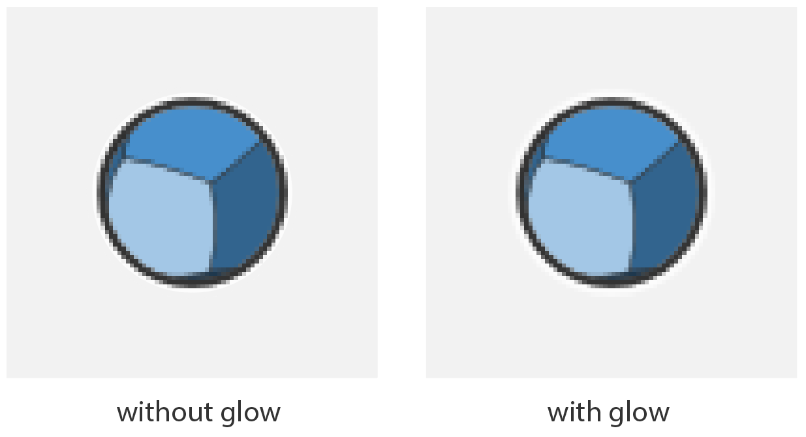

Figure 36: Light Background: Glow is Not Noticeable

#### Pixel Pushing

Contents of some icons might not render correctly at a small size. This is usually caused by the individual pixels of the icon shapes not aligning to the display’s pixel grid.

To address this problem, tweak the icon’s vector shapes while also checking how they render as pixels within a small size canvas (usually 16px).

If the icon will be used in the UI only in one specific size, the design should primarily address that size, but it is good practice to design for all the possible sizes. The pixel pushing is most useful for small size icons; for larger size icons, this step is recommended but not required.

Taking the example of a 12px icon, we can see that the one on the right has sharper details.

Figure 37: Icons without Pixel Pushing (Left) and with Pixel Pushing (Right)

Looking at these icons closely, notice that the elements are different. The icon on the right renders more crisply in smaller sizes because the colors are not partially allotted to a pixel (which leads to blur and fuzziness).

Figure 38: Zoomed-In View of Icons Shown Above

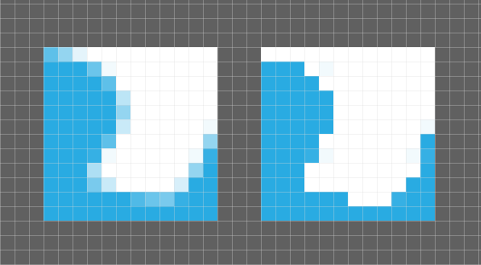

Figure 39: Pixel Grid Overlaid on Icons

#### Using Symbology

To make specific actions intuitive, use a standard set of symbols and graphic elements across icons. These symbols should convey functional or domain-specific engineering simulation concepts, and they are typically held constant within and across icon category groupings.

Examples:

-   Plus (+) symbols indicate a positive change in the application, like creating or adding something to a model or a physics condition.
-   The "X" symbol is often colored red to indicate negative changes such as canceling a process or removing a component.
-   Asterisks (\*) are often colored orange to indicate a reference or establish a relationship between processes or components in the application.

Symbols can be placed on a scale that ranges from completely abstract to the exact representation of the idea itself. Examples are shown below.

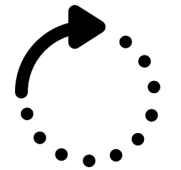

Figure 40: Custom Abstract Symbols

Figure 41: Universally Understood Abstract Symbols

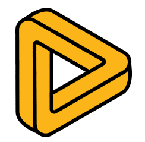

Figure 42: Brand Logos

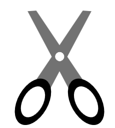

Figure 43: Representational Symbols of Objects

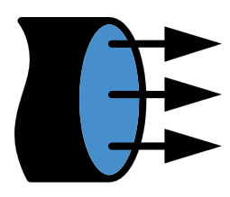

Figure 44: Combining Symbols to Generate Meaning

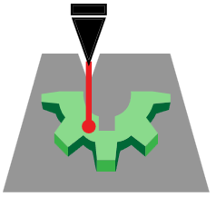

Figure 45: Representations of Objects

## Cheat Sheet

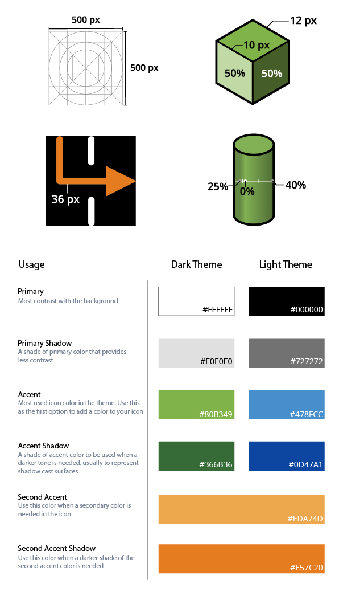

Figure 46: Cheat Sheet for Icon Design

# Revision History

| **​Version**  | **​Date**     | **​Description of Changes**                                                                                                                                                                                                                                                                                                                                                                                                                                                                                                                                                                                                                 |
|--------------|--------------|--------------------------------------------------------------------------------------------------------------------------------------------------------------------------------------------------------------------------------------------------------------------------------------------------------------------------------------------------------------------------------------------------------------------------------------------------------------------------------------------------------------------------------------------------------------------------------------------------------------------------------------------|
| ​23R2         | ​July 2023    | ​Initial version                                                                                                                                                                                                                                                                                                                                                                                                                                                                                                                                                                                                                            |
| ​24R1         | ​January 2024 | Updated Figures 1-7 and Excel spreadsheet to reflect changes to color palettes in [Color Palettes and Their Usage](#_Color_Palettes_and) Moved and updated information about [Font Colors](#font-colors) Updated the typefaces used by Discovery in [Typefaces](#typefaces) Clarified usage of small caps font treatment in [Small Caps](#small-caps), and added guidance for other [Font Treatments](#font-treatments) Updated information about [Main UI Fonts](#main-ui-fonts) and [Help Overlay Fonts](#help-overlay-fonts) Reorganized [Capitalization](#capitalization) section, and updated to reflect changes to small caps usage  |
| 24R2         | July 2024    | New row added in [Color Palettes and Their Usage](#_Color_Palettes_and) New section added for [3D Data Visualization Colors](#3d-data-visualization-colors)                                                                                                                                                                                                                                                                                                                                                                                                                                                                                |
