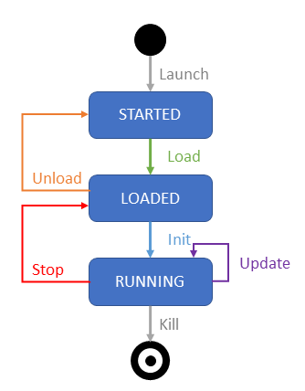

# Documentation

## Introduction

This document is intended for developers who need to develop client applications communicating with AVxcelerate Sensors Simulator internal services in order to:

- integrate AVxcelerate Sensors Simulator (AVX) in their driving simulation application,
- integrate the System Under Test (SUT) into the simulation loop.

This document describes how AVxcelerate Sensors Simulator works and how to use it. The API is composed of different protocol buffer contracts and gRPC services. In this document, the usage of the API is demonstrated in some code snippets written in C# programming language. Samples written in C++ and Python programming languages are provided in the *VSS API* folder.

## Overview

AVxcelerate Sensors Simulator embeds physics-based sensor models for camera, lidar and radar. It computes the sensor outputs from a virtual world model. The step-by-step execution of AVxcelerate Sensors Simulator is driven by an external software (referred below as "Simulation System"). External components, for example perception algorithms, can interact with AVxcelerate Sensors Simulator through the data acquisition or sensor feedback control interfaces. In summary, the API contains different services which allow to:

- drive the sensors' simulation using the *[Simulation](#simulation)* service,
- adjust the sensors' parameters during the simulation using the *[Feedback Control](#feedback_control_service)* service,
- adjust parameters of the lighting system during the simulation using the *[Lighting System Control](#ls_control_service)* service,
- being notified about new sensor data using the *Sensor Data Notifier* service, refer to [Notifications](#notifications),
- request or read sensor data using the *Data Access* service, refer to [Sensor data acquisition](#sensor_data_acquisition).


The API is designed to contain a minimum of simulation logic. This means that the responsibility for executing a blocking or a non-blocking loop is on the Simulation System side. AVX always waits until completion of each simulation command and sends back an acknowledgment when all components have been fully executed. It is the responsibility of the Simulation System to sequence the execution of all the software involved in the simulation (including AVX). In short terms AVxcelerate Sensors Simulator is totally passive in terms of simulation scheduling.

The AVxcelerate Sensors Simulator API is composed of different [protocol buffer](https://developers.google.com/protocol-buffers) contracts and [gRPC](https://grpc.io/) services defining the interface of AVxcelerate Sensors Simulator. In gRPC, a client application can directly call a method on a server application on a different machine as if it were a local object. Another benefit of using gRPC with protocol buffers is that the contract files (.proto) can be compiled into [different programming languages](https://grpc.io/docs/#official-support).

The usage of the API is demonstrated in some [Examples](#examples) provided in this documentation, with code snippets written in C# programming language.

## Services

This section presents the main services of the AVxcelerate Sensors Simulator API.

### Simulation

The *Simulation* service (exposed in the *simulation.proto* file) provides you with control procedures to monitor your simulation by requesting state transitions. The *ResourceUploader* service (exposed in the *upload.proto* file) allows you to upload resources as byte stream before loading them.

All possible states (started, loaded, running) and transitions (load/unload, initialize, update, stop and kill) of AVX during a simulation sequence are depicted in the following illustration.

*AVX State Machine*



Six control procedures (corresponding to the six possible state transitions) are provided in the *Simulation* service.

> **Note:** AVX simulation sequence/logic always must be considered when using simulation control procedures to trigger state transitions. Procedures that are not consistent with the  simulation transitions will end in error.
> Example of a valid simulation sequence: **LOAD** > **INIT** > n **UPDATE** > **STOP** > **UNLOAD** > **KILL**

> **Prerequisite:** When the track and/or assets are not files but byte streams, you must use the  *[Resource Uploader](#resource_uploader_service)* service to upload resources before being able to load them.

- **LOAD**: loads a new scene and configures simulation, sensors, and lighting systems.
    Always the **first** command.
  
    -> AVX switches to **LOADED** state.

- **INIT**: sets the scenario to its initial state (asset positions, date and time, etc.)
  
    -> AVX switches to **RUNNING** state and is ready to receive updates.

- **UPDATE**: applies a world update for a given simulation step and generates sensor data.
  
    -> AVX remains in **RUNNING** state.

- **STOP**: stops the simulation
  
    -> AVX switches to **LOADED** state.

- **UNLOAD**: allows to have a clear environment for a new simulation.
  
    -> AVX switches to **STARTED** state.

- **KILL**:  stops all AVX processes.
    The **KILL** command can be applied from any state. It can be used for example to end the simulation if there is a blocking problem.
    For a new simulation, AVX must be launched again after a **KILL** command.

For more information on the state transition commands, please refer to the [ResourceUploader service](../ref/reference-documentation.md#resourceuploader) service. For an implementation example, refer to [Simulation control example](#simulation_control_example).

### Resource Uploader{#resource_uploader_service}

The *Resource Uploader* service (exposed in the *upload.proto* file) is an alternative way to provide resources such as tracks, assets, sensor configurations, or lighting systems to AVxcelerate Sensors Simulator without referencing paths or sending binary data directly through the **Configuration** message of the **LOAD** command.

With the *ResourceUploader* service, using the **UPLOAD** command before executing the **LOAD** command, you upload those files and send their contents as a byte array using gRPC streaming capabilities.
The *ResourceUploader* service allows you to upload simultaneously multiple sensor configurations, lighting systems, and assets.

For more information, please refer to the vss::simulation::ResourceUploader service. For an implementation example, refer to [ResourceUploader example](#resource_uploader_example).

### Sensors Feedback Control{#feedback_control_service}

The *Feedback Control* service (exposed in the *feedback_control.proto* file) allows you to update sensor parameters during the simulation. It can only be used when AVX is in **RUNNING** state and has been started with the `-fbc` [process argument](https://ansyshelp.ansys.com/account/secured?returnurl=/Views/Secured/corp/v242/en/Optis_UG_VSS/Optis/UG_VSS/R_UG_VSS_simulation_arguments.html).

The process (external software) you will develop will be running as a closed-loop simulation to update sensor parameters in real-time.
It will retrieve sensor outputs, analyze them and if needed adjust them for the next output produced. The update of parameters sent to AVX will depend on your algorithms and defined thresholds.

> **Note:** Updating one or several sensor parameters through the Feedback Control triggers a sensor reload. Thus, a certain latency (more or less significant depending on your configuration) can be observed for the updated frame to be generated.
> Only three parameters can be updated without requiring a sensor reload: the camera gain, exposure and time encoding.

The Feedback Control is available for the following sensor parameters:

- All Sensors
  
  Sensor Protection (Beta feature)

  > **Note:** Once enabled, the protection of a sensor cannot be undone. In the current release, this feature only has an effect on radar sensors. A Tx Waveform Report will not be generated for radars that are protected.
  
- Camera Sensor
  
  Focal length | Wavelength of Focal length | Chromatic Dispersion presets | Focal Shift | Aperture values | Distortion values | Imager resolution | Exposure time | Readout noise values | Thermal noise values | Native bit depth | Gain | Output mode values | Time encoding
  
- Lidar Sensor
  
  All lidar parameters.
  
  For certain lidar parameters (rotating or flashing), the feedback control is only applied at the end of the frame: Rotation speed | Firing sequence | Firing frequency | Power | Responsivity | Aperture area | Pulse shape and duration | Max current | Max number of returns

- Radar Sensor
  
  All radar parameters **except** for:
  
  - Antenna Tx/Rx: Ids | Polarization | Horizontal and Vertical power beam width | Pattern identity (File) | Peak gain
  - Mode: Id | Multiplexing Type | Waveform | Center frequency | Transmission power
  
  The Feedback Control also allows you to activate or deactivate a radar mode during the simulation.
  
  > **Tips:** To know the modes IDs of the radars included in the sensor layout, you can [read the sensor configuration](https://ansyshelp.ansys.com/account/secured?returnurl=/Views/Secured/corp/v242/en/Optis_UG_VSS/Optis/UG_VSS/T_UG_VSS_reading_a_sensor_configuration.html) or use the Sensor Labs.

The complete list of available feedback control parameters can also directly be found in vss::feedback_control::FeedbackControl. For an implementation example, refer to [Sensor Feedback Control example](#feedback_control_example).

### Lighting System Control{#ls_control_service}

The *Lighting System Control* service allows you to retrieve and update lighting system parameters during the simulation. This service can only be accessed when AVX is in **RUNNING** state, has been started with the `-lsc` [process argument](https://ansyshelp.ansys.com/account/secured?returnurl=/Views/Secured/corp/v242/en/Optis_UG_VSS/Optis/UG_VSS/R_UG_VSS_simulation_arguments.html), and when a lighting system has been loaded during the simulation configuration.

For more information and a complete list of available lighting system control parameters, please refer to the vss::lighting_system_control::LightingSystemControl service. For an implementation example, refer to [Lighting System Control Example](#ls_control_example).

### Sensor data access

The *Sensor Data Notifier* service (exposed in the *sensor_data_output_notification.proto* file) allows an external software to be notified anytime sensor data is produced.
The *Data Access* service allows to retrieve the data. The requested sensor response can then be parsed to be processed with your own algorithm.

#### Notifications{#notifications}

During the simulation, sensors produce data according to their assigned frequency. An external software can subscribe to the sensor data notifications stream using the *SensorDataNotifier* service. AVX then streams notifications to the subscriber when new sensor data is produced.

Notifications are sent in a **SensorDataDescription** message which contains all the needed information to identify and acquire the data produced by a sensor during a simulation step.

Depending on the `output_splitting` value in the simulation parameters (vss::simulation::SimulationParameters), a sensor can produce multiple data during one single simulation step. All unique data identifiers along with some metadata are stored in the repeated `data_by_identifiers` field. The metadata contains information about the publisher's host address, the data access server port if available, and the characteristics of the data. The metadata also allows identification and filtering to access only data of interest.

> **Notes:**
>
> The fields `data_id` and `metadata` in the **SensorDataDescription** message contain values only if the data is not split. They are deprecated and kept only to ensure backward compatibility. Please prefer using the field `data_by_identifiers` to access data identifiers and metadata.
>
> If `data_by_identifiers` does not provide the data access server port, this means that the data is only available via shared memory.

For a complete description of this service, please refer to the vss::data_access::SensorDataNotifier service. For an implementation example, refer to [Subscription to sensor data notifications example](#sub_data_notification_example).

#### Sensor data acquisition{#sensor_data_acquisition}

During a simulation, the data produced by the sensors are added to a data store which holds the data in the shared memory, except if storage to shared memory is disabled in the simulation parameters. Once a notification about a new sensor output is received, the data can be requested using the unique data identifiers that are specified in the notifications.

Three different methods can be used to acquire the sensor data produced in a simulation:

- requesting it by calling the vss::data_access::DataAccess::RequestData method,
- requesting it through stream by calling the vss::data_access::DataAccess::RequestDataStream method,
- accessing it directly from the shared memory.

Accessing the sensor data directly from the shared memory is more performant than accessing it from the RPC. However, to access the data directly from the shared memory, the external software and AVX must be executed on the same machine. Accessing the data from the RPC through stream allows the user to bypass the 2 gigabytes limit from proto.

The AVxcelerate Sensors Simulator API contains some classes that implement the data access from the shared memory for Windows and Unix-based systems and for different programming languages (C#, C++, Python). This plugin allows you to use the same service definition for access from shared memory and access via RPC. For more details refer to vss::data_access::DataAccess. For an implementation example, refer to [Sensor data acquisition example](#sensor_data_acq_example).

#### Data retention

The data produced by the sensors are held in the data store until it is released. Not all the data generated by the sensors for all the simulation steps are held in the shared memory for the whole duration of the simulation in order to avoid overloading the memory.

By default, only the two last data blocks generated by each sensor are retained in the shared memory and accessible to the data consumer application. With this default behavior, when the data for the simulation step n is created, the data for the simulation step n-2 is erased. This behavior is equivalent to setting `maxStoredData` to `2`.

You can opt for one of the following two strategies for data retention:

- defining the **amount of data blocks** that are stored in parallel for each sensor (by setting the `maxStoredData` parameter),
- defining the lifetime for the data stored in the shared memory (by setting the `retentionTimeFrame` parameter).

For more details, refer to [Data Retention Strategy](https://ansyshelp.ansys.com/account/secured?returnurl=/Views/Secured/corp/v242/en/Optis_UG_VSS/Optis/UG_VSS/C_UG_VSS_data_retention_strategy.html) in AVxcelerate Sensors User's Guide.

The data retention strategy can be modified in the *Imagine.Pre.VssSpawner.dll.config* configuration file located in the AVX installation directory in *VSS/VssSpawner*. Refer to [Configuring the Data Retention Strategy](https://ansyshelp.ansys.com/account/secured?returnurl=/Views/Secured/corp/v242/en/Optis_UG_VSS/Optis/UG_VSS/C_UG_VSS_data_retention_strategy.html) in AVxcelerate Sensors User's Guide.

#### Data format

The sensor data stored in the shared memory is serialized using the vss::sensor_data::SensorData proto message. Therefore, the data buffer, received from the data request, must be parsed using this proto contract.

The Camera Output (Image) and Imager Output (Injection) of physics-based camera sensors can be stored unserialized by setting the sensor parameter `serialize_data` in vss::simulation::SimulationParameters to `false`.

By default, the sensor data contains all data produced by one single sensor during one simulation step. For example, the sensor data of a lidar sensor can contain point-cloud, waveform and contribution map data, depending on the simulation parameters provided during the loading phase. However, the data produced by a radar sensor can be split per mode or per transmitter, using the `output_splitting` field in the simulation parameters. In this case, the radar data are stored in shared memory as follows:

- **MODE**: for each mode one **SensorData** message is created containing the data of this single mode.
  
  > **Note:** When the Tx waveform report is activated and the data split per mode, one Tx waveform report will be contained in the data of each mode.

- **TRANSMITTER**: for each Tx antenna one **SensorData** message is created containing the data of this single Tx antenna
  
  > **Note:** When the Tx waveform report is activated and the data split per Tx, the same Tx waveform report will be contained in the data of each Tx antenna of one mode.

In the data notification, the field `data_by_identifiers` contains all data identifiers together with their metadata produced by one single sensor in one single simulation step.

### Ground Truth Data Helper

The *Ground Truth Data Helper* service (exposed in the *ground_truth_data_helper.proto* file) allows you to retrieve ground truth data from a sensor during a simulation. This service can only be accessed when AVX is in the **LOADED** or **RUNNING** state.

#### Contribution dictionary

 If a lidar sensor is loaded in the simulation, with the *contribution* simulation parameter set to *true*, a contribution dictionary can be requested using the *GetContributionDictionary* rpc method, with a sensor identifier as parameter. The returned data is a *ContributionDictionary* (vss::ground_truth_access::ContributionDictionary).

#### Pixel segmentation tag color map

 If a camera sensor is loaded in the simulation, with the `generatePixelSegmentation` parameter set to true, the tag/color map used by pixel segmentation algorithm can be requested by calling the `GetPixelSegmentationTagColorMap` method. The returned message is a PixelSegmentationTagColorMap containing TagColorMap data.

> **Notes:**
>
> Same TagColorMap data can be used in SimulationParameters.PixelSegmentationMapping to freely assign tag/color associations. All tags that are not associated with a color by the user are automatically assigned with a unique color by AVxcelerate Sensors Simulator.
>
> The tag/color map is common to all camera sensors.

For an implementation example, refer to [Ground Truth Data Helper example](#gt_helper_example).

## Examples{#examples}

This section provides examples showing how to prepare your own component for interacting with the different AVX interfaces.

Before continuing reading, if you are not familiar with the basic principles of Protocol Buffers and gRPC, please read the getting started guides on:

- [Protocol Buffers](https://developers.google.com/protocol-buffers)
- [gRPC](https://www.grpc.io/)

The following sections will give you guidance on how to use the different interfaces of AVX. The sample code is given in C# programming language. If you're programming in another programming language you can adapt the code snippets with the help of the gRPC documentation which includes examples for different programming languages.

### Preliminary steps{#preliminary_steps}

<ol>
<li>Compile all the needed protobuf contracts. Please follow the instructions on the Protocol Buffers and gRPC websites. There are several tutorials and documentation available.</li>
<li>Include the generated code into your project.</li>
</ol>
Then, you can start implementing your own logic.

### AVX internal gRPC server{#create_grpc_channel}

When AVX is launched with the argument `-p` for the port of the server, the AVX internal gRPC server listens for client requests on the specified host address and port.

> **Note:** The port value must be an integer and you must ensure that this port is not in use or blocked by any firewall.

To use the services of the gRPC server to interact with AVX, you need to implement a new gRPC client connecting to the server through a channel (HTTP/2 connection).

<ol>
<li>
Create a channel.

Here is an example in C# programming language:

```cs
Channel _channel = new Channel(hostName, portValue, ChannelCredentials.Insecure);
try
{
    _channel.ConnectAsync(DateTime.UtcNow.AddSeconds(5)).Wait();
}
catch (AggregateException e)
{
    Log.Error($"gRPC Channel failed to connect properly with host {hostName} and port {portValue}. Please check your AVX Server before connecting");
    throw new InvalidOperationException("gRPC connection failed", e);
}
```

</li>
<li>Wait 5 seconds, if the channel cannot be opened during this period, an error is raised.
</li>
</ol>

> **Note:** A gRPC channel should be reused when making gRPC calls. See also [Performance best practices with gRPC](https://docs.microsoft.com/en-us/aspnet/core/grpc/performance?view=aspnetcore-5.0#:~:text=Multiple%20gRPC%20clients%20can%20be,can%20make%20multiple%20simultaneous%20calls).

This channel will be used in the following client implementation examples.

### Simulation control example{#simulation_control_example}

#### Prerequisites

- The [preliminary steps](#preliminary_steps) are done: *simulation.proto* is compiled and included in your project.
- The gRPC channel is already [created](#create_grpc_channel).
- AVX is started with the following [process arguments](https://ansyshelp.ansys.com/account/secured?returnurl=/Views/Secured/corp/v242/en/Optis_UG_VSS/Optis/UG_VSS/R_UG_VSS_simulation_arguments.html):
  - `-p` followed by the port of the AVX internal gRPC server
  - when the client application is running on another machine, `-h` followed by the IP address of the machine on which AVX internal gRCP server is running.

#### Steps

<ol>

<li>
Instantiate the `Simulation.SimulationClient` class from the gRPC channel. The class `SimulationClient` is generated from the protobuf contract which defines the *Simulation* service.
</li>

```cs
_client = new Simulation.SimulationClient(_channel);
```

<li>
Use the client to send the different commands to AVX and receive back the command status. Make sure your command order is compliant with AVX State Machine.
</li>

```cs
// Example of usage of the STOP command

Status status = _client.Stop(new Empty());

if (status.Code == StatusCode.UnknownFailure)
{
    // Handle error case
    throw new Exception($"Stop command failed to execute properly. Message: {status.Message}");
}

// status.Code == StatusCode.Success -> Simulation is stopped
// ...
```

<li>
Implement your logic according to your needs. Refer to the vss::simulation::Simulation service.

</li>

<li>
At the end of the simulation close the channel and dispose of all objects.
</li>

<li>
Implement an error processing that sends a **KILL** command to stop AVX properly if something goes wrong in your code, otherwise AVX processes will not be closed properly, thus preventing the application from restarting.
</li>

</ol>

> **Note:** **LOAD** must always be the first command sent to AVX, except if you use the **UPLOAD** command of the *ResourceUploader Service* prior to the **LOAD** command. For more information about using the the *ResourceUploader Service*, refer to [Resource Uploader example](#resource_uploader_example).
> **KILL** must be the last command sent to AVX.

### Resource Uploader example{#resource_uploader_example}

#### Prerequisites

- The [preliminary steps](#preliminary_steps) are done: *upload.proto* is compiled and included in your project.
- The gRPC channel is already [created](#create_grpc_channel).
- AVX is started with the following [process arguments](https://ansyshelp.ansys.com/account/secured?returnurl=/Views/Secured/corp/v242/en/Optis_UG_VSS/Optis/UG_VSS/R_UG_VSS_simulation_arguments.html):
  - `-p` followed by the port of the AVX internal gRPC server
  - when the client application is running on another machine, `-h` followed by the IP address of the machine on which AVX internal gRCP server is running.

#### Steps

<ol>

<li>

Instantiate the `ResourceUploader.ResourceUploaderClient` class from the gRPC channel. The class `ResourceUploaderClient` is generated from the protobuf contract defining the *ResourceUploader* service.
</li>

```cs
 _client = new ResourceUploader.ResourceUploaderClient(rpcChannel as RpcChannel);
```

<li>

Make sure AVX is in the **STARTED** state.
</li>

<li>
Request the upload of the desired resource(s) using a unique identifier for each resource and defining the correct metadata according to the type of the resource.

- For Tracks, Assets, or Lighting Systems the metadata consists in the resource identifier (`ResourceIdentifier`) and is mandatory, for example:

```cs
        UploadMetadata = new UploadMetaData
        {
            Values =
            {
                {
                    "ResourceIdentifier", resourceIdentifierValue
                }
            }
        }        
```

- For Sensor Configurations, the resource type (`ResourceType`) must be specified as a sensor configuration (`SensorConfiguration`), for example:

```cs
        UploadMetadata = new UploadMetaData
        {
            Values =
            {
                {
                    "ResourceType", "SensorConfiguration"
                }
            }
        }
```

The following example demonstrates the process of uploading one resource file using gRPC streaming. First, the resource file is opened as a stream. Then, byte arrays are extracted from the stream for transmission via gRPC streaming. This approach applies to various resource types.

```cs

        public async Task<Status> UploadResource(FilePath resourcePath, string resourceIdentifier)
        {
            var uploadResourceCall = _client.UploadResource();
                
            // the first RequestStream should contain the metadata.
            await uploadResourceCall.RequestStream.WriteAsync(new UploadRequest
            {
                UploadMetadata = new UploadMetaData
                {
                    Values =
                    {
                        {
                            "ResourceIdentifier", resourceIdentifier
                        }
                    }
                }
            });
        
            // send the resource byte content (here we read the bytes from a file stream)
            await using var readStream = File.OpenRead(resourcePath);
        
            var buffer = new byte[1024 * 1024];
            int count;
            while ((count = await readStream.ReadAsync(buffer)) != 0)
            {
                await uploadResourceCall.RequestStream.WriteAsync(new UploadRequest
                {
                    Data = UnsafeByteOperations.UnsafeWrap(buffer.AsMemory(0, count))
                });
            }
        
            await uploadResourceCall.RequestStream.CompleteAsync();
        
            return await uploadResourceCall;
        }
```

</li>

<li>You can now load the uploaded resources using the **LOAD** command of the *Simulation* service. Ensure that in the **Configuration** message of the **LOAD** command, the `vss.ResourceIdentifier` field aligns with the identifier assigned in the `UploadMetadata` of the uploaded resource:

 - for Tracks, Assets, or Lighting Systems: the `vss.ResourceIdentifier` must match the identifier set in the `UploadMetadata` to correctly reference the track, asset, or lighting system,
 - for Sensor Configurations: the `vss.ResourceIdentifier` is optional, you do not have to assign an identifier to load a sensor configuration.

</li>

</ol>

### Sensor Feedback Control example{#feedback_control_example}

#### Prerequisites

- The [preliminary steps](#preliminary_steps) are done: *feedback_control.proto* is compiled and included in your project.
- The gRPC channel is already [created](#create_grpc_channel).
- AVX is started with the following [process arguments](https://ansyshelp.ansys.com/account/secured?returnurl=/Views/Secured/corp/v242/en/Optis_UG_VSS/Optis/UG_VSS/R_UG_VSS_simulation_arguments.html):
  - `-p` followed by the port of the AVX internal gRPC server
  - when the client application is running on another machine, `-h` followed by the IP address of the machine on which AVX internal gRCP server is running.
  - `-fbc`

#### Steps

<ol>
<li>

Instantiate the `FeedbackControl.FeedbackControlClient` class from the gRPC channel. The class `FeedbackControlClient` is generated from the protobuf contract which defines the *FeedbackControl* service.
</li>

```cs
_client = new FeedbackControl.FeedbackControlClient(_channel);
```

<li>
Wait for the simulation to be in **Running** state.
</li>

<li>

At any time in **Running** state, you can send a request to adjust sensor parameters by calling the `FeedbackControl.FeedbackControlClient.Send()` method with the appropriate parameters in each request:

  - the *sensor_id* as it is defined in the sensor configuration given to AVX,
  - at least one of the sensor parameters (but you can also provide multiple parameters for one sensor in a single request).

```cs
// Example for camera

FeedbackControl feedback = new FeedbackControl
{
    sensorId = "vehicle_front_camera",
    feedbackControlCameraParameters = new FeedbackControlCameraParameters
    {
        gain = 1.3,
        injectionTime = 100
    }
};

Status status = _client.Send(feedback);

if (status.Code == StatusCode.UnknownFailure)
{
    // Handle error case
    throw new Exception($"Send feed back command failed. Message: {status.Message}");
}

// status.Code == StatusCode.Success -> go on with your logic
```

</li>

<li>
Implement your logic according to your needs. Refer to the vss::feedback_control::FeedbackControl service.
</li>

</ol>

### Lighting System Control example{#ls_control_example}

#### Prerequisites

- The [preliminary steps](#preliminary_steps) are done: *lighting_system_control.proto* is compiled and included in your project.
- The gRPC channel is already [created](#create_grpc_channel).
- AVX is started with the following [process arguments](https://ansyshelp.ansys.com/account/secured?returnurl=/Views/Secured/corp/v242/en/Optis_UG_VSS/Optis/UG_VSS/R_UG_VSS_simulation_arguments.html):
  - `-p` followed by the port of the AVX internal gRPC server
  - when the client application is running on another machine, `-h` followed by the IP address of the machine on which AVX internal gRCP server is running.
  - `-lsc`

#### Steps

<ol>

<li>

Instantiate the `LightingSystemControl.LightingSystemControlClient` class from the gRPC channel. The class `LightingSystemControlClient` is generated from the protobuf contract which defines the *LightingSystemControl* service.
</li>

```cs
_client = new LightingSystemControl.LightingSystemControlClient(_channel);
```

<li>
Wait for the simulation to be in **Running** state.
</li>

<li>
At any time in *Running* state you can send a:

  - Set request to update lighting system parameters by calling the `LightingSystemControl.LightingSystemControlClient.Set()` method with appropriate parameters and get the feedback status.
  - Get request to retrieve the current lighting system state by calling the `LightingSystemControl.LightingSystemControlClient.Set()` method with appropriate parameters.

</li>

<li>
Implement your logic according to your needs. Refer to the vss::lighting_system_control::LightingSystemControl service.

</li>

</ol>

### Subscription to sensor data notifications example{#sub_data_notification_example}

#### Prerequisites

- The [preliminary steps](#preliminary_steps) are done: *sensor_data_output_notification.proto* is compiled and included in your project.
- The gRPC channel is already [created](#create_grpc_channel).

#### Steps

<ol>
<li>
Instantiate the `SensorDataNotifier.SensorDataNotifierClient` class from the gRPC channel. The class `SensorDataNotifierClient` is generated from the protobuf contract which defines the *SensorDataNotifier* service.
</li>

```cs
var client = new SensorDataNotifier.SensorDataNotifierClient(_channel);
```

<li>
Start AVX and subscribe to notifications. You can subscribe to notifications as soon as AVX is ready to receive RPC requests.
</li>

```cs
using (var call = client.Subscribe(new Empty()))
{
    while (await call.ResponseStream.MoveNext(CancellationToken.None))
    {
        SensorDataDescription notification = call.ResponseStream.Current;
        // Go on with your business logic e.g. filter notifications, request data, ...
    }
}
```

> **Note:** As notifications might come in fast, you should consider treating them as fast as possible. For example analyzing notifications and requesting data outside of the *while* loop, inside another thread might be a good idea.

</ol>

### Sensor data acquisition example{#sensor_data_acq_example}

You can access the sensor data in two different ways depending on your use case.

#### Accessing the sensor data directly from the shared memory

> **Note:** To access the sensor data directly from the shared memory, the sensor and the component requesting the data must be located on the same machine.

##### Prerequisites

<ol>
<li>Compile all the needed protobuf contracts. Please follow the instructions on the Protocol Buffers and gRPC websites. There are several tutorials and documentation available.</li>
<li>Generate the plugin. To do so, three executables are provided in the *VSS_API > bin* folder.

Assuming you start from a given protobuf contract, you can generate extra tooling leveraging built-in `protoc` plugin mechanism.

```shell
> protoc.exe --shm_out=<shmOutputFolder> \
             --plugin=protoc-gen-shm=<shm_xx_plugin.exe> \
             --proto_path=<myProtoFolder> <MyProtoFile>
```

Where <shm_xx_plugin.exe> is the path to *shm_cpp_plugin.exe*, *shm_csharp_plugin.exe* or *shm_python_plugin.exe*.

You end up with an *xxx.shm.h*| *xxx.shm.cs* | *xxx.shm.py* file.

You can of course enrich an existing `protoc` command line (generating gRPC files) with `--shm_out` and `-plugin=protoc-gen-shm` options. Then you will end up with an extra xxx.shm.h|cs|py file, along with well-known generated ones ie *xxx.pb*, *xxx.grpc.pb* & *xxx.grpc.pb*.

> **Note:** The function signature in generated `.shm` files shall be compatible with gRPC function signature.
> Thus, when you generate both `.shm` and gRPC files, it is recommended to use the same gRPC version that the Shm plugin version.
> You can find this version in the header of the generated `.shm` files.

</li>
<li>Include the generated code into your project.</li>
</ol>

##### Steps

<ol>

<li>
Start AVX and subscribe to notifications.
</li>

<li>
Once a notification about new sensor data is received, the data can be acquired in one of two ways:
    - doing a call with a client instance that has the same signature as the call from data access server.
    - doing a static call with the sensor data identifier you want to request from the shared memory.

Both methods use the same underlying code and are differentiated only in their function signature.

</li>

* Instance call:

```cs
// Create client
var channel = new Channel("localhost:50051", ChannelCredentials.Insecure);
var client  = new DataAccess.DataAccessClient(channel);

// Request Data
Task<SensorDataBuffer> res = await client.RequestDataOptimized(sensorDataIdentifier);
SensorDataBuffer sensorDataBuffer = res.Result;
```

* Static call:

```cs
// Request Data
SensorDataBuffer sensorDataBuffer = DataAccess.DataAccessClient.RequestDataQuery(sensorDataIdentifier);
```

<li>
You can parse the received data buffer using the class `SensorData` generated from the *sensor_data.proto* file:
</li>

```cs
if (sensorDataBuffer.Data.IsEmpty)
{
    // An empty buffer is returned if data couldn't be retrieved (e.g. when data is already released)
}
else
{
    // Deserialize data buffer
    SensorData data = SensorData.Parser.ParseFrom(sensorDataBuffer.Data);
}
```

</ol>

#### Accessing the sensor data using the RPC

##### Prerequisites

- The [preliminary steps](#preliminary_steps) are done: are done: *sensor_data_access.proto*, *sensor_data_buffer.proto* and *sensor_data.proto* are compiled and included in your project.
- AVX is started with the following [process argument](https://ansyshelp.ansys.com/account/secured?returnurl=/Views/Secured/corp/v242/en/Optis_UG_VSS/Optis/UG_VSS/R_UG_VSS_simulation_arguments.html):
  - `-p` followed by the port of the AVX internal gRPC server
  - when the client application is running on another machine, -h followed by the IP address of the machine on which AVX internal gRCP server is running.
  - `-d`

##### Steps

<ol>
<li>
Create a gRPC channel to communicate with the **Data access server**. The client can only receive 4 MB by default, so you need to setup the channel and set the length for any received message to unlimited (-1 for unlimited).
</li>

```cs
// Specifying the host address and port number of the data access server
var endpoint = "localhost:50508"

// Instanciating the gRPC channel
var channel = new Channel(endpoint,
                             ChannelCredentials.Insecure,
                          new List<ChannelOption>
                          {
                            new ChannelOption(ChannelOptions.MaxReceiveMessageLength, -1)
                          });
```

<li>
Instantiate the `DataAccessClient` class from the gRPC channel. The class `DataAccessClient` is generated from the Protobuf contract which defines the *DataAccess* service.
</li>

```cs
// Create client
var client = new DataAccess.DataAccessClient(channel);
```

<li>
Start AVX with the sensor data access server (argument `-d <PORT>`) and subscribe to notifications as described in **Subscription to Sensor Data Notifications Example**.
</li>

<li>
Once a notification about new sensor data is received, you have two choices:

- [Request Data through a single proto message](#req_data_single)
- [Request Data through a stream](#req_data_stream)

</li>
</ol>

###### Request data through a single proto message{#req_data_single}

<ol>

<li>

The data can be acquired through a single message by calling the **DataAccessClient.RequestData** method and using the unique data identifier acquired from the notification.
</li>

```cs
// Request Data
Task<SensorDataBuffer> sensorDataTask = client.RequestDataAsync(sensorDataIdentifier).ResponseAsync;
SensorDataBuffer sensorDataBuffer = sensorDataTask.Result;
```

<li>
You can parse the received data buffer using the class `SensorData` generated from the *sensor_data.proto* file:
</li>

```cs
if (sensorDataBuffer.Data.IsEmpty)
{
    // An empty buffer is returned if data couldn't be retrieved (e.g. when data is already released)
}
else
{
    // Deserialize data buffer
    SensorData data = SensorData.Parser.ParseFrom(sensorDataBuffer.Data);
}
```

</ol>

###### Request Data through a stream{#req_data_stream}

<ol>
<li>
In stream mode, data is split and sent to clients in chunks. These data chunks can be acquired through a stream by calling the **DataAccessClient.RequestDataStream** method and using the unique data identifier obtained from the notification.
</li>

```cs
// Request Data
using var streamingCall = _client.RequestDataStream(sensorDataIdentifier);

```

<li>
You can concatenate the data chunks received through the stream into a byte array:
</li>

```cs
using var memoryStream  = new MemoryStream();
while (await streamingCall.ResponseStream.MoveNext(CancellationToken.None))
  {
    memoryStream.Write(streamingCall.ResponseStream.Current.Data.ToByteArray());
  }
return memoryStream.ToArray();
```

<li>

By default, the size of a stream data chunk is **256 kB**. You can modify the size of data chunk by editing the *VRXPERIENCE_Sensors_dataAccessServer.dll.config* file (delivered with AVX installation, located in the executable folder). To do so, change the value for the **sensorDataChunkSize** key (must be a positive integer).

````cs
    <appSettings>
        <add key="isDiagnosticOn"
             value="false"/>
        <add key="sensorDataChunkSize"
             value="262144"/>
    </appSettings>
````

</li>
</ol>

### Ground Truth Data Helper example{#gt_helper_example}

#### Prerequisites

- The [preliminary steps](#preliminary_steps) are done: *ground_truth_data_helper.proto* is compiled and included in your project.
- The gRPC channel is already [created](#create_grpc_channel).

#### Steps

<ol>

<li>
Instantiate the `GroundTruthDataHelper.GroundTruthDataHelperClient` class from the gRPC channel. The class `GroundTruthDataHelperClient` is generated from the protobuf contract which defines the *GroundTruthDataHelper* service.

```cs
_client = new GroundTruthDataHelper.GroundTruthDataHelperClient(_channel);
```

</li>
<li>
Wait for the simulation to be in **Loaded** or **Running** state.

At any time in **Loaded** or **Running** state you can send a:

<ul>
<li>

`GetContributionDictionary` request to retrieve the current contribution dictionary of a lidar by calling the `GroundTruthDataHelper.GroundTruthDataHelperClient.GetContributionDictionary(SensorIdentifier)` method with the wanted sensor identifier.
</li>
<li>

`GetPixelSegmentationTagColorMap` request to retrieve the tag/color map used in the camera pixel segmentation algorithm by calling the `GroundTruthDataHelper.GroundTruthDataHelperClient.GetPixelSegmentationTagColorMap (new Empty())`.
</li>

</ul>
<li>
Implement your logic according to your needs. Refer to the vss::ground_truth_access::GroundTruthDataHelper service.
</li>
</ol>
