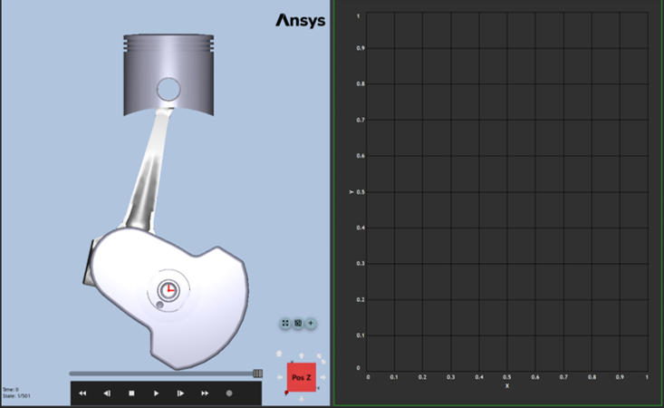
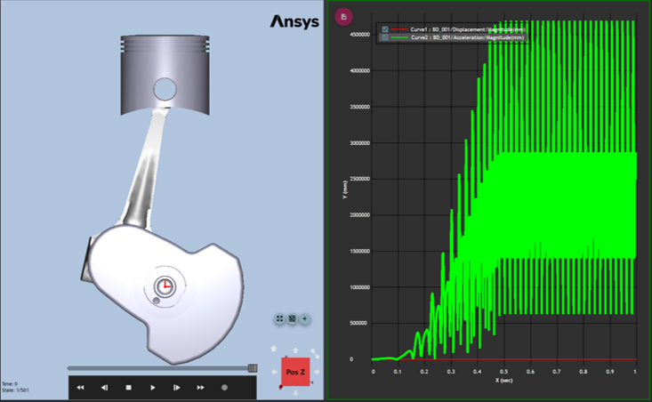
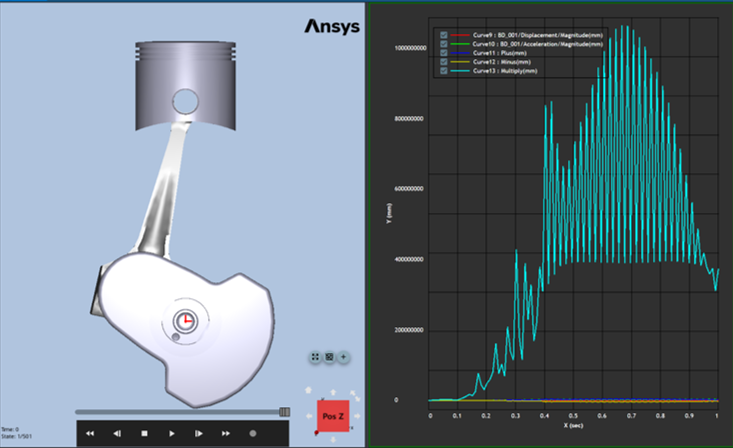
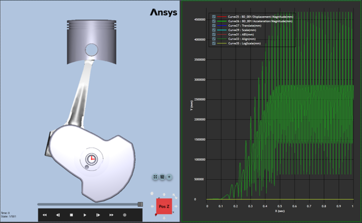
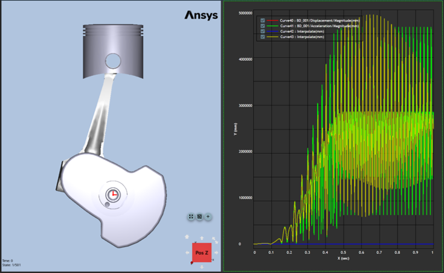
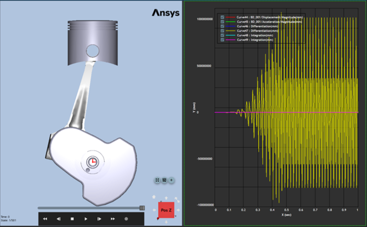
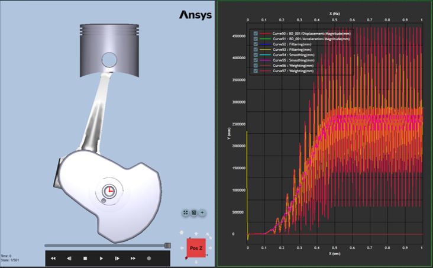
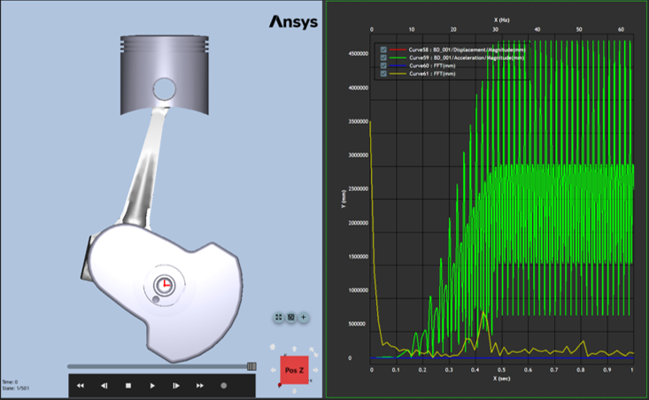
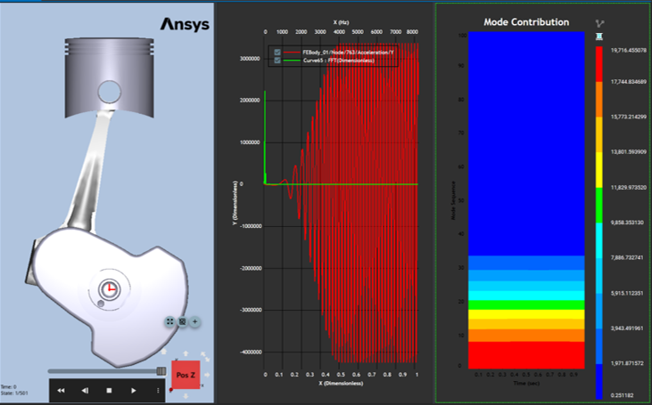

# Chart
The following sample code illustrates how to create a simple example.
* The example was created using "Ansys installed path/Motion/Document/Modal Flex.zip"

## Common Settings
```
# Import the appropriate classes from .Net C# library.
from System.Collections.Generic import List

# Import the appropriate classes from the Ansys Motion Standalone Postprocessor C# library.
from VM.Models.OutputReader import *
from VM.Models.Post import *
from VM.Operations.Post.Models import *
from VM.Operations.Post.Utilities import *
from VM.ViewModels.Post import *
from VM.ViewModels.Post.Entities.Charts import *
from VM.Windows.Post.Controls.Model import *

# Start the headless application interface
applicationHandler = ApplicationHandler()

# Import result file
filepath = r'ModalFlex.dfr'
paths = List[str](1)
paths.Add(filepath)
applicationHandler.AddDocument(paths)
```
## Create Plot View
Chart view is useful for analyzing simulation results by using a graph which is composed of data points.


```
# Create PlotView
chartView = applicationHandler.AddPlotView()
```

## Create Curve
A graph can be added to the activated chart view. 
For combinations of paths(Characteristic, Component) on the curve, refer to Common Settings in [Getting Started with the Python language](getting_started_operation_api_using_py.md).


```
# Set array about combination of characteristic and component
curvePaths = List[str]()
curvePaths.Add(r'Displacement/Magnitude')

# Set a Curve Parameter
parameters = PlotParameters()
parameters.Paths = curvePaths
parameters.Target = "BD_001"

# Add Curves (FilePath, Curve Parameter)
# FilePath - The path of the result to access.
# parameters - The class used as a parameter of the AddCurve function.
# The instance of the curve.
curves = chartView.AddCurves(filepath, parameters)

# Multiple Curve
# Set array about entity names
entitynames = List[str]()
entitynames.Add("BD_001")
entitynames.Add("BD_003")

# Set array about combination of characteristic and component
curvePaths = List[str]()
curvePaths.Add(r'Displacement/X')
curvePaths.Add(r'Displacement/Z')

# Set a Curve Parameter
# Targets - Entity names
# Paths - array about combination of characteristic and component 
# Sum - The sum of curves of all entities, including the same path(Characteristic, Component).
parameters = PlotParametersEx()
parameters.Paths = curvePaths
parameters.Targets = entitynames
parameters.Sum = True

# Add Curves (FilePath, Curve Parameter)
# FilePath - The path of the result to access??
# parameters - The class used as a parameter of the AddCurve function.??
curves = chartView.AddCurves(filepath, parameters)
```

## Simple Math
It is perform addition, subtraction and multiplication between graphs in the chart view. At least two graphs must be selected for the operation.


```
# seriesNames - The list of the curve name to perform the operation.
# simpleMathType - The types of the simple math are as follows.
# points - The number of data points for interpolation.

# Add
chartView.CreateSimpleMath(curves, SimpleMathType.Add, 100)

# Subtract
chartView.CreateSimpleMath(curves, SimpleMathType.Subtract, 100)

# Multiply
chartView.CreateSimpleMath(curves, SimpleMathType.Multiply, 100)
```

## Transform
It is transform graphs through translate, align, scale, and absolute in the chart view.


```
# Transform - Translate
# OffsetX - The value to translate for X- axis.
# OffsetY - The value to translate for Y- axis.
chartView.CreateTranslate(curves, 0, 100)

# Transform - Scale
# ScaleX - The value to scale for X- axis.
# ScaleY - The value to scale for Y- axis.
chartView.CreateScale(curves, 2, 2)

# Transform - Absolute
# SignType - The types of the absolute value are as follows.
chartView.CreateAbsolute(curves, SignType.Positive)

# Transform - Align (Zero, Curve)
# AlignType - The types of the alignment are as follows.
chartView.CreateAlign(curves, AlignType.Curve)

# Transform - Log Scale
# Coeficient - The value of the coefficient.
# BaseValue - The value of the base.
# Decibel - Taking the decibel scale for the list of the curve (20Log_10(Y)).
chartView.CreateLogScale(curves, 10, 10, False)
```

## Interpolation
It is interpolate graphs with the desired number of data points in the chart view.


```
# SeriesName - The list of the curve name to perform the operation.
# Points - The number of the data points for interpolation.
chartView.CreateInterpolation(curves, 200)
```

## Calculus
It is integrate or differentiate graphs in the chart view.


```
# Calculus - Differentiation
chartView.CreateDifferentiatedCurve(curves)

# Calculus - Integration
chartView.CreateIntegratedCurve(curves)
```

## Signal Processing
It is perform data filtering and smoothing of graphs in the chart view.


```
# Signal Processing - Filtering (LowPass, HighPass, BandPass, BandStop)
# SeriesName - The list of the curve name to perform the operation.
# FilteringType - The types of the filter are as follows.
# Order - As decreasing value, output would be more smooth.
# Cut off Frequency(Hz) (Low Cut off Frequency(Hz)) - The value of frequency1.
# High Cut off Frequency(Hz) - The value of frequency2.
chartView.CreateFiltering(curves, FilteringType.LowPass, 2, 100, 100)

# Signal Processing - Smoothing
# SeriesName - The list of the curve name to perform the operation. 
# SmoothingType - The types of the sommthing are as follows.
# PointsOfWindow - The number of points for window.
# PolyOrder - The value of polyOrder.
chartView.CreateSmoothing(curves, SmoothingType.MovingWindowAveraging, 8, 2)

# Signal Processing - FrequencyWeighting
# SeriesName - The list of the curve name to perform the operation.
# WeightingType - The types of the weighting are as follows.
# AxisType - The types of the axis are as follows. chartView.CreateFrequencyWeighting(series, WeightingType.AWeighting, FrequencyAxisType.X)
chartView.CreateFrequencyWeighting(curves, WeightingType.AWeighting, FrequencyAxisType.X)
```

## FFT
It is transform data in the time domain to the frequency domain by using the Fast Fourier Transformation method (FFT) in the chart view.



```
# SeriesNames - The list of the curve name to perform the operation
# FFTType - Magnitude, Phase
# FFTWindowType - Rectangular, Triangular, Bartlett, Hanning, Hamming, Welch, BlackMan, None
# ScaleType - Original, Logarithm, Decibel
# Points - The number of data point for FFT
# Start - The start time for using FFT on target data series
# End - The end time for using FFT on target data series
chartView.CreateFFT(curves, FFTType.Magnitude, FFTWindowType.Rectangular, ScaleType.Original, 128, 0, 1.0)
```

## STFT
The short time furrier transformation method(STFT) can transform the data in time domain to the frequency domain. this example describes how to create the STFT.
* The color map plot is supported through this operation.



```
# SamplingFrequency  - the number of the interval for dividing Y direction grids on color map.
# TimeSlice - the number of the interval for dividing  X direction grids on color map.
# Overlap - the value of the percentage for setting overlapped intervals.
# SelectedPoints - the number of data point for FFT.
# Start - the start time for using FFT on target data series.
# End - the end time for using FFT on target data series.
# ReferenceValue - the reference value on decibel as the type of the scale.
# ScaleFactor - the scale factor to change from time domain to another domain.
# SelectedScaleType - the scale type of STFT. STFT Scale Type has Original, Decibel.
data = HeatMapSTFTDataViewModel()
data.SamplingFrequency = 100
data.TimeSlice = 0.05
data.Overlap = 50
data.SelectedPoints = 16384
data.Start = 0
data.End = 1.000000000001
data.ReferenceValue = 1E-05
data.ScaleFactor = 1.0
data.SelectedScaleType = STFTScaleType.Original
chartView.CreateSTFT(data, fft)
```