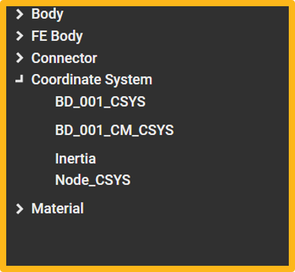

# Animation

The following sample code illustrates how to create a simple example.

* The example was created using "Ansys installed path/Motion/Document/Modal Flex.zip"
* 
## Common Settings

```
# Import the appropriate classes from .Net C# library.
from System.Collections.Generic import List

# Import the appropriate classes from the Ansys Motion Standalone Postprocessor C# library.
from VM.Models.OutputReader import *
from VM.Models.Post import *
from VM.Operations.Post.Models import *
from VM.Operations.Post.Utilities import *
from VM.ViewModels.Post import *
from VM.ViewModels.Post.Entities.Charts import *
from VM.Windows.Post.Controls.Model import *

# Start the headless application interface
applicationHandler = ApplicationHandler()

# Import result file
filepath = r'result file path'
paths = List[str](1)
paths.Add(filepath)
applicationHandler.AddDocument(paths)
```

## Create Coordinate System

The Coordinate system can be created from various entities in the result as below, and this example describes how to create the Coordinate System.

* Rigid Body
* FE Node
* Marker



```
# Name - Set the name of instance.
# ParentInfo - Specifies The path of an parent entity.
animationview.CreateCoordinateSystem("Node_CSYS", "FEBody_01/Node/763")
animationview.CreateCoordinateSystem("BD_001_CSYS", "BD_001")
animationview.CreateCoordinateSystem("BD_001_CM_CSYS", "BD_001/CM")

# Get instance of entity view model
csys = animationview.GetViewModelByName("BD_001_CSYS")
csys.Position = "0, 250, 0"
csys.MarkerSize = 10
```
