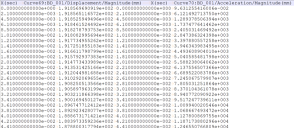

# Example

The following sample code illustrates how to create a simple example.
* The example was created using "Ansys installed path/Motion/Document/Modal Flex.zip"

## Common Settings

```
# Using Python.NET
# Import the appropriate classes from .Net C# library.
from System.Collections.Generic import List

# Import the appropriate classes from the Ansys Motion Standalone Postprocessor C# library.
from VM.Models.OutputReader import *
from VM.Models.Post import *
from VM.Operations.Post.Models import *
from VM.Operations.Post.Utilities import *
from VM.Post.API.OutputReader import *
from VM.ViewModels.Post import *
from VM.ViewModels.Post.Entities.Charts import *
from VM.Windows.Post.Controls.Model import *

# Start the headless application interface
applicationHandler = ApplicationHandler()

# Import result file
filepath = r'result file path'
paths = List[str](1)
paths.Add(filepath)
applicationHandler.AddDocument(paths)
```

## Export All Curves

Export all curves on active plot view.



```
# Set the save file path
chartView.ExportAllCurves(r'file path')
```

## Export Image

Export image for plot view.

```
# Using Python.NET
import clr
clr.AddReference("SciChart.Core")

# Import the appropriate classes from .Net C# library.
from SciChart.Core import *

# Plot ViewModel - The target plot view of the curve with import numeric​.
# File Path - The path of the file with curve data.​
# ExportType - Provides values for ExportType with Png, Jpeg, Bmp, Xps​.
applicationHandler.ExportImage(chartView, "file path", ExportType.Png)
```
