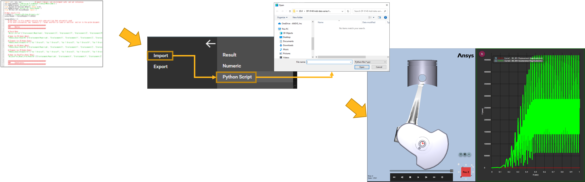

# Getting Started with the Python language

The Ansys Motion Standalone Postprocessor C# library can be used in the python code by using [Python.NET](https://pythonnet.github.io/) or [IronPython](https://ironpython.net/).

## System requirements

If you are using CPython, you will need to install Python.NET first.

```
pip install pythonnet
```

## Notes

* As shown in the figures below, to create curves using the Operation API, you need to know the following information. When you see the "AddCurves" function within the UI, you can observe Characteristics and Components.
The combination of these paths(Characteristics, Components) can be used as input values within the function "AddCurves"

	

## How to execute Operation API

For executing operations, Import file includes Python script as follows :

- Make the file includes operation script.
- Import the file on Postprocessor.(Dropdown menu -> Import -> Python Script)



## The [API](lib/VM.Operations.Post.Interfaces.md) class

The Ansys Motion Standalone Postprocessor C# library supports the headless application interface. The [API](lib/VM.Operations.Post.Interfaces.md) class allows you to use it.

```
from VM.Operations.Post.Models import *

applicationHandler = ApplicationHandler()
# Enter your code here.
```

## Example

The following sample code illustrates how to create and analyze a simple example:

```
# Using Python.NET

# Import the appropriate classes from .Net C# library.
from System.Collections.Generic import List

# Import the appropriate classes from the Ansys Motion Standalone Postprocessor C# library.
from VM.Models.OutputReader import *
from VM.Operations.Post.Models import *

# Start the headless application interface
applicationHandler = ApplicationHandler()

# Import result file
filepath = r'result file path'
paths = List[str](1)
paths.Add(filepath)
applicationHandler.AddDocument(paths)

# Create PlotView
chartView = applicationHandler.AddPlotView()

# Get a active plot view
chartView = applicationHandler.GetActivePlotView()

# Create Curve
parameters = PlotParameters()
parameters.Paths = List[str](2)
parameters.Target = "BD_001"
parameters.Paths.Add(r'Displacement/X')
parameters.Paths.Add(r'Displacement/Z')
chartView.AddCurves(filepath, parameters)

# Close a view
applicationHandler.RemoveView("view name"")

# Close a Document
applicationHandler.RemoveDocument("result file path")
```

## See also

* [Python.NET](https://pythonnet.github.io/)
* [IronPython](https://ironpython.net/)
* [Reference](lib/VM.md)
	* [VM](lib/VM.md)	 
	* [VM.Operations.Post](lib/VM.Operations.Post.Interfaces.md)
		* [VM.Operations.Post.Interfaces](lib/VM.Operations.Post.Interfaces.md)
		* [VM.Operations.Post.Interfaces.LineSeries](lib/VM.Operations.Post.Interfaces.LineSeries.md)
		* [VM.Operations.Post.Models](lib/VM.Operations.Post.Models.md)
		* [VM.Operations.Post.Utilities](lib/VM.Operations.Post.Utilities.md)