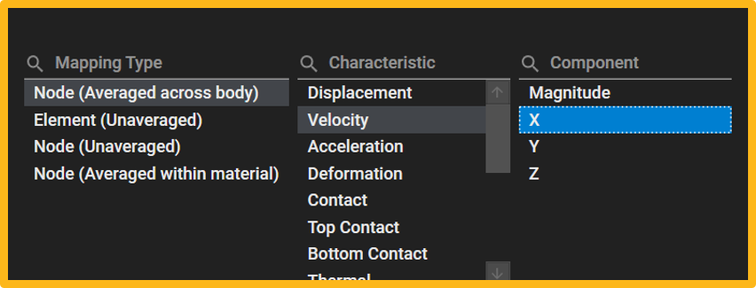
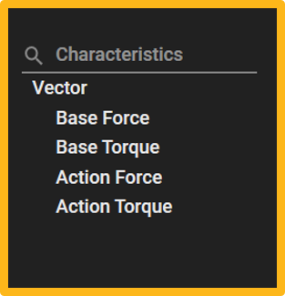
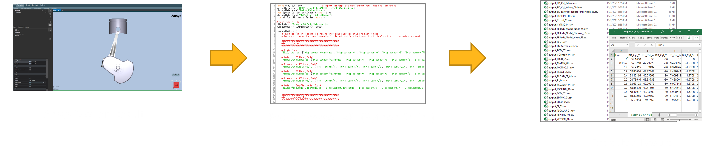

# Getting Started with the Python language

The Ansys Motion Standalone Postprocessor C# library can be used in the python code by using [Python.NET](https://pythonnet.github.io/) or [IronPython](https://ironpython.net/).

## System requirements

If you are using CPython, you will need to install Python.NET first.

```
pip install pythonnet
```

It's a good idea to add the Motion\bin directory to your PATH environment variable. You can do this in the Python code as follows:

```
import sys
sys.path.append('Ansys installed path/Motion/bin')
```

## Notes

* PythonNet only support Python 2.7.x, 3.5.x, 3.6.x, 3.7.x and 3.8.x. If you are using Ironpython or run the Python script from the Scripting menu of Ansys Workbench, PythonNet may not be required.

* As illustrated in the figures below, to create a Contour or Vector using the Result File Reader, you need to be aware of the following information:
	* Within the UI, by accessing the "Contour" function, you can observe Characteristics and Components. The combination of these paths (Characteristics, Components) can be utilized as input values.
	* Within the UI, by accessing the "Vector" function, you can observe Characteristics. These paths (Characteristics) can be used as input values.
						
	||
	|:--:| 
| *Contour* |
||
| *Vector* |

## How to execute Result File Reader

The Postprocessor API is a functionality that allows you to access Ansys Motion analysis results independently of the postprocessor and extract the desired results. The Postprocessor API can be used for process automation, integration with other processes, and integration with design optimization tools.



## Example

The following sample code demonstrates how to create curves :

```
# Using Python.NET
import clr

# Adding references from Ansys Motion Standalone Postprocessor
clr.AddReference('VM.Post.API.OutputReader') 

# Import the appropriate classes from the Ansys Motion Standalone Postprocessor C# library.
from VM.Post.API.OutputReader import *
from VM.Models.OutputReader import *

# Import result file
outputReader = OutputReader("Result File Path"")

# Get Curves
paths = List[str]() 
paths.Add("Displacement/Magnitude")
paths.Add("Displacement/Z")

plotParameterex = PlotParametersEx()
plotParameterex.Target = "BD_001"
plotParameterex.Paths = paths

results = outputReader.GetCurves(plotParameterex)

# Close
outputReader.Close()
```

## See also

* [Python.NET](https://pythonnet.github.io/)
* [IronPython](https://ironpython.net/)
* [Reference](lib/VM.md)
	* [VM](lib/VM.md)	 
	* [VM.Post.API.OutputReader](lib/VM.Post.API.OutputReader.md)