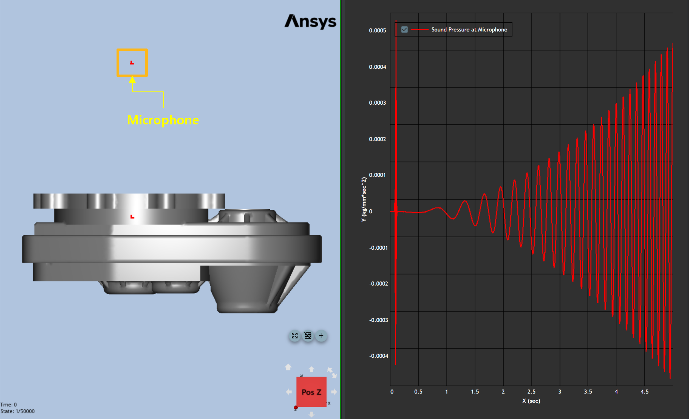

# Analysis

The following sample code illustrates how to create a simple example.

* The example was created using "Ansys installed path/Motion/Document/Drive Train Models.zip"

## Common Settings

```
# Import the appropriate classes from .Net C# library.
from System.Collections.Generic import List

# Import the appropriate classes from the Ansys Motion Standalone Postprocessor C# library.
from VM.Models.OutputReader import *
from VM.Models.Post import *
from VM.Operations.Post.Models import *
from VM.Operations.Post.Utilities import *
from VM.ViewModels.Post import *
from VM.ViewModels.Post.Entities.Charts import *
from VM.Windows.Post.Controls.Model import *

# Start the headless application interface
applicationHandler = ApplicationHandler()

# Import result file
filepath = r'result file path'
paths = List[str](1)
paths.Add(filepath)
applicationHandler.AddDocument(paths)
```

## Sound Pressure

Sound pressure analysis (SPA) can be used to analyze the sound pressure generated by the vibration of the system surface based on "Rayleigh Integral". this example describes how to create the Sound Pressure.

* Before the analysis, the bodies that are the source of sound pressure must be defined as FE or EasyFlex bodies in the preprocessor.
* The coordinate systems must be created to define the microphone positions which are the target positions for sound pressure calculation.



```
# Set the body name
targetbodies = List[str](1)
targetbodies.Add(r'Housing_01/FE_Housing')

# Set the coordinate system
microphones = List[str](1)
microphones.Add(r'Microphone')

# Body Names - The list of the entity name.
# CoordinateSystems - The list of the coordinatesystem name.
# CoarseningRate - It's used to set the percentage of the number of nodes remaining in the sampling result with respect to the initial number of nodes.
# MaxAreaFactor It's used to set the condition that the area of each element generated by the sampling result cannot be greater than (Max. Area Factor)*(Average element area).
# MaxAspectRatio - It's used to set the condition that the aspect ratio of each element generated by the sampling result cannot be greater than max. aspect ratio.
# AirDensity - The air density.
# SoundVelocity - The sound velocity.
# Frequency - The number of analysis results per second is determined as 10*analysis frequency.
# Start - The start frame for the time range to be analyzed.
# End - The end frame for the time range to be analyzed.
# isDeicbelScale - The decibel scale.
curves = animationview.CreateSoundPressure(targetbodies, microphones, 10.0, 100.0, 3.0, 1.21E-09, 343000.0, 2000.0, 1, 100, False)
```
