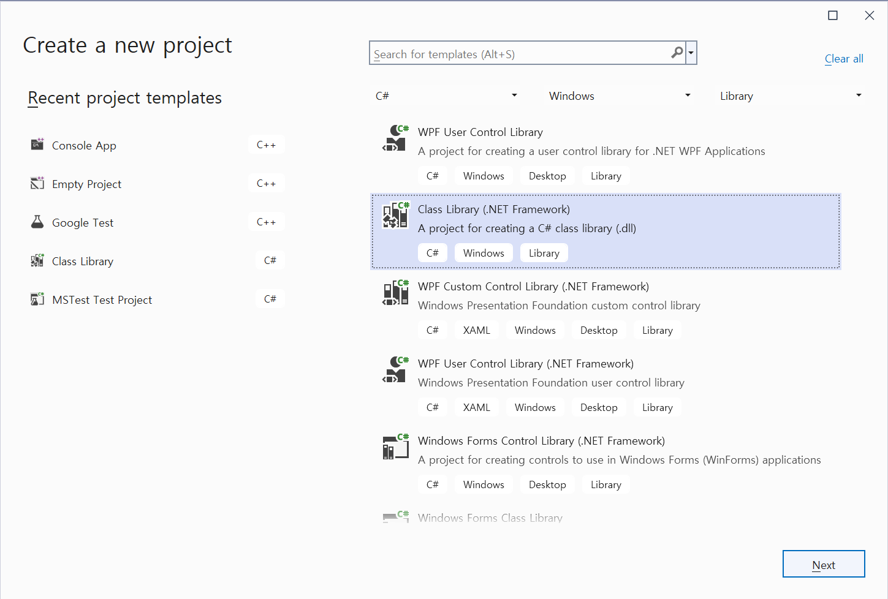
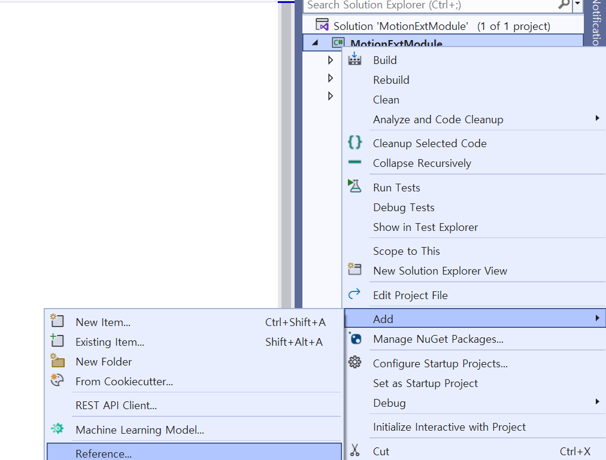
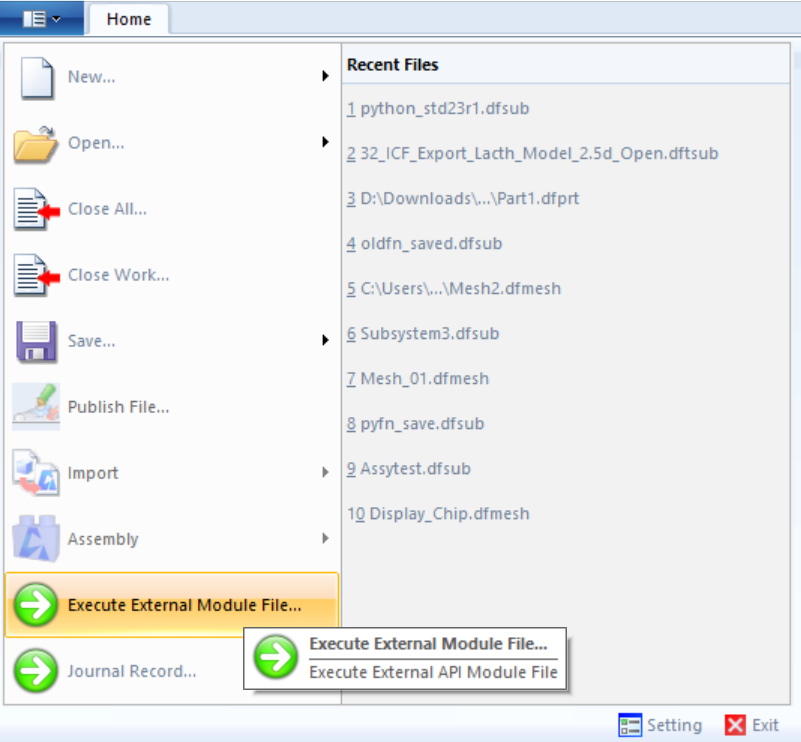
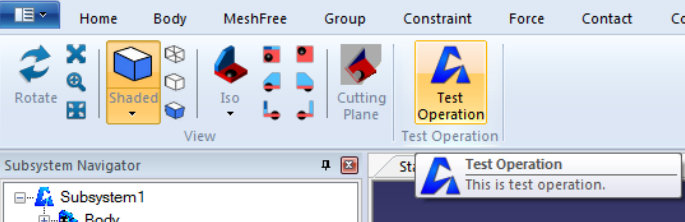

# Getting Started with the C# language
The Ansys Motion Standalone Preprocessor C# library can be used to develop two types of extension modules.
* [External Motion/API module](#create-new-external-module-for-the-ansys-motion-standalone-preprocessor)
* [Addon module for the Ribbon UI](#create-a-new-operation-module-and-add-it-to-the-ribbon-menu-of-the-ansys-motion-standalone-preprocessor)

## System requirements
The Ansys Motion Standalone Preprocessor C# Library requires a development environment with the .NET Framework version 4.8.

## Common Settings
First, you need to create a new C# project for the .NET class library. It's different for your development environment.

This document uses Visual Studio 2022 as an example.

### Create C# project
Create a new .NET Framework class library as follows:



### Add reference
Add the assembly from the Ansys Motion Standalone Preprocessor C# library to the project references.



See [Reference](lib/VM.md) for information on which assemblies to add.

### License setting
First, add the reference "Ansys installed path\Motion\bin\VMLNet.dll". Then add the following code snippet to any source code in the project.

```
using VM.Managed.License;
[assembly: OpenLicense("API_User", null)]
```

The "API_User" string can be replaced with any other string.

It is recommended to add new source code(for example:LicenseInfo.cs) to the project for the assembly attribute.

## Create new external module for the Ansys Motion Standalone Preprocessor
Please note that all steps of the [Common Settings](#common-settings) must be done before.

The following code shows the source code for displaying a message box.

```
using System.Windows.Forms;
namespace API
{
    public class Module
    {
        public static void Main()
        {
            MessageBox.Show("This is API sample.");
        }
    }
}
```
You can change the namespace and class names. But you cannot change the name, argument, and return type of the Main function.

Finally, the System.Windows.Forms assembly must be added to the reference.

### Execute the external module from Ansys Motion Standalone Preprocessor

The new external module can be executed from the 'Home&rarr;Execute External Module File...' menu of the Ansys Motion Standalone Preprocessor.



## Create a new operation module and add it to the ribbon menu of the Ansys Motion Standalone Preprocessor

After setting up the [Common Settings](#common-settings), add the following code to the project.

```
using System.Windows.Forms;
using VM.Managed;
using VM.Managed.Operation;

namespace OPERATION
{
    public class TestOperation : OperationBase
    {
        public TestOperation(Document doc)
            : base(doc)
        {
        }
        public override void Execute()
        {
            MessageBox.Show("This is OPERATION sample.");
        }
        public override string Name
        {
            get { return "TestOperation"; }
        }
    }
}
```

Don't forget to add reference to System.Windows.Forms assembly.

Build the project and copy the output dll file to the 'Ansys installed path\Motion\bin' directory.

### Add new button to the ribbon menu
Create new ribbon resource files 'Ansys installed path\Motion\bin\Templates\Resources\TestOpearation.dfresx' as follow:

```
<Resource>
  <!--ICON-->
  <Data name="ID_ICO_TestOperation">
    <Value>337,..\VMRes.dll</Value>
  </Data>
  <!--TEXT-->
  <Data name="ID_TXT_TestOperation">
    <Value>Test Operation</Value>
  </Data>
  <Data name="ID_TOOLTIP_TestOperation">
    <Value>This is test operation.</Value>
  </Data>
</Resource>
```

And new ribbon file 'Ansys installed path\Motion\bin\Templates\Ribbons\TestOperation.dfrbbx:
```
<Ribbon>
  <Documents>
    <Document name="SubSystem" toolkit="General">
      <Tabs>
        <Tab name="TestOperation" text="ID_TXT_TestOperation" access_key="T">
          <Panels>
            <PrePanel name="SimpleViewPanel"/>
            <Panel name="TestOperation" text="ID_TXT_TestOperation" icon="ID_ICO_TestOperation">
              <Buttons>
                <Button name="Test Operation" text="ID_TXT_TestOperation" tooltip="ID_TOOLTIP_TestOperation" icon_small="ID_ICO_TestOperation" icon_large="ID_ICO_TestOperation" command="TEST_OPERATION" access_key="S"/>
              </Buttons>
            </Panel>
          </Panels>
        </Tab>
        <Removes/>
      </Tabs>
    </Document>
  </Documents>
</Ribbon>
```

Finally, add new sub system module file 'Ansys installed path\Motion\bin\Templates\Modules\TestOperation.dfmdx'
```
<Module name="Subsystem" toolkit="General" is_overlap="true">
  <DocumentCommands>
    <!--Test Operation-->
    <Command command="TEST_OPERATION" operation="OPERATION.TestOperation,OPERATION"/>
  </DocumentCommands>
  <ViewCommands/>
</Module>
```

Then, you can see new command button on the ribbon menu of the sub system file as follow:



## See also
* The sample code of the Ansys Motion Preprocessor C# library is available in the 'Ansys installed path\Motion\Document\API Tutorial.zip' file.
* [Reference](lib/VM.md)