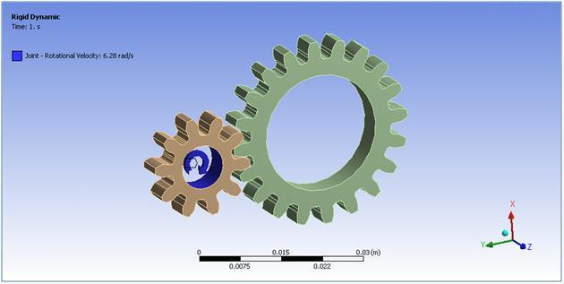
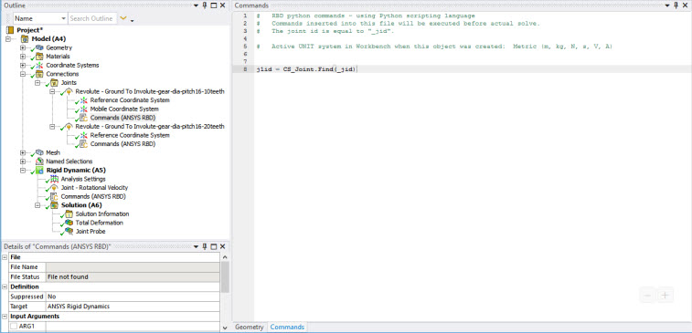
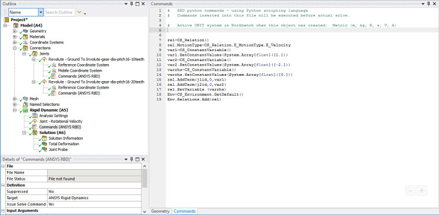

# Constraint equation

This example considers the gear mechanism shown below.



A relation is created between two revolute joints to simulate a gear with a
ratio 2 M. Commands are used to enforce the ratio of velocities between the
two wheels, and create a linear relation between rotational velocities,
defined by:

(1)*ω 1 \+ (-2)*ω2 = 0

First, the joint objects are retrieved using their IDs:

    j1id = CS_Joint.Find(_jid)
    j2id = CS_Joint.Find(_jid)



Next, the relationship between the two wheels is defined. The complete list of
commands is shown below. A description of these commands follows.



1. A relation object is created and specified as a relation between velocities:

    ```
    rel=CS_Relation()
    rel.MotionType=CS_Relation.E_MotionType.E_Velocity
    ```

2. The constant coefficients that appear in the relation are created. The first constant term is created by:

    ```
    var1=CS_ConstantVariable()
    var1.SetConstantValues(System.Array[float]([1.]))
    ```

3. The second coefficient and constant right hand side are created by: 

    ```
    var2=CS_ConstantVariable()
    var2.SetConstantValues(System.Array[float]([-2.]))
    varrhs=CS_ConstantVariable()
    varrhs.SetConstantValues(System.Array[float]([0.]))
    ```

4. The first term of relation (1) X ω_1 is added to the relation object:

    ```
    rel.AddTerm(j1id,0,var1)
    ```

    The first argument is the joint object. The second argument defines the DOF
    (degrees of freedom) of the joint that are involved in the relation. Here, `0`
    represents the rotation, which is the joint's first and only DOF is the
    rotation.

5. The second term and right hand side are introduced in the same manner:

    ```
    rel.AddTerm(j2id,0,var2)
    rel.SetVariable (varrhs)
    ```

6. The relation is added to the list of relations:

    ```
    Env=CS_Environment.GetDefault()
    Env.Relations.Add(rel)
    ```
