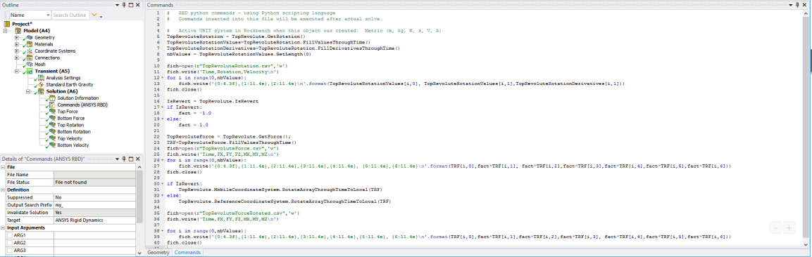

# Export of joint forces

In this example joint forces are extracted in the local coordinate system,
rotated into the global coordinate system, and written into an ASCII File.

First, the joint is retrieved by inserting the following command on the
corresponding joint in the tree:

    TopRevolute = CS_Joint.Find(_jid)

Next, the commands object shown below is inserted in the result node. An
explanation of these commands follows.



1. Get measures from the joint:
  
    ```
    TopRevoluteRotation = TopRevolute.GetRotation()
    ```

2. Extract transient values for this measure:
  
    ```
    TopRevoluteRotationValues=TopRevoluteRotation.FillValuesThroughTime()
    ```

3. Get angle derivatives by extracting the time derivatives of the measure:
  
    ```
    TopRevoluteRotationDerivatives=TopRevoluteRotation.FillDerivativesThroughTime()
    ```

4. Count the number of components of this array:
  
    ```
    nbValues = TopRevoluteRotationValues.GetLength(0)
    ```

5. Open the ASCII output file:
  
    ```
    fich=open(r"TopRevoluteRotation.csv",'w')
    fich.write('Time,Rotation,Velocity\n')
    ```

6. Loop over all time values, and write values:
  
    ```
    for i in range(0,nbValues):
    fich.write('{0:4.3f},{1:11.4e},{2:11.4e}\n'.format(TopRevoluteRotationValues[i,0],
    TopRevoluteRotationValues[i,1],TopRevoluteRotationDerivatives[i,1])) 
    fich.close()
    ```

7. Check if joint is « revert » or not:

    ```
    IsRevert = TopRevolute.IsRevert 
    if IsRevert: 
    fact = -1.0 
    else: 
    fact = 1.0 
    ```

8. Extract force measurements and write them to the file:
  
    ```
    TopRevoluteForce = TopRevolute.GetForce() 
    TRF=TopRevoluteForce.FillValuesThroughTime() 
    fich=open(r"TopRevoluteForce.csv",'w') 
    fich.write('Time,FX,FY,FZ,MX,MY,MZ\n') 
    for i in range(0,nbValues): 
      fich.write('{0:4.3f},{1:11.4e},{2:11.4e},{3:11.4e},{4:11.4e}, 
    {5:11.4e},{6:11.4e}\n'.format(TRF[i,0],fact*TRF[i,1],
    fact*TRF[i,2],fact*TRF[i,3],fact*TRF[i,4],fact*TRF[i,5],fact*TRF[i,6])) 

    fich.close()
    ```

9. Get the joint reference coordinate system, and rotate the forces from the global coordinate system to the joint coordinate system:

    ```
    if IsRevert:
    TopRevolute.MobileCoordinateSystem.RotateArrayThroughTimeToLocal(TRF)
    else:
      TopRevolute.ReferenceCoordinateSystem.RotateArrayThroughTimeToLocal(TRF)

    fich=open(r"TopRevoluteForceRotated.csv",'w') 
    fich.write('Time,FX,FY,FZ,MX,MY,MZ\n') 

    for i in range(0,nbValues): 
      fich.write('{0:4.3f},{1:11.4e},{2:11.4e},{3:11.4e},{4:11.4e},{5:11.4e}, 
    {6:11.4e}\n'.format(TRF[i,0],fact*TRF[i,1],fact*TRF[i,2],fact*TRF[i,3], 
    fact*TRF[i,4],fact*TRF[i,5],fact*TRF[i,6])) 
    fich.close()
    ```
