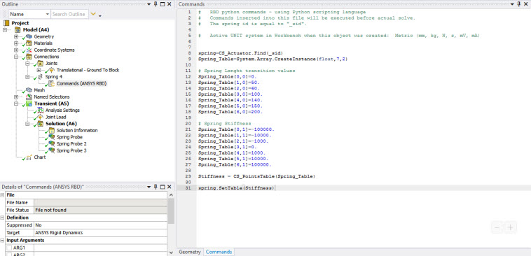
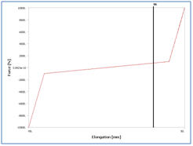
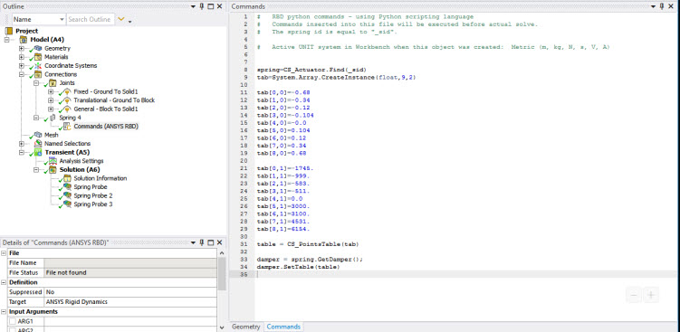

# Non-linear spring damper

This example shows how the behavior of a spring can be altered to introduce a
non-linear force-displacement relationship. The complete list of commands is
shown below. A description of these commands follows.



1. Retrieve the spring object using its ID:

    ```
    Spring=CS_Actuator.Find(_sid)
    ```

2. Create an array of real values and fill it with the pairs of values (elongation, force):

    ```
    Spring_table=System.Array.CreateInstance(float,7,2)

    #
    # LENGTH transition values
    spring_table[0,0]=0.
    spring_table[1,0]=50.
    spring_table[2,0]=60.
    spring_table[3,0]=100.
    spring_table[4,0]=140.
    spring_table[5,0]=150.
    spring_table[6,0]=200.
    #
    # Spring Stiffness
    spring_table[0,1]=-100000.
    spring_table[1,1]=-10000.
    spring_table[2,1]=-1000.
    spring_table[3,1]=0.
    spring_table[4,1]=1000.
    spring_table[5,1]=10000.
    spring_table[6,1]=100000.
    stiffness = CS_PointsTable(spring_table)
    spring.SetTable(stiffness)
    ```

    In this command, `7` represents the number of rows and `2` for the number of
    columns. The first column gives elongation and the second, the corresponding
    force value. This command generates a [PointsTable](pointstable.md)  assigned to the spring, as
    shown below.

    

    Each spring object in the Mechanical GUI is actually a combination of a spring
    and a damper. The `GetDamper` method enables you to retrieve the damper object
    on a given spring, as shown below.

    

3. Introduce a table to define a non-linear force velocity relation:
  
    ```
    Damper=spring.GetDamper()
    ```
