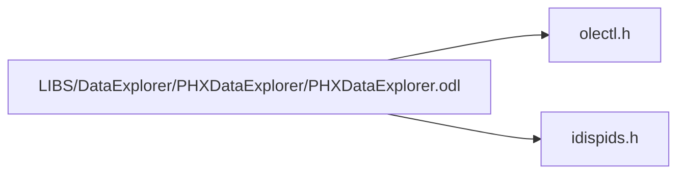

# File PHXDataExplorer.odl

![][IDL]

**Location**: `LIBS/DataExplorer/PHXDataExplorer/PHXDataExplorer.odl`


## Classes

* [PHXDATAEXPLORERLib::\_DPHXDataExplorer](interfacePHXDATAEXPLORERLib_1_1__DPHXDataExplorer.md#interfacePHXDATAEXPLORERLib_1_1__DPHXDataExplorer)
* [PHXDATAEXPLORERLib::\_DPHXDataExplorerEvents](interfacePHXDATAEXPLORERLib_1_1__DPHXDataExplorerEvents.md#interfacePHXDATAEXPLORERLib_1_1__DPHXDataExplorerEvents)
* [PHXDATAEXPLORERLib::PHXDataExplorer](classPHXDATAEXPLORERLib_1_1PHXDataExplorer.md#classPHXDATAEXPLORERLib_1_1PHXDataExplorer)
* [PHXDATAEXPLORERLib::IPHXDataExplorerPointer](interfacePHXDATAEXPLORERLib_1_1IPHXDataExplorerPointer.md#interfacePHXDATAEXPLORERLib_1_1IPHXDataExplorerPointer)
* [PHXDATAEXPLORERLib::PHXDataExplorerPointer](classPHXDATAEXPLORERLib_1_1PHXDataExplorerPointer.md#classPHXDATAEXPLORERLib_1_1PHXDataExplorerPointer)
* [PHXDATAEXPLORERLib::IPHXDEKeepalive](interfacePHXDATAEXPLORERLib_1_1IPHXDEKeepalive.md#interfacePHXDATAEXPLORERLib_1_1IPHXDEKeepalive)
* [PHXDATAEXPLORERLib::IDataExplorerFacadeOwner](interfacePHXDATAEXPLORERLib_1_1IDataExplorerFacadeOwner.md#interfacePHXDATAEXPLORERLib_1_1IDataExplorerFacadeOwner)
* [PHXDATAEXPLORERLib::IPageVisibility](interfacePHXDATAEXPLORERLib_1_1IPageVisibility.md#interfacePHXDATAEXPLORERLib_1_1IPageVisibility)
* [PHXDATAEXPLORERLib::ILegacyVisiblity](interfacePHXDATAEXPLORERLib_1_1ILegacyVisiblity.md#interfacePHXDATAEXPLORERLib_1_1ILegacyVisiblity)

## Namespaces

* [PHXDATAEXPLORERLib](namespacePHXDATAEXPLORERLib.md#namespacePHXDATAEXPLORERLib)

## Includes

* <olectl.h>
* <idispids.h>



## Source

```
// PHXDataExplorer.odl : type library source for ActiveX Control project.

// This file will be processed by the Make Type Library (mktyplib) tool to
// produce the type library (PHXDataExplorer.tlb) that will become a resource in
// PHXDataExplorer.ocx.

[ uuid(091E15A1-980A-4B43-AD02-91DFD8144D7E), version(2.0),
  helpfile("PHXDataExplorer.hlp"),
  helpstring("PHXDataExplorer ActiveX Control module"),
  control ]
library PHXDATAEXPLORERLib
{
   #include <olectl.h>
   #include <idispids.h>
   #include "olectl.h"

   importlib(STDOLE_TLB);
   importlib(STDTYPE_TLB);

   //  Primary dispatch interface for CPHXDataExplorer

   [ uuid(14375246-E4A1-4A30-85B2-0DF991B4FFB1),
     helpstring("Dispatch interface for PHXDataExplorer Control"), hidden ]
#ifndef DOXYGEN_SHOULD_SKIP_THIS    // so that _DPHXDataExplorer appears as PHXDataExplorer in documentation
   dispinterface _DPHXDataExplorer
   {
      properties:
#else
   dispinterface PHXDataExplorer
   {
      methods:
#endif
         // NOTE - ClassWizard will maintain property information here.
         //    Use extreme caution when editing this section.
         //{{AFX_ODL_PROP(CPHXDataExplorerCtrl)
         [id(1)] BSTR author;
         [id(2)] BSTR description;
         [id(3)] BSTR displayName;
         [id(4)] IDispatch* modelCenter;
         [id(5)] BSTR tradeStudyType;
         [id(6)] IDispatch* dataHistory;
         [id(7)] BSTR tradeStudySetup;
         [id(27)] BSTR associatedModelFile;
         [id(28)] BSTR associatedModelFileUUID;
         [id(60)] BSTR creationDate;

         [id(61)] BSTR tradeStudyUri; 
         //}}AFX_ODL_PROP

      methods:
         // NOTE - ClassWizard will maintain method information here.
         //    Use extreme caution when editing this section.
         //{{AFX_ODL_METHOD(CPHXDataExplorerCtrl)
         [id(8)] long getNumPages();
         [id(9)] IDispatch* getPage(long page);
         [id(10)] IDispatch* addPage(BSTR type, VARIANT insertBefore, VARIANT setupString);
         [id(11)] void removePage(long page);
         [id(12)] void movePage(long page, long insertBefore);
         [id(13)] void selectPage(long page);
         [id(14)] long getSelectedPage();
         [id(15)] void pageCut(long index);
         [id(16)] void pageCopy(long index);
         [id(17)] void pagePaste();
         [id(18)] void invokeInsertPageGUI();
         [id(19)] void toXMLFile(BSTR fileName, [optional]VARIANT includeRunData);
         [id(20)] BSTR getPageType(long page);
         [id(21)] void fromXMLFile(BSTR fileName, [optional]VARIANT root);
         [id(22)] BSTR toXML([optional]VARIANT includeRunData);
         [id(23)] void fromXML(BSTR xml, [optional] VARIANT root);
         [id(24)] void getMenuItems(LPDISPATCH iPHXMenuItem);
         [id(25)] void invokeMenuItem(long id);
         [id(26)] boolean isMenuItemEnabled(long id);
         [id(29)] void updateThumbHint(long id);
         [id(30)] void fromCenterLink(BSTR server, BSTR runMatrixID, BSTR userName, BSTR password);
         [id(31)] BSTR getPageSetup(long page);
         [id(32)] void exportImage(long page, BSTR hints, BSTR filename);
         [id(33)] boolean ignoreDefaultPlotSetup();
         [id(34)] void setupPlotsPre();
         [id(35)] void setupPlotsPost();
         [id(36)] void showGeomTooltip(long run, long x, long y);
         [id(37)] void showGeomViewer(long run, long x, long y);
         [id(38)] void updateGeomViewerHint(long viewerID);
         [id(39)] void setGeomViewerRunID(long viewerID, long runID);
         [id(40)] void updateComparisonViewHint(BOOL restore);
         [id(41)] boolean isMenuItemChecked(long id);
         [id(42)] void removeFromComparisonList(long runID);
         [id(43)] void addToComparisonList(long runID);
         [id(44)] void addRunsToComparisonList(VARIANT runIDs);
         [id(45)] boolean getDaXType();
         [id(46)] boolean getDaXFormat();
         [id(47)] void ensureRunDataAction();
         [id(48)] void multiPageCut(VARIANT index);
         [id(49)] void multiPageCopy(VARIANT index);
         [id(50)] void multiDelete(VARIANT index);
         [id(51)] IDispatch* getKeepalive();
         [id(52)] long getHWND();
         [id(53)] void loadTemplate( BSTR str);
         [id(54)] void saveTemplate( BSTR str);
         [id(55)] void toXMLSaveContext(LPDISPATCH saveContext, [optional] VARIANT includeRunData);
         [id(56)] void fromXMLSaveContext(LPDISPATCH saveContext, [optional] VARIANT root);
         [id(57)] void show();
         [id(58)] void hide();
         [id(59), propget] boolean isVisible();
         [id(62)] BSTR getPageTitle(long page);
               //}}AFX_ODL_METHOD
         //}}AFX_ODL_METHOD
   };

#ifndef DOXYGEN_SHOULD_SKIP_THIS // hide from documentation
   //  Event dispatch interface for CPHXDataExplorerCtrl
   
   [ uuid(3D2E8CB8-81A2-46EA-86F8-850D4CCC5905),
     helpstring("Event interface for PHXDataExplorer Control") ]
   dispinterface _DPHXDataExplorerEvents
   {
      properties:
         //  Event interface has no properties

      methods:
         // NOTE - ClassWizard will maintain event information here.
         //    Use extreme caution when editing this section.
         //{{AFX_ODL_EVENT(CPHXDataExplorerCtrl)
         //}}AFX_ODL_EVENT
   };

   //  Class information for CPHXDataExplorerCtrl
   
   [ uuid(FA0DBB7C-BEB1-4950-AC2A-E479C1D9FFE7),
     helpstring("PHXDataExplorer Control"), control ]
   coclass PHXDataExplorer
   {
       [default] dispinterface _DPHXDataExplorer;
       [default, source] dispinterface _DPHXDataExplorerEvents;
   };
#endif // DOXYGEN_SHOULD_SKIP_THIS


   //  Primary dispatch interface for PHXDataExplorerPointer
   [ uuid(EF05817D-2113-4F01-901F-569BB83EE42A) ]
   dispinterface IPHXDataExplorerPointer
   {
      properties:
         // NOTE - ClassWizard will maintain property information here.
         //    Use extreme caution when editing this section.
         //{{AFX_ODL_PROP(PHXDataExplorerPointer)
         //}}AFX_ODL_PROP
         
      methods:
         // NOTE - ClassWizard will maintain method information here.
         //    Use extreme caution when editing this section.
         //{{AFX_ODL_METHOD(PHXDataExplorerPointer)
         [id(1)] IDispatch* getDataExplorer();
         //}}AFX_ODL_METHOD

   };

#ifndef DOXYGEN_SHOULD_SKIP_THIS // hide from documentation
   //  Class information for PHXDataExplorerPointer
   
   [ uuid(3E03FBC4-FB2F-4B0E-B388-59B49861669D) ]
   coclass PHXDataExplorerPointer
   {
      [default] dispinterface IPHXDataExplorerPointer;
   };


        //{{AFX_APPEND_ODL}}
        //}}AFX_APPEND_ODL}}
   //  Primary dispatch interface for PHXDEKeepalive
   
   [ uuid(C484FD38-0B9F-4191-868E-84E03B660F6C) ]
   dispinterface IPHXDEKeepalive
   {
      properties:
      methods:
   };
#endif // DOXYGEN_SHOULD_SKIP_THIS

#ifndef DOXYGEN_SHOULD_SKIP_THIS // hide from documentation
   //  Primary dispatch interface for ICanHazDE
   [ uuid(276713D7-E8E3-488C-80DA-70899430EA05), 
      helpstring("Data Explorer facade owner interface") ]
   dispinterface IDataExplorerFacadeOwner
   {
      properties:
         [id(1978)] IDispatch* dataExplorerFacade;       
      
      methods:    
      
   };
#endif // DOXYGEN_SHOULD_SKIP_THIS
   
   [ uuid(A1ED8D1C-717D-42D9-B02C-11326F5572B6), 
      helpstring("Page visibility interface") ]
   dispinterface IPageVisibility
   {
#ifndef DOXYGEN_SHOULD_SKIP_THIS // hide from documentation
      properties:
#endif
      methods:
         [id(1992)] void hide(long index);  

         [id(1993)] void show(long index);

         [id(1994)] boolean isVisible(long index); 

         [id(1995)] long getDataViewHWND(); 

         [id(1996)] long getViewHWND(long index);
   }

#ifndef DOXYGEN_SHOULD_SKIP_THIS // hide from documentation
   [ uuid(39E431DC-BFD2-4BE5-9BC9-5D9126975369), 
      helpstring("Legacy visibility interface") ]
   dispinterface ILegacyVisiblity
   {
      properties:
      methods:
      [id(2000)] void showLegacy(); 

      [id(2001)] long getLegacyHWND();
   }
#endif
};
```

[public]: https://img.shields.io/badge/-public-brightgreen (public)
[private]: https://img.shields.io/badge/-private-red (private)
[IDL]: https://img.shields.io/badge/language-IDL-blue (IDL)