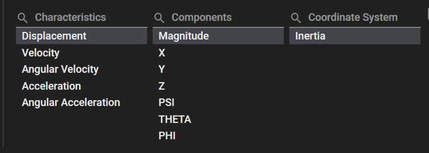
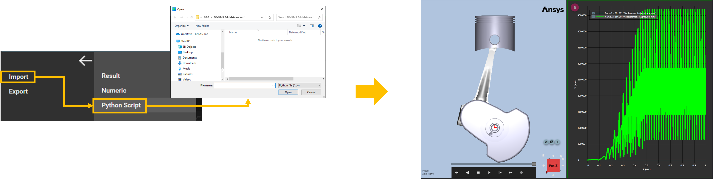

# Operation API using the Python language

The Ansys Motion Standalone Postprocessor C# library can be used in the python code by using [Python.NET](https://pythonnet.github.io/) or [IronPython](https://ironpython.net/).

## System requirements

The Operation API uses the IronPython 2.7.12 engine.
Since the engine is included within the Motion Postprocessor, no additional installation is required.

## Notes

* As shown in the figures below, to create curves using the Operation API, you need to know the following information. When you see the "AddCurves" function within the UI, you can observe Characteristics and Components.
The combination of these paths(Characteristics, Components) can be used as input values within the function "AddCurves"



## How to execute Operation API

For executing operations, Import file includes Python script as follows :
- Make the file includes operation script.
- Import the file on Postprocessor.(Dropdown menu -> Import -> Python Script)




## Example

The Operation API can manage tasks from start to finish, centered around the ApplicationHandler class.
This class implements the main functionlities of the API and helps users controls the entire flow, including the initialization and termination of the API.
By using the ApplicationHandler class, you can gain a comprehensive understanding of the overall behavior of the API and efficiently handle the necessary tasks.

* To use the Operation API, you can conveniently develop by refering to the following guidlines.
* Refer to operationapi.py in "Ansys installed path/Motion/Document/Postprocessor API for Python.zip"
* The result file used here is based on the output from the 'Install_Path\Motion\Document\Pre and Post Processor.zip' file.

* Create a example.py file	
  
```
# Example_OperationAPI.py
# Refer to the operationapi.py file
import sys
references_path = __file__.rsplit('\\', 1)[0]
sys.path.append(references_path)
from operationapi import *

# Start the headless application interface
applicationHandler = ApplicationHandler()

# Import result file
# Get Install Path
# The 'XX' in AWP_ROOTXXX represents the year, like 25 for the year 2025, and the leat 'X' indicates the half of the year,
# where '1' represents the first half and '2' represents the second half.
# For example, in 'AWP_ROOT251' and 'AWP_ROOT252', '25' represents the year 2025, and '1' indicates the first half of the year,
# while '2' indicates the second half.
install_path = get_env_variable("AWP_ROOTXXX")

filepath = combine_path(install_path, r'Motion\Document\Pre and Post Processor\Model\Result\Suspension.dfr')
paths = List[str](1)
paths.Add(filepath)
applicationHandler.AddDocument(paths)
```

## See also

* [Python.NET](https://pythonnet.github.io/)
* [IronPython](https://ironpython.net/)
* [Reference](lib/VM.md)
	* [VM](lib/VM.md)	 
	* [VM.API.Post.Operations](lib/VM.API.Post.Operations.md)
	* [VM.Operations.Post](lib/VM.Operations.Post.Interfaces.md)
		* [VM.Operations.Post.Interfaces](lib/VM.Operations.Post.Interfaces.md)