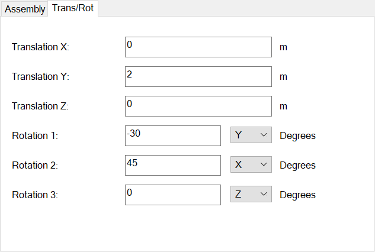

# Additional information on positioning entities using BaseTrans and LocalTrans

As discussed in [Create and position finite-difference surfaces and solids](finite-difference-surfaces-and-solids.md), many OpenTD classes contain the members BaseTrans and LocalTrans, which both can be used to position entities. BaseTrans is equivalent to using AutoCAD commands like MOVE or ROTATE3D to position the entity, while LocalTrans is equivalent to using the Trans/Rot tab that can be found when editing an entity:



These particular Trans/Rot parameters would result in the following transformations:

1. Translate 2 m along the entity's base Y axis
2. Rotate -30 deg about the entity's Y axis
3. Rotate 45 deg about the entity's new X axis, that is, rotations are intrinsic (they are about the entity's current axes, not some fixed axes).

LocalTrans is an instance of the *Transformation* class. To use it to perform the operations listed above, you'd use something like this:

```c#
a.LocalTrans.Ty = 2;
a.LocalTrans.Axis1 = 1; // Y
a.LocalTrans.Rot1 = -30;
a.LocalTrans.Axis2 = 0; // X
a.LocalTrans.Rot2 = 45;
a.Update();
```

BaseTrans is an instance of the *Matrix3d* class, that is, it is a 4x4 matrix representing a geometric transformation:


The upper-left 3x3 submatrix represents a rotation. (In general it could represent many other operations, but when positioning entities using OpenTD, you should stick to rotations.) The 3x1 column vector on the right represents a translation. The bottom row should always be 0 0 0 1.

OpenTD positions entities at the WCS origin, then transforms them by BaseTrans, followed by LocalTrans. Some of the methods available to BaseTrans are frequently misunderstood. There is a family of methods that sets the rotation matrix:

- SetToRotation
- SetToRotX
- SetToRotY
- SetToRotZ

These cannot be used sequentially to perform sequential rotations. Each one clears the rotation matrix and sets it to a single rotation. For example, SetToRotX(45) creates a rotation matrix that rotates 45 deg about the X axis.

To perform sequential rotations, use matrix multiplication. For example, to perform a 10 deg rotation about an entity's Z axis, followed by a 50 deg rotation about its new X axis (that is, intrinsic rotations), you could use something like:

```c#
var A = new Matrix3d().SetToRotZ(10);
var B = new Matrix3d().SetToRotX(50);
a.BaseTrans = A \* B;
a.Update();
```

For intrinsic rotations, multiply matrices in order from left to right.

Translations can also be included using matrix multiplication. For example, to perform a 10 deg rotation about an entity's Z axis, followed by a 2 m translation along its X axis, followed by a 50 deg rotation about its X axis, you could use something like:

```c#
var A = new Matrix3d().SetToRotZ(10);
var T = new Matrix3d();
T.SetOrigin(new Point3d(2, 0, 0));
var B = new Matrix3d().SetToRotX(50);
a.BaseTrans = A * T * B;
a.Update();
```
