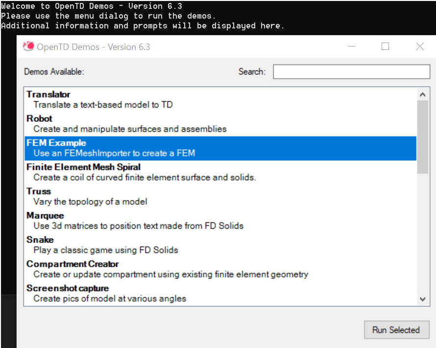

# Test demo

This tutorial demonstrates the implementation of System Coupling Participant
Library APIs in a transient coupled analysis.

This example shows how to set up and perform a transient coupled analysis using
a simple test solver and the Ansys Mechanical solver as participants.

The implementation of the restart interfaces in the participant solver is also demonstrated (It also shows how to implement the restart interfaces in the participant solver),
create restart points at specified intervals, and restart the coupled analysis
from a previously generated restart point.

## Problem description and participant setup

This example is a modification of System Coupling's _Oscillating Plate Fluid-Structure Interaction_ tutorial.

The setup of the Mechanical participant is identical to the oscillating plate
tutorial. A thin flexible plate, made of a linear elastic material, (Young's
modulus = 2.5E6 [Pa], Poisson's ratio = 0.35, density = 2550 [kg m^-3]) has a
fixed support along its bottom face. A pressure load of 100 [Pa] is applied on
one side of the plate for the first 0.5 [s] of the simulation, which starts the
oscillation. The setup is illustrated in _Figure 1_.

  
_Figure 1: Structural solver geometry_

Since the purpose of this example is to demonstrate the use of Participant
Library APIs for a transient analysis, a simple damping force solver will be
used to couple with Mechanical via System Coupling. This solver receives nodal
displacements $\vec{X}$ from Mechanical and calculates the damping force
$\vec{F}$ using the following formula:

$$
\vec{F} = - c \frac{d\vec{X}}{dt}
$$

Formula:

\vec{F} = - c \frac{d\vec{X}}{dt}


where $c$ is the damping coefficient and $\frac{d\vec{X}}{dt}$ is the rate of change
of nodal positions with respect to time (nodal velocities).
The damping solver will then provide the calculated
forces to Mechanical via System Coupling, and these damping forces will cause the
oscillations to diminish in amplitude. The higher the damping coefficient value is,
the faster the oscillations will diminish. The damping coefficient value of 1.0
will be provided to the damping solver via a command line argument `--dampcoeff 1.0`.

The surface mesh for the damping solver consists of 11 quadrilateral elements
that overlap the plate surface in Mechanical. The surface mesh is shown in _Figure 2_.

  
_Figure 2: Surface mesh in the damping solver_

## Fortran

Download the [SCP library tutorial package](https://github.com/ansys/DevRelPublics/raw/main/Downloads/SystemCoupling/syc_ParticipantLibrary_r1_25.zip)
and extract it to a local directory. Inside the resulting directory, you will
find a subdirectory called **OscillatingPlateDamping**. This will serve as the
simulation working directory and contains all the files needed for this
tutorial. The contents of this subdirectory are:

## Visualize the results in Ansys EnSight

Use Ansys EnSight to view the Mechanical solver results after the co-simulation run is complete.
You'll be able to plot the plate deformation over time.
One point at the top of the plate will be used to track the displacement
in the chart, which is a useful way to verify that the damping occurs
due to the force calculated in the damping solver.

1. **Open Ansys EnSight.**

2. **Load the Mechanical solver results file.**

    ```python
    # This program prints Hello, world!
    print('Hello, world!')
    ```

3. **Enable deformation.**

```python
# This program prints Hello, world!
print('Hello, world!')
```

4. **Visualize the nodal displacement.**

    ```
    # This program prints Hello, world!
    print('Hello, world!')
    ```