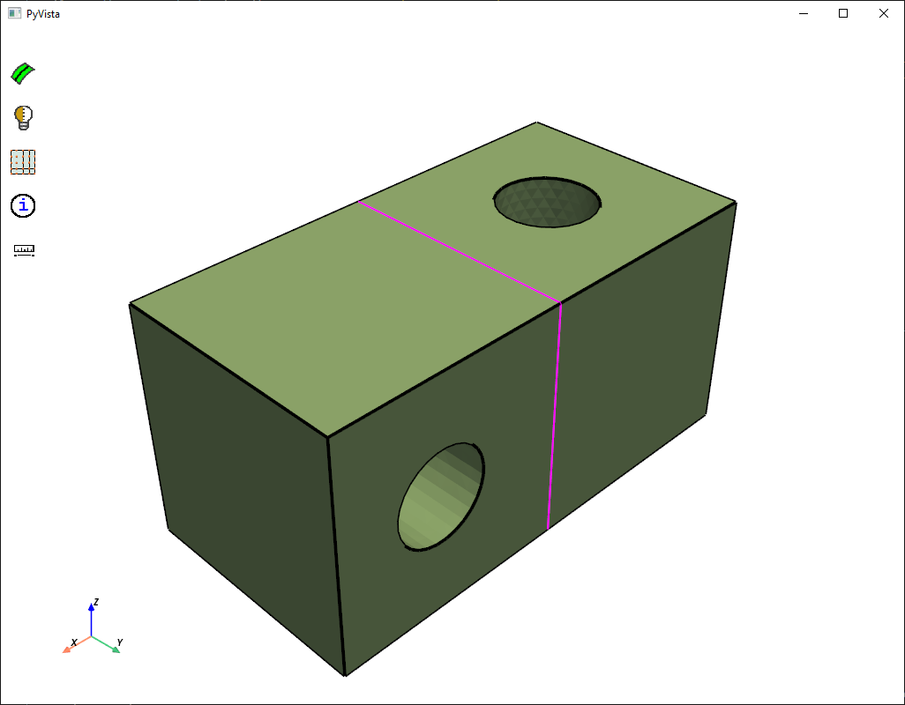
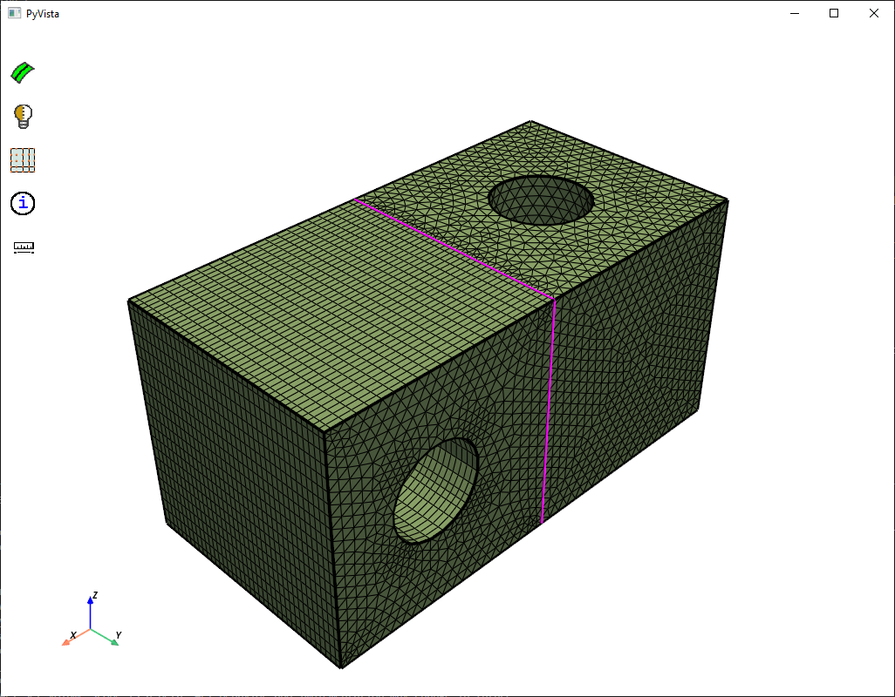
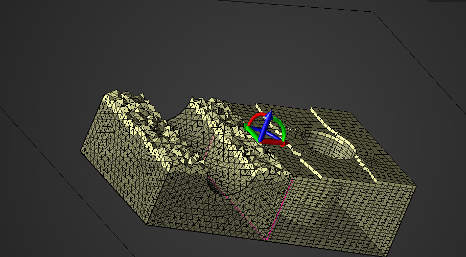

# MultiZone controls

*This is a beta feature. API behavior and implementation may change in future.*

The [`MultiZoneControl`](../api/_autosummary/ansys.meshing.prime.MultiZoneControl.md#ansys.meshing.prime.MultiZoneControl) class provides automatic geometry decomposition into mapped (sweepable) regions and free regions.
Mapped (sweepable) regions are filled with hexahedral elements and free regions are filled with non-hexahedral elements.
When you perform MultiZone Method meshing, all regions are meshed with a pure hexahedral mesh if possible.

The `AutoMesh` class lets you to automatically create the hex mesh on the scoped bodies using MultiZone meshing algorithms.
[`AutoMesh.mesh()`](../api/_autosummary/ansys.meshing.prime.AutoMesh.mesh.md#ansys.meshing.prime.AutoMesh.mesh) function lets you  perform MultiZone meshing with the given MultiZone control.

The following example shows to apply a MultiZone control on a body:

1. Start the PyPrimeMesh client and read the model. The model is made up of two topo volumes that share a connected topo face between them. The two topo volumes have volume zones defined. The left volume zone is `solid1` and right is `solid`.
   > ```python
   > file_io = prime.FileIO(model)
   > res = file_io.read_pmdat(
   >     r"E:\Test\2Boxes_2Holes.pmdat", prime.FileReadParams(model=model)
   > )
   > print(model)
   > ```

   > **Output:**
   > ```pycon
   > Part Summary:

   > Part Name: zone2boxes_2holes
   > Part ID: 2
   >  24 Topo Edges
   >  13 Topo Faces
   >  2 Topo Volumes

   >  0 Edge Zones
   >      Edge Zone Name(s) : []
   >  0 Face Zones
   >      Face Zone Name(s) : []
   >  2 Volume Zones
   >      Volume Zone Name(s) : [solid1, solid]

   >  2 Label(s)
   >      Names: [solid, solid1]

   >  Bounding box (-10 -10 0)
   >               (30 10 20)

   >  error_code :  ErrorCode.NOERROR
   > ```

   

2. Initialize the MultiZone control. MultiZone control sets the parameters and controls used for MultiZone meshing.
   > ```python
   > multizone_control = model.control_data.create_multi_zone_control()
   > ```
3. Define the volume scope and surface scope within the model and apply the volume scope and surface scope to the Multizone Control. In this example, volume scope is scoped specifically to “solid1” to show the difference between the MultiZone mesh and automesh
   > #### NOTE
   > Using the string “\*” as the expression for parts, labels, and zones for the surface scope includes all the available entities in the Multizone control.

   > ```python
   > volume_scope = prime.ScopeDefinition(
   >     model=model,
   >     entity_type=prime.ScopeEntity.VOLUME,
   >     evaluation_type=prime.ScopeEvaluationType.ZONES,
   >     part_expression="*",
   >     label_expression="*",
   >     zone_expression="solid1",
   > )

   > multizone_control.set_volume_scope(volume_scope)

   > surface_scope = prime.ScopeDefinition(
   >     model=model,
   >     entity_type=prime.ScopeEntity.FACEZONELETS,
   >     evaluation_type=prime.ScopeEvaluationType.ZONES,
   >     part_expression="*",
   >     label_expression="*",
   >     zone_expression="*",
   > )

   > multizone_control.set_surface_scope(surface_scope)
   > ```
4. Sets the MultiZone sizing parameters to initialize MultiZone sizing control parameters.
   > #### NOTE
   > When you provide the sizefield, MultiZone method uses the provided sizefield and impacts the MultiZone mesh.

   > ```python
   > sizing_params = prime.MultiZoneSizingParams(model)
   > sizing_params.max_size = 1
   > sizing_params.min_size = 0.04
   > sizing_params.growth_rate = 1.2
   > multizone_control.set_multi_zone_sizing_params(sizing_params)
   > parts = model.parts
   > autoMesher = prime.AutoMesh(model)
   > autoMeshParams = prime.AutoMeshParams(model)
   > autoMeshParams.multi_zone_control_ids = [multizone_control.id]

   > for p in parts:
   >     result = autoMesher.mesh(p.id, autoMeshParams)
   >     print(result)
   > ```

   > **Output:**
   > ```pycon
   > # This API set_multi_zone_sizing_params is a Beta. API Behavior and implementation may change in future.
   > max_size :  1
   > min_size :  0.039063
   > growth_rate :  1.2
   > use_volumetric_size_field :  False
   > error_code :  ErrorCode.NOERROR
   > warning_codes :  []
   > error_locations :  []
   > ```
   

   


Some points to remember while performing MultiZone Meshing:

* MultiZone Meshing supports only topology.
* If the MultiZone meshing scopes only a few bodies of a multibody part, the remaining bodies of the part are auto meshed conformally.
* After creating the MultiZone control, you should specify its id in the automesh params for it to be considered for MultiZone meshing.
* When you use the MultiZone mesh method in combination with other mesh methods in a multibody part, the bodies are meshed with conformally.
  For example, in the model below, the multibody part meshes with the MultiZone Method and AutoMesh.

  

* Sometimes MultiZone is not automatically able to decompose a geometry into sweepable regions, though such decomposition may be possible.
  For example, in the model below the MultiZone mesh produces free mesh.

  

* When you scope the source and target faces to MultiZone, MultiZone automates the geometry decomposition and generates the pure hex mesh
  into sweepable regions to produce a purely hex mesh. In the below images, if the faces highlighted in green
  color are scoped as source and target faces, MultiZone produces a purely hex mesh on the source and target faces.

  
