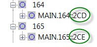
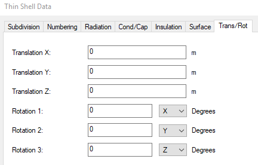
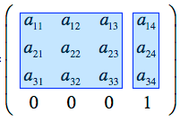
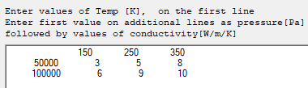

# Creating TD models

We will start our tour of OpenTD by learning how to connect to TD and create new entities like nodes and conductors.

## Hello World (Start TD and create a node)

Let’s create a simple OpenTD program. Start by creating a C\# console application in Visual Studio. Look for the template called “Console App (.NET Framework)”, not “.NET Core” or “.NET Standard”. It should look something like this:


Next, add a reference to the OpenTDv242.dll assembly, which you can find in the GAC. (Try looking under C:\\Windows\\Microsoft.NET\\assembly\\GAC_MSIL\\OpenTDv242.) If there are multiple directories, use the one with the highest Assembly Version, which you will see in the directory name, for example “…_24.2.0.0__...”.

Add the following code, then compile and run the program:

```csharp
using OpenTDv242;

namespace OpenTDv242GettingStarted

{

 class HelloWorld

 {

     public static void Main(string[] args)

     {

            var td = new ThermalDesktop();

            td.Connect();

 

            var n = td.CreateNode();

         n.Comment = "Hello World!";

            n.Update();

     }

 }

}
```

When you run the program, an instance of TD should open and a node should be created at (0, 0, 0). When you edit the node, the comment should be “Hello World!”. If any of these things are not true, check the Troubleshooting section at the end of this guide.

Assuming it worked, let’s examine how. First, we created a *ThermalDesktop* object called td. This object represents one instance of TD. It has hundreds of methods for interacting with TD models. A single OpenTD client program can create an arbitrary number of ThermalDesktop instances, allowing you to manipulate several models and communicate between them.

Next, we called the ThermalDesktop.*Connect()* method. By default, this will start a new instance of TD using the latest version of AutoCAD installed. You can control how it works using the ThermalDesktop*.ConnectConfig* property (see Section 9.1).

Connect(), like most ThermalDesktop commands, is called synchronously, so it will only return control to your program once it finishes. If there is a problem, it will throw an exception. All OpenTD methods throw exceptions if there is a problem; you do not need to check return values for success.

Once Connect() returned, we called ThermalDesktop.*CreateNode()* to create a node in TD with default settings. We put the return value in a variable called n. This variable is of type *Node* and represents the TD node in our client program.

Next, we updated the *Comment* member of n. This only updated the comment for the client-program Node. To send that update to TD, we called the Node.*Update()* method. This is an important concept to understand; when you work with objects in your client program that represent objects in TD, they do not automatically propagate their changes to TD. To do that, you need to call the Update() method. (Some objects also have *UpdateFromTD()* methods to get the latest changes from TD.)

## Create nodes and a conductor

This program demonstrates how to create two nodes and connect them with a conductor. To try it, create a .NET Framework C\# console application that references OpenTD, add the following code, then compile and run it.

```c#
using OpenTDv242;

namespace OpenTDv242GettingStarted

{

    class CreateNodesAndConductors

    {

        public static void Main(string[] args)

        {

            var td = new ThermalDesktop();

            td.Connect();

            var n1 = td.CreateNode();

            n1.Submodel = "bar";

            n1.Id = 100;

            n1.Update();

            var n2 = td.CreateNode();

            n2.Submodel = "bar";

            n2.Id = 110;

            n2.Origin = new Point3d(1, 1, 0);

            n2.Update();

            var c = td.CreateConductor(n1, n2);

            c.Submodel = "bar";

            c.Value = 10;

            c.Update();

        }

    }

}
```

How did this program work? After starting a new instance of TD, we created two Node objects, n1 and n2, using the CreateNode() method.

When TD created each node, it set the Node.*Handle* property to a unique identifier, the same string you may have noticed in the TD Model Browser:



Since TD allows duplicate SINDA names for some entities, OpenTD uses AutoCAD *handles* to identify most entities uniquely. (See Section 2.7 for a detailed discussion of handles and related concepts.)

Next, we called the *CreateConductor* method. This method accepts two *Connections* representing the nodes connected to the conductor. Each Connection consists of a handle and a *marker*. As mentioned above, a handle is a unique identifier for a TD entity. A marker is an integer that determines how something is connected such as Top or XMAX. (See Section 2.7.)

When we called CreateConductor, we simply passed it our two nodes, n1 and n2. OpenTD knows how to implicitly create new Connections from Nodes by reading the Node.Handle property and assuming a default value for the Connection.Marker property, which is fine because node connections do not use markers. (See Section 9.4 for a discussion of implicit casting.)

## Use a loop to create many layers, nodes, and conductors

It is easy to create two nodes and a conductor using the GUI. The real usefulness of an API like OpenTD is in automating things that are tedious and/or time-consuming. For example, the following program creates 101 nodes in a sinusoid pattern connected by conductors and puts them on 101 randomly-colored layers. This program only uses a few new OpenTD concepts, but it demonstrates how OpenTD types can be combined with C\# statements to quickly accomplish things that would take much longer using the GUI.

```c#
using System;

using System.Collections.Generic;

using OpenTDv242;

namespace OpenTDv242GettingStarted

{

    class UseLoop

    {

        public static void Main(string[] args)

        {

            // parameters

            const int numNodes = 101;

            const string submodel = "wavybeam";

            const int startingNodeNum = 200;

            const string layerPrefix = "Random Layer";

            const double Length = 10.0;

            const double amplitude = 2.0;

            const double freq = 4;

            var startingPoint = new Point3d(0, 1, 0);

            // start TD

            var td = new ThermalDesktop();

            td.Connect();

            // create nodes and put them in a list for later use

            var r = new Random();

            var nodes = new List\< Node\> ();

            for (int i = 0; i \< numNodes; ++i)

{

                var layer = td.CreateLayer(layerPrefix + " " + i);

                layer.ColorIndex = r.Next(254) + 1;

                layer.Update();

                double x = Length / (numNodes - 1) \*i;

                double y = amplitude \*Math.Sin(freq \*x / Length \*2 \*Math.PI);

                var nodeDisplacementFromStartingPoint = new Vector3d(x, y, 0);

                var n = td.CreateNode();

                n.Layer = layer.Name;

                n.Submodel = submodel;

                n.Id = startingNodeNum + i;

                n.Origin = startingPoint + nodeDisplacementFromStartingPoint;

                n.Update();

                nodes.Add(n);

            }

            // create conductors

            for (int i = 0; i \< nodes.Count - 1; ++i)

{

                var c = td.CreateConductor(nodes[i], nodes[i + 1]);

                c.Layer = nodes[i].Layer;

                c.Submodel = submodel;

                c.Update();

            }

            // control view

            td.ZoomExtents();

        }

    }

}
```

In the above program, note that we performed vector addition using the + operator:

n.Origin = startingPoint + nodeDisplacementFromStartingPoint;

OpenTD knows how to perform limited arithmetic with its *Point2d*, *Point3d*, *Vector3d*, and *Matrix3d* objects.

## Create and position finite-difference surfaces and solids

You can use OpenTD to create Finite Difference (FD) surfaces and solids, and other geometric entities. When working with geometric entities in OpenTD, you will use two class members to position and orient objects:

**BaseTrans**: This Matrix3d represents the position and orientation of the entity’s local coordinate system relative to the AutoCAD World Coordinate System (WCS). Modifying this member is equivalent to using AutoCAD commands such as MOVE or ROTATE3D to position and orient the entity.

**LocalTrans**: This *Transformation* represents the position and orientation of the entity relative to its local coordinate system. Modifying this member is equivalent to editing the “Trans/Rot” tab in the GUI:



 Here is a program that demonstrates creating FD entities and positioning them using BaseTrans and LocalTrans:

```c#
using OpenTDv242;

namespace OpenTDv242GettingStarted

{

    class PositionFiniteDifference

    {

        public static void Main(string[] args)

        {

            var td = new ThermalDesktop();

            td.Connect();

            // create a rectangle and position it using BaseTrans,

            // which is equivalent to moving and rotating it using

            // AutoCAD commands

            var rect = td.CreateRectangle();

            rect.TopStartSubmodel = "plate";

            rect.TopStartId = 1;

            rect.XMax = 1.1;

            rect.YMax = 2.1;

            rect.BreakdownU.Num = 10;

            rect.BreakdownV.Num = 20;

            rect.BaseTrans.SetToRotX(30);

            rect.BaseTrans.SetOrigin(new Point3d(0, 0, 1));

            rect.Update();

            // create an FD solid brick and position it using LocalTrans,

            // which is equivalent to moving and rotating it using

            // the TD Trans/Rot tab

            var fdBrick = td.CreateSolidBrick();

            fdBrick.StartSubmodel = "brick";

            fdBrick.StartId = 1;

            fdBrick.XMax = 0.19;

            fdBrick.YMax = 0.31;

            fdBrick.ZMax = 0.50;

            fdBrick.BreakdownU.Num = 2;

            fdBrick.BreakdownV.Num = 3;

            fdBrick.BreakdownW.Num = 5;

            fdBrick.LocalTrans.Tx = 0.5;

            fdBrick.LocalTrans.Ty = 1.0;

            fdBrick.LocalTrans.Tz = 0.5;

            fdBrick.LocalTrans.Axis1 = 2; // rotate about z

            fdBrick.LocalTrans.Rot1 = 30; // rotate 30 deg about z

            fdBrick.Update();

            // control view

            td.SetVisualStyle(VisualStyles.THERMAL_PP);

            td.RestoreIsoView(IsoViews.NE);

        }

    }

}
```

## Additional information on positioning entities using BaseTrans and LocalTrans

As discussed in Section 2.4, many OpenTD classes contain the members BaseTrans and LocalTrans, which both can be used to position entities. BaseTrans is equivalent to using AutoCAD commands like MOVE or ROTATE3D to position the entity, while LocalTrans is equivalent to using the Trans/Rot tab that can be found when editing an entity:


These particular Trans/Rot parameters would result in the following transformations:

1. Translate 2 m along the entity's base Y axis
2. Rotate -30 deg about the entity's Y axis
3. Rotate 45 deg about the entity's new X axis, that is, rotations are intrinsic (they are about the entity's current axes, not some fixed axes).

LocalTrans is an instance of the *Transformation* class. To use it to perform the operations listed above, you'd use something like this:

```c#
a.LocalTrans.Ty = 2;

a.LocalTrans.Axis1 = 1; // Y

a.LocalTrans.Rot1 = -30;

a.LocalTrans.Axis2 = 0; // X

a.LocalTrans.Rot2 = 45;

a.Update();
```

BaseTrans is an instance of the *Matrix3d* class, that is, it is a 4x4 matrix representing a geometric transformation:



The upper-left 3x3 submatrix represents a rotation. (In general it could represent many other operations, but when positioning entities using OpenTD, you should stick to rotations.) The 3x1 column vector on the right represents a translation. The bottom row should always be 0 0 0 1.

OpenTD positions entities at the WCS origin, then transforms them by BaseTrans, followed by LocalTrans. Some of the methods available to BaseTrans are frequently misunderstood. There is a family of methods that sets the rotation matrix:

- SetToRotation
- SetToRotX
- SetToRotY
- SetToRotZ

These cannot be used sequentially to perform sequential rotations. Each one clears the rotation matrix and sets it to a single rotation. For example, SetToRotX(45) creates a rotation matrix that rotates 45 deg about the X axis.

To perform sequential rotations, use matrix multiplication. For example, to perform a 10 deg rotation about an entity's Z axis, followed by a 50 deg rotation about its new X axis (that is, intrinsic rotations), you could use something like:

```c#
var A = new Matrix3d().SetToRotZ(10);

var B = new Matrix3d().SetToRotX(50);

a.BaseTrans = A \* B;

a.Update();
```

For intrinsic rotations, multiply matrices in order from left to right.

Translations can also be included using matrix multiplication. For example, to perform a 10 deg rotation about an entity's Z axis, followed by a 2 m translation along its X axis, followed by a 50 deg rotation about its X axis, you could use something like:

```c#
var A = new Matrix3d().SetToRotZ(10);

var T = new Matrix3d();

T.SetOrigin(new Point3d(2, 0, 0));

var B = new Matrix3d().SetToRotX(50);

a.BaseTrans = A \* T \* B;

a.Update();
```

## Create finite elements

In TD, finite elements can be created directly by attaching them to existing nodes, but the preferred approach is to use an FE Mesh Importer. OpenTD allows you to use either method.

Creating a finite element mesh using the *FEMeshImporter* class is demonstrated in the following program:

```c#
using System;

using OpenTDv242;

namespace OpenTDv242GettingStarted

{

    class CreateFiniteElements

    {

        public static void Main(string[] args)

        {

            var td = new ThermalDesktop();

            td.Connect();

            // In TD and OpenTD, you can create a FEM with nodes and elements

            // directly, but the preferred approach is to use an FE Mesh Importer.

            // We'll demonstrate how to use a mesh importer. We'll start

            // by creating an empty one:

            bool useUCS = false;

            var meshImporter = td.CreateFEMeshImporter("a mesh importer", useUCS);

            // We're going to call the FEMeshImporter.SetMesh command, but

            // first we'll need to construct an FEMesh to pass to it. We'll

            // use linear quads, but a full complement of linear and quadratic

            // surface and solid element types are available.

            // The FEMesh object is a lightweight description of the mesh, with

            // lightweight nodes and elements that are only used as input to

            // the SetMesh command.

            var feMesh = new OpenTDv242.RadCAD.FEModel.FEMesh();

            int uDiv = 10;

            int vDiv = 10;

            double height = 0.5;

            double xPeriods = 2.0;

            double yPeriods = 1.0;

            double xLen = 5.0;

            double yLen = 3.0;

            int id = 0;

            int elemId = 0;

            for (int j = 0; j \< vDiv + 1; ++j)

{

                double y = j \*yLen / vDiv;

                for (int i = 0; i \< uDiv + 1; ++i)

{

                    double x = i \*xLen / uDiv;

                    double z = height \*

                    Math.Cos(x / xLen \*xPeriods \*2.0 \*Math.PI) \*

                    Math.Cos(y / yLen \*yPeriods \*2.0 \*Math.PI);

                    // lightweight node description:

                    var node = new OpenTDv242.RadCAD.FEModel.Node();

                    node.x = x;

                    node.y = y;

                    node.z = z;

                    node.Nx = 0.0;

                    node.Ny = 0.0;

                    node.Nz = 1.0;

                    node.id = ++id;

                    feMesh.nodes.Add(node);

                    if (i \< uDiv && j \< vDiv)

{

                        // lightweight surface description:

                        var face = new OpenTDv242.RadCAD.FEModel.SurfaceElement();

                        face.id = ++elemId;

                        face.order = 1;

                        face.numNodes = 4;

                        int baseIndex = j \*(uDiv + 1) + i + 1;

                        face.nodeIds.Add(baseIndex);

                        face.nodeIds.Add(baseIndex + 1);

                        face.nodeIds.Add(baseIndex + 1 + uDiv + 1);

                        face.nodeIds.Add(baseIndex + uDiv + 1);

                        feMesh.surfaceElements.Add(face);

                    }

                }

            }

            // Okay, now we can call SetMesh:

            meshImporter.SetMesh(feMesh);

            td.SetVisualStyle(VisualStyles.THERMAL_PP);

            td.RestoreIsoView(IsoViews.SE);

            td.ZoomExtents();

        }

    }

}
```

If you create a mesh using the FEMeshImporter class (the preferred approach), it is important to note that the *FEMesh* definition provided during creation is only used at that time. After creation, the client-side FEMesh object is not connected to the TD model and if you want to edit the mesh, you will have to get the editable objects to modify. This is discussed in Section 3.2.

## Work with cconnections, handles, markers, and domains

To connect objects in TD, you will use a Connection. A Connection contains a handle and a marker. As discussed in Section 2.2 a handle is a string that TD uses to uniquely identify each object in a drawing. You have probably seen them listed in the Model Browser:


In addition to Connections, OpenTD uses handles to find objects when, for example, you call the Update() method on an object. Internally, OpenTD keeps track of which dwg contains the object, and finds it in the dwg using the Handle property of the object.

The other part of a Connection is a marker. This is an integer that specifies how the associated object is connected. For example, marker = 1 connects to the XMIN surface of an FD brick. Marker = 42 connects to XMAX, YMAX, and ZMAX. And Marker = 63 connects to all six surfaces of a brick. You might be wondering if those are random numbers! Converted to binary they make more sense:

| Decimal | Binary   | Applied Surfaces |      |      |      |      |      |
|---------|----------|------------------|------|------|------|------|------|
| 1       | 0b000001 |                  |      |      |      |      | XMIN |
| 42      | 0b101010 | ZMAX             |      | YMAX |      | XMAX |      |
| 63      | 0b111111 | ZMAX             | ZMIN | YMAX | YMIN | XMAX | XMIN |

There is a special value for markers: if Marker is set to -999, then the Connection connects to a TD domain. In this special case, the Handle member no longer specifies the handle of a single TD object, but rather the name of the domain.

The following program demonstrates these concepts:

```c#
using System.Collections.Generic;

using OpenTDv242;

namespace OpenTDv242GettingStarted

{

    class WorkWithConnections

    {

        public static void Main(string[] args)

        {

            var td = new ThermalDesktop();

            td.Connect();

            // create a rectangle:

            var brick = td.CreateSolidBrick();

            // create a heatload with default connection:

            // equiv. to td.CreateHeatLoad(new Connection(brick.Handle, 1));

            var heatLoad = td.CreateHeatLoad(brick);

            heatLoad.AppliedType = RcHeatLoadData.AppliedTypeBoundaryConds.SURFACE;

            heatLoad.Update();

            // with marker = 1 = 0b000001, heatload applied to XMIN

            // let's apply it to XMIN and YMIN:

            heatLoad.ApplyConnections[0].Marker = 0b000101;

            heatLoad.Name = "q applied to brick";

            heatLoad.Update();

            // create a rectangle:

            var rect = td.CreateRectangle();

            rect.BaseTrans.SetToRotX(90);

            rect.BaseTrans.SetOrigin(new Point3d(0, 0, 2));

            rect.XMax = 2;

            rect.YMax = 3;

            rect.BreakdownU.Num = 10;

            rect.BreakdownV.Num = 15;

            rect.Update();

            // create a domain that includes some of the rect nodes:

            var domainConnections = new List\< Connection\> ();

            foreach (Node n in td.GetNodes())

            {

                if (rect.AttachedNodeHandles.Contains(n.Handle))

                {

                    if (n.Origin.Z \< 4 && n.Origin.X \< 1)

domainConnections.Add(new Connection(n));

                }

            }

            td.GetDomainManager().CreateDomain

            ("HEATED", DomainType.NODESET, domainConnections);

            // apply a heat load to the domain:

            var rectHeatLoad = td.CreateHeatLoad(

            new Connection("HEATED", -999));

            rectHeatLoad.Name = "q applied to rectangle domain";

            rectHeatLoad.Update();

            td.SetVisualStyle(VisualStyles.THERMAL);

            td.RestoreIsoView(IsoViews.SW);

            td.ZoomExtents();

        }

    }

}
```

## Work with units, symbols, and expressions

OpenTD offers full support for units, symbols, and expressions. The most important concept to understand is that – except for a few exceptions discussed below – all dimensional values in OpenTD are expressed in the units defined in a thread static variable called *Units.WorkingUnits*, which is completely independent of the drawing units set in any connected TD instance.

You can use expressions in OpenTD anywhere you can use them in the GUI. Look for members named "SomethingExp" to set the expression corresponding to the member "Something". Just like in the GUI, expressions have their own unit system, independent of the dwg units and the WorkingUnits. This is the main exception to the rule that all dimensional values in OpenTD are expressed in Units.WorkingUnits.[^1] Any other exceptions will be class members with fixed units in their names.

The following program shows how to use WorkingUnits, symbols, and expressions:

[^1]: The other exceptions are rare properties that must be entered in a specific unit, for example km for *PlanetParameters.radiusKm*. In all cases these will be indicated by the unit name in the name of the property.

```c#
using System;

using System.Collections.Generic;

using System.Linq; // for the Select method, below

using OpenTDv242;

namespace OpenTDv242GettingStarted

{

    class WorkWithUnitsSymbolsExpressions

    {

        public static void Main(string[] args)

        {

            var td = new ThermalDesktop();

            td.Connect();

            // To set the units used in the GUI, use SetDwgUnits.

            // This is equivalent to setting Preferences-\>Units.

            // Here we'll set the dwg units to English with inches

            // instead of feet for model length:

            var dwgUnits = new UnitsData();

            dwgUnits.SetToEng();

            dwgUnits.modelLength = UnitsData.ModelLength.INCH;

            td.SetDwgUnits(dwgUnits);

            // OpenTD uses its own unit system called WorkingUnits

            // to control input and output of all dimensional

            // values. In this example we'll set WorkingUnits to SI,

            // then set and get the density of a material in kg/m3.

            // Then we'll set WorkingUnits.modelLength to cm and get

            // the same property, showing that it will now return as

            // kg/cm3. Note that since the dwg units were set to inches

            // and lbm, the value shown in the GUI is 0.289018 lbm/in\^3:

            // it's completely independent of the WorkingUnits.

            string materialName = "steel";

            if (td.GetThermoPropss().Select(x =\> x.Name).Contains(materialName))

                td.DeleteThermoProps(materialName);

            var material = td.CreateThermoProps(materialName);

            Units.WorkingUnits.SetToSI(); // this is the default anyway

            material.Density = 8000; // kg/m3

            material.Update();

            Console.WriteLine(material.Density); // "8000"

            Console.WriteLine(material.Density.ToString()); // "8000 kg/m\^3"

            Units.WorkingUnits.modelLength = UnitsData.ModelLength.CM;

            Console.WriteLine(material.Density); // "0.008"

            Console.WriteLine(material.Density.ToString()); // "0.008 kg/cm\^3"

            // You can set both the dwg units and WorkingUnits with the

            // SetUnits method. Also, you don't always have to create

            // a new UnitsData. The Units.SI and Units.Eng UnitsData

            // objects are convenient static readonly objects that

            // correspond to standard SI and English units systems.

            td.SetUnits(Units.SI);

            // Create symbols using the CreateSymbol method. Here we'll

            // create a symbol representing a heat load value in Btu/hr:

            string symbolName = "heatload";

            var heatload = td.CreateSymbol(symbolName, "34.12 \* 2");

            heatload.Description = "heat load in Btu/hr";

            heatload.Update();

            // Get evaluated symbol values using GetSymbolValue. These

            // represent the basic symbol values, unmodified by Case Sets

            // or other means.

            var heatloadValue = td.GetSymbolValue(symbolName);

            Console.WriteLine(\$"{symbolName} value = {heatloadValue}");

            // You can use expressions in OpenTD anywhere you can use

            // them in the GUI. Here we'll create a heatload, set its

            // value expression ("ValueExp") to our symbol created above,

            // then set the units of the expression to BTU/hr to match

            // the symbol:

            var n = td.CreateNode();

            var q = td.CreateHeatLoad(new List\< Connection\> { n });

            q.ValueExp.Value = symbolName;

            q.ValueExp.units.energy = UnitsData.Energy.BTU;

            q.ValueExp.units.time = UnitsData.Time.HR;

            q.Update();

            td.ZoomExtents();

        }

    }

}
```

## Create thermophysical properties using bivariate arrays

The following program demonstrates how to create or open a thermophysical property database, and how to create materials in it. One of the material definitions uses bivariate arrays, which are used in many places within SINDA/FLUINT, TD, and OpenTD.

```c#
using System.Collections.Generic;

using OpenTDv242;

namespace OpenTDv242GettingStarted

{

    class CreateThermophysicalProps

    {

        public static void Main(string[] args)

        {

            var td = new ThermalDesktop();

            td.Connect();

            // Let's make sure we're working with an empty database.

            // Note: relative pathnames in OpenTD are relative to the current

            // working directory, which usually starts at the location of your

            // exe file.

            string dbPath = "TemporaryThermoPropDatabase.tdp";

            System.IO.File.Delete(dbPath);

            td.OpenThermoPropDB(dbPath);

            // We'll create a thermophysical property representing Al 6061-T6,

            // with data taken from the Spacecraft Thermal Control Handbook.

            // The handbook uses the following units:

            // density: kg/cm3

            // k: W/(cm.degC)

            // Cp: W-hr/(kg.degC)

            // We'll set WorkingUnits to SI with cm before setting density and k.

            // For Cp, we'll need to set energy units to W-hr.

            // Since we're working with inconsistent units, we'll save and restore

            // whatever working unit system was in use before now.

            Units.SaveWorkingUnits();

            Units.WorkingUnits.SetToSI();

            Units.WorkingUnits.modelLength = UnitsData.ModelLength.CM;

            var Al6061 = td.CreateThermoProps("Al6061-T6");

            Al6061.Comment = "Al 6061-T6 from Spacecraft Thermal Control Handbook\\n"
        
\+"The Aerospace Corp., 2002";

            Al6061.Density = 0.00277;

            Al6061.Conductivity = 1.679;

            Units.WorkingUnits.energy = UnitsData.Energy.WATT_HOUR;

            Al6061.SpecificHeat = 0.267;

            Al6061.Update();

            Units.RestoreWorkingUnits();

            // To rename a thermophysical property, you need to use Rename,

            // since thermophysical properties are stored in TD using names as

            // identifiers, unlike other entities that use AutoCAD handles.

            Al6061.Rename("Aluminum 6061-T6");

            // What if you've got a material with anisotropic,

            // temperature- and pressure-dependent conductivity?

            // For example, here's the conductivity of "Material A":

            // conductivity in x and y directions:

            // 100 K: 21 W/(m.K)

            // 200 K: 25 W/(m.K)

            // 300 K: 27 W/(m.K)

            // conductivity in z-dir: (W/(m.K))

            // 150 K 250 K 350 K

            // 50 kPa 3 5 8

            // 100 kPa 6 9 10

            // Here's how to create a material with temperature-

            // and pressure-dependent conductivity.

            Units.WorkingUnits.SetToSI();

            var materialA = td.CreateThermoProps("Material A");

            materialA.Comment = "Aniso k demo";

            materialA.Anisotropic = 1;

            materialA.VarConductivity = 1;

            materialA.VarConductivityY = 1;

            var kxyTemp = new List\< double\> { 100, 200, 300, };

            var kxyValue = new List\< double\> { 21, 25, 27, };

            materialA.ConductivityTemp = kxyTemp;

            materialA.ConductivityValue = kxyValue;

            materialA.ConductivityYTemp = kxyTemp;

            materialA.ConductivityYValue = kxyValue;

            materialA.VarCondTempPresZ = 1;

            materialA.bivarTemperatureZ = new List\< double\> { 150, 250, 350 };

            materialA.bivarPressureZ = new List\< double\> { 50, 100 };

            materialA.bivarConductivityZ = new List\< double\>
        
{

                3, 5, 8,

6, 9, 10,

};

            materialA.Update();

        }

    }

}
```

After running the program, the kz conductivity for Material A will show that the three lists of doubles we input are now expressed as a bivariate array:



The dwg units default to SI so the pressures are shown in Pa, even though we set the OpenTD WorkingUnits to kPa. Remember that WorkingUnits are independent of dwg units (see Section 2.8).

## Create optical properties

If you have a RadCAD license, you can create optical properties with OpenTD. The following program creates a simple optical property, and a more complicated wavelength-dependent property:

```c#
using System.Collections.Generic;

using OpenTDv242;

namespace OpenTDv242GettingStarted

{

    class CreateOpticalProperties

    {

        public static void Main(string[] args)

        {

            var td = new ThermalDesktop();

            td.Connect();

            // Let's make sure we're working with an empty optical database.

            // Note: relative pathnames in OpenTD are relative to the current

            // working directory, which usually starts at the location of your

            // exe file.

            string dbPath = "TemporaryOpticalPropDatabase.rco";

            System.IO.File.Delete(dbPath);

            td.OpenOpticalPropDB(dbPath);

            // create simple optical property

            var black = td.CreateOpticalProps("black");

            black.Comment = "ideal black surface";

            black.Alph = 1;

            black.Emis = 1;

            black.Update();

            // create wavelength-dependent optical property

            var catalac = td.CreateOpticalProps("Cat-A-Lac Black");

            catalac.Comment = "Cat-A-Lac Black from TwoPlates.dwg";

            catalac.UseWaveLengthDepProps = 1;

            catalac.UseVarWaveLengthEmiss = 1;

            // wavelength always in micrometers, regardless of WorkingUnits:

            catalac.emissVarWaveLengthum = new List\< double\> {

                0.100, 8.000, 10.000, 13.000, 19.000, 20.000,

30.000, 40.000, 60.000, 110.000, 1000.000,

};

            catalac.emissVarWaveLengthValue = new List\< double\> {

                0.92, 0.92, 0.85, 0.91, 0.94, 0.82,

0.95, 0.95, 0.78, 0.6, 0.1,

};

            catalac.Update();

        }

    }

}
```

## Create fluid entities

With a FloCAD license, you can use OpenTD to work with FloCAD entities, using methods like those we’ve already discussed for thermal entities. Here is a program that demonstrates working with FloCAD:

```c#
using System.Collections.Generic;

using OpenTDv242;

using OpenTDv242.FloCAD;

namespace OpenTDv242GettingStarted

{

    class CreateFluidEntities

    {

        public static void Main(string[] args)

        {

            var td = new ThermalDesktop();

            td.Connect();

            // create a fluid submodel

            var primary = td.CreateFluidSubmodel("PRIMARY");

            primary.ClearFluidLists();

            primary.FluidIds.Add(6070);

            primary.FluidLetters.Add(0); // 0 = A, 1 = B, etc.

            primary.FluidFilenames.Add(""); // will be set to "Water", b/c ID 6070

            primary.Update();

            // create some lumps

            var lumps = new List\< Lump\> ();

            for (int i = 0; i \< 10; ++i)

{

                var lump = td.CreateLump();

                lump.Submodel = "PRIMARY";

                lump.Origin = new Point3d(0.1 \*i, 1, 0);

                lump.Volume = 1e-4;

                lump.Update();

                lumps.Add(lump);

            }

            // make end lumps into plenums

            lumps[0].LumpType = RcLumpData.LumpTypes.PLENUM;

            lumps[0].InitialPres = 2e5;

            lumps[0].Update();

            lumps[lumps.Count - 1].LumpType = RcLumpData.LumpTypes.PLENUM;

            lumps[lumps.Count - 1].InitialPres = 1e5;

            lumps[lumps.Count - 1].Update();

            // connect the lumps with stubes

            for (int i = 0; i \< lumps.Count - 1; ++i)

{

                var stube = td.CreatePath(lumps[i], lumps[i + 1]);

                stube.FlowArea = 0.003;

                stube.Update();

            }

            // control view

            td.SetVisualStyle(VisualStyles.THERMAL_PP);

            td.RestoreIsoView(IsoViews.SW);

            td.ZoomExtents();

        }

    }

}
```
