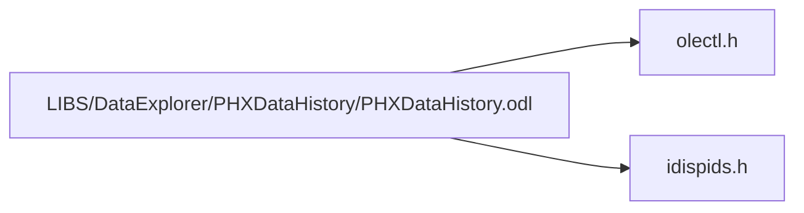

# File PHXDataHistory.odl

![][IDL]

**Location**: `LIBS/DataExplorer/PHXDataHistory/PHXDataHistory.odl`


## Classes

* [PHXDATAHISTORYLib::DataHistoryVariableMetadataStruct](structPHXDATAHISTORYLib_1_1DataHistoryVariableMetadataStruct.md#structPHXDATAHISTORYLib_1_1DataHistoryVariableMetadataStruct)
* [PHXDATAHISTORYLib::DataHistoryVariableStruct](structPHXDATAHISTORYLib_1_1DataHistoryVariableStruct.md#structPHXDATAHISTORYLib_1_1DataHistoryVariableStruct)
* [PHXDATAHISTORYLib::\_DPHXDataHistory](interfacePHXDATAHISTORYLib_1_1__DPHXDataHistory.md#interfacePHXDATAHISTORYLib_1_1__DPHXDataHistory)
* [PHXDATAHISTORYLib::\_DPHXDataHistoryToModel](interfacePHXDATAHISTORYLib_1_1__DPHXDataHistoryToModel.md#interfacePHXDATAHISTORYLib_1_1__DPHXDataHistoryToModel)
* [PHXDATAHISTORYLib::\_DPHXDataHistoryEvents](interfacePHXDATAHISTORYLib_1_1__DPHXDataHistoryEvents.md#interfacePHXDATAHISTORYLib_1_1__DPHXDataHistoryEvents)
* [PHXDATAHISTORYLib::PHXDataHistory](classPHXDATAHISTORYLib_1_1PHXDataHistory.md#classPHXDATAHISTORYLib_1_1PHXDataHistory)
* [PHXDATAHISTORYLib::DataHistoryVariableMetadata](classPHXDATAHISTORYLib_1_1DataHistoryVariableMetadata.md#classPHXDATAHISTORYLib_1_1DataHistoryVariableMetadata)
* [PHXDATAHISTORYLib::PHXDataExplorerPlugIn](interfacePHXDATAHISTORYLib_1_1PHXDataExplorerPlugIn.md#interfacePHXDATAHISTORYLib_1_1PHXDataExplorerPlugIn)
* [PHXDATAHISTORYLib::PHXDataExplorerExportPlugIn](interfacePHXDATAHISTORYLib_1_1PHXDataExplorerExportPlugIn.md#interfacePHXDATAHISTORYLib_1_1PHXDataExplorerExportPlugIn)
* [PHXDATAHISTORYLib::IDHVariable](interfacePHXDATAHISTORYLib_1_1IDHVariable.md#interfacePHXDATAHISTORYLib_1_1IDHVariable)
* [PHXDATAHISTORYLib::IPHXMenuItems](interfacePHXDATAHISTORYLib_1_1IPHXMenuItems.md#interfacePHXDATAHISTORYLib_1_1IPHXMenuItems)
* [PHXDATAHISTORYLib::ISaveContext](interfacePHXDATAHISTORYLib_1_1ISaveContext.md#interfacePHXDATAHISTORYLib_1_1ISaveContext)

## Namespaces

* [PHXDATAHISTORYLib](namespacePHXDATAHISTORYLib.md#namespacePHXDATAHISTORYLib)

## Includes

* <olectl.h>
* <idispids.h>



## Source

```
// PHXDataHistory.odl : type library source for ActiveX Control project.

// This file will be processed by the Make Type Library (mktyplib) tool to
// produce the type library (PHXDataHistory.tlb) that will become a resource in
// PHXDataHistory.ocx.

[ uuid(39BAE22B-3E29-4DC7-A37B-13B5611B0033), version(2.0),
  helpfile("PHXDataHistory.hlp"),
  helpstring("PHXDataHistory ActiveX Control module"),
  control ]
library PHXDATAHISTORYLib
{
   #include <olectl.h>
   #include <idispids.h>

   importlib(STDOLE_TLB);
   importlib(STDTYPE_TLB);

   //There is a wrapper class for this struct in DataHistoryDataStructures::DataHistorySmartPointers
   //   the wrapper needs to be kept up to date with any canges made here.
   [uuid(8671f043-8be7-4c75-b2ae-ccd193d164a9)]
   typedef struct
   {
      BSTR name;
      boolean isNumeric;
      boolean isInput;
      boolean isBinary;
      boolean isDesignVar;
      BSTR equation;
      BSTR format;
      BSTR type;
      BSTR units;
      BSTR fileName;
      BSTR geomScript;
      BSTR enumValues;
      BSTR enumAliases;
      VARIANT lowerBound;
      VARIANT upperBound;
      VARIANT customMetadata;
   } DataHistoryVariableMetadataStruct;

   //There is a wrapper class for this struct in DataHistoryDataStructures::DataHistorySmartPointers
   //   the wrapper needs to be kept up to date with any canges made here.
   [uuid(888728e8-b042-4c38-82e3-68765738116a)]
   typedef struct
   {
      VARIANT index;
      VARIANT varValue;
      boolean isValid;
      boolean isModified;
      DataHistoryVariableMetadataStruct metadata;
   } DataHistoryVariableStruct;


   //  Primary dispatch interface for CPHXDataHistoryCtrl
   [ uuid(76DF9BEB-B18B-4E42-8FA3-88D3C14C9344),
     helpstring("Dispatch interface for PHXDataHistory Control"), hidden ]
#ifndef DOXYGEN_SHOULD_SKIP_THIS    // so that _DPHXDataHistory appears as PHXDataHistory in documentation
   dispinterface _DPHXDataHistory
   {
      properties:
#else
   dispinterface PHXDataHistory
   {
      methods:
#endif
         // NOTE - ClassWizard will maintain property information here.
         //    Use extreme caution when editing this section.
         //{{AFX_ODL_PROP(CPHXDataHistoryCtrl)
         [id(1)] BSTR suggestedIndependantVar;
         [id(80)] BSTR suggestedIndependentVar;
         [id(2)] VARIANT suggestedDependentVars;
         [id(30)] long suggestedCountFrom;
         [id(37)] IDispatch* dataExplorerPointer;
         [id(38)] boolean settingRun;
         [id(40)] BSTR centerLinkServer;
         [id(41)] BSTR centerLinkRunMatrixID;
         [id(42)] BSTR centerLinkJobConnector;
         [id(43)] BSTR centerLinkQueue;
         [id(64)] LPDISPATCH dataHistoryToModel;
         [id(78)] boolean warmStartStudyComplete;         
         [id(79)] BSTR tradeStudyModelFile;
               //}}AFX_ODL_PROP

      methods:
         // NOTE - ClassWizard will maintain method information here.
         //    Use extreme caution when editing this section.
         //{{AFX_ODL_METHOD(CPHXDataHistoryCtrl)
         [id(3)] void addVariable(LPDISPATCH var);
         [id(4)] void setNumExpectedRuns(long numRuns);
         [id(5)] void startRuns();
         [id(6)] void endRuns();
         [id(7)] long getNumFailedRuns();
         [id(8)] long getErrorID(long run);
         [id(9)] BSTR getErrorMessage(long run);
         [id(10)] void setError(long run, long errorID, BSTR message);
         [id(11)] long getNumRuns();
         [id(12)] long getNumVariables();
         [id(13)] void setResult(VARIANT index, long run, VARIANT value, boolean valid, boolean modified);
         [id(14)] VARIANT getValue(VARIANT index, long run);
         [id(15)] boolean isValid(VARIANT index, long run);
         [id(16)] boolean isModified(VARIANT index, long run);
         [id(17)] void toCSVFile(BSTR fileName, [optional] VARIANT variablesInRows, [optional] VARIANT includeFailed);
         [id(18)] BSTR toXML([optional]VARIANT includeRunData);
         [id(19)] void toXMLFile(BSTR fileName, [optional]VARIANT includeRunData);
         [id(20)] void fromXML(BSTR xmlStr, [optional] VARIANT root);
         [id(21)] void fromXMLFile(BSTR fileName, [optional] VARIANT root);
         [id(22)] BSTR toCSV([optional] VARIANT variablesInRows, [optional] VARIANT includeFailed);
         [id(23)] long getNumNonEmptyRuns();
         [id(24)] IDispatch* getVariable(VARIANT index);
         [id(25)] IDispatch* createVariable();
         [id(26)] boolean isRunning();
         [id(27)] long getNumExpectedRuns();
         [id(28)] BSTR getRunName(long runNum);
         [id(29)] void setRunName(long runNum, BSTR name);
         [id(31)] void insertRun(long insertBefore);
         [id(32)] void deleteRun(long run);
         [id(33)] void deleteVariable(VARIANT index);
         [id(34)] BSTR getFormattedValue(VARIANT index, long run);
         [id(35)] void setFormattedResult(VARIANT index, long run, BSTR value, boolean valid, boolean modified);
         [id(36)] long getNumCustomVars();
         [id(39)] void fromCenterLink(BSTR serverName, BSTR runMatrixID, BSTR userName, BSTR password);
         [id(44)] long getUniqueID();
         [id(45)] VARIANT getVariableValues(VARIANT index);
         [id(46)] long createDesignVariable(VARIANT index);
         [id(47)] void addVariableAt(LPDISPATCH var, long location);
         [id(48)] void setVariableValues(VARIANT index, long run, VARIANT values, boolean valid, boolean modified);
         [id(49)] void setUsernamePassword(BSTR username, BSTR password);
         [id(50)] boolean isHighlighted(long run);
         [id(51)] void highlight(long run, boolean highlight, boolean handleEvent);
         [id(52)] void setResultAsFile(VARIANT index, long run, boolean valid, boolean modified, BSTR tempFileName, BSTR tempFileDir);
         [id(53)] long getNumDesignVariables();
         [id(54)] BSTR getDatabaseFile();
         [id(55)] void setDatabaseFile(BSTR filename);
         [id(56)] void removeAutosave();
         [id(57)] void setTradeStudySetup(BSTR setup);
         [id(58)] BSTR getTradeStudySetup();
         [id(59)] void setTradeStudyType(BSTR type);
         [id(60)] BSTR getTradeStudyType();
         [id(61)] void setShortVariableNames( boolean shortenVariableNames );
         [id(62)] IDispatch* getVariable2(VARIANT index);
         [id(63)] BSTR getVariableTempDir(VARIANT index);

         [id(65)] void setRunValues(long run, VARIANT values, BOOL valid, BOOL modified);
         [id(66)] VARIANT getFailedRunIndexes();
         [id(67)] void toXMLSaveContext(LPDISPATCH saveContext, [optional] VARIANT includeRunData);
         [id(68)] void fromXMLSaveContext(LPDISPATCH saveContext, [optional] VARIANT root);
         [id(69)] VARIANT getCompletedRunIndices();
         [id(70)] boolean isRunComplete(long run);
         [id(73)] void addCheckpoint(long runNumber, BSTR value);
         [id(74)] long getNumCheckpoints();
         [id(76)] BSTR getCheckpointValue(long checkpointIndex);
         [id(77)] long getCheckpointRunNumber(long checkpointIndex);

         // NOTE (KMC): We want to skip this documentation since this method is public for COM, but we don't want our 
         //users to be really be doing this. This was per Nathan's advice.
#ifndef DOXYGEN_SHOULD_SKIP_THIS
#endif
         [id(81)] void setUniqueID(long identifier);

         [id(82)] long getNumCompletedRuns();

#ifndef DOXYGEN_SHOULD_SKIP_THIS
         [id(83)] ULONG getCompletedRunData(
            [out]                          VARIANT* runIDs,
            [out]                          VARIANT* errorIDs,
            [out]                          VARIANT* errorMessages,
            [out]                          VARIANT* variableValues,
            [out]                          LONG* endSequenceNumber,
            [in, defaultvalue(0)]          ULONG startSequenceNumber,
            [in, defaultvalue(0xFFFFFFFF)] ULONG maxLength,
            [in, defaultvalue(FALSE)]      boolean allVariables);
#else
         [id(83)] ULONG getCompletedRunData(
            [out]                          VARIANT* runIDs,
            [out]                          VARIANT* errorIDs,
            [out]                          VARIANT* errorMessages,
            [out]                          VARIANT* variableValues,
            [out]                          LONG* endSequenceNumber,
            [in]                           ULONG startSequenceNumber = 0,
            [in]                           ULONG maxLength = ULONG_MAX,
            [in]                           boolean allVariables = false);
#endif
         [id(84)] VARIANT getHighlightedRuns();

         [id(85)] void setHighlightedRuns(VARIANT selectedRunIndices);

         [id(86)] void addVariableStructs(VARIANT dhVarStructs, long run);


      //}}AFX_ODL_METHOD
   };

   //  Primary dispatch interface for CPHXDataHistoryToModelCtrl
   [ uuid(80412376-d61e-416a-8df1-26cf2c4ec732),
     helpstring("Dispatch interface for PHXDataHistoryToModel control")]
#ifndef DOXYGEN_SHOULD_SKIP_THIS    // so that _DPHXDataHistoryToModel appears as PHXDataHistoryToModel in documentation
   dispinterface _DPHXDataHistoryToModel
   {
      properties:
#else
   dispinterface PHXDataHistoryToModel
   {
      methods:
#endif
         // NOTE - ClassWizard will maintain property information here.
         //    Use extreme caution when editing this section.
         //{{AFX_ODL_PROP(CPHXDataHistoryToModelCtrl)

         // add property definitions here

         //}}AFX_ODL_PROP

      methods:
         // NOTE - ClassWizard will maintain method information here.
         //    Use extreme caution when editing this section.
         //{{AFX_ODL_METHOD(CPHXDataHistoryToModelCtrl)

         [id(1)] BOOL canSaveToModel(LPDISPATCH dataHistory, long run);

         [id(2)] void saveToModel(LPDISPATCH dataHistory, long run);

         [id(3)] BOOL canRerunRuns(LPDISPATCH dataHistory, VARIANT runs);

         [id(4)] void rerunRuns(LPDISPATCH dataHistory, VARIANT runs);

         [id(5)] void closeDataHistory(LPDISPATCH dataHistory);

               //}}AFX_ODL_METHOD
   };


   //  Event dispatch interface for CPHXDataHistoryCtrl
   [ uuid(799E1901-5409-45C6-ACEA-0255FE4BD3C4),
     helpstring("Event interface for PHXDataHistory Control") ]
#ifndef DOXYGEN_SHOULD_SKIP_THIS
   dispinterface _DPHXDataHistoryEvents
#else
   dispinterface PHXDataHistoryEvents
#endif
   {
      properties:
         //  Event interface has no properties

      methods:
         // NOTE - ClassWizard will maintain event information here.
         //    Use extreme caution when editing this section.
         //{{AFX_ODL_EVENT(CPHXDataHistoryCtrl)
         [id(1)] void variablesChanged();
         [id(2)] void progressMeterChange(long completed, long total);
         [id(3)] void progressMeterStart();
         [id(4)] void progressMeterStop();
         [id(5)] void dataChanged(long varIndex, long runIndex);
         [id(6)] void progressMeterEstimate(long estimate);
         [id(7)] void highlightChanged(long runIndex, boolean highlight, boolean handleEvent);

         //}}AFX_ODL_EVENT
   };

#ifndef DOXYGEN_SHOULD_SKIP_THIS

   //  Class information for CPHXDataHistoryCtrl
   
   [ uuid(1636E131-1E51-4C6A-B31D-5E6D691C57C9),
     helpstring("PHXDataHistory Control"), control ]
   coclass PHXDataHistory
   {
      [default] dispinterface _DPHXDataHistory;
      [default, source] dispinterface _DPHXDataHistoryEvents;
   };

   [ uuid(CA4F77A7-2265-48B5-AFAB-F2F2E0F02F91) ]
   coclass DataHistoryVariableMetadata
   {
      [default] dispinterface IDHVariable;
   };

#endif


   [ uuid(14375246-E4A1-4A30-85B2-0DF991B4FFB2),
     helpstring("Dispatch interface for a PHXDataExplorer Plugin") ]
   dispinterface PHXDataExplorerPlugIn
   {
      properties:

      methods:
         [id(6)] LPDISPATCH getDataHistory();
         [id(7)] void setDataHistory(LPDISPATCH dataHistory);
         [id(8)] LPDISPATCH getModelCenter();
         [id(9)] void setModelCenter(LPDISPATCH modelCenter);
         [id(10)] BSTR getPageTitle();
         [id(11)] BSTR toString();
         [id(12)] void fromString(BSTR str);
         [id(13)] void getMenuItems(LPDISPATCH iPHXMenuItem);
         [id(14)] void invokeMenuItem(long id);
         [id(15)] boolean isMenuItemEnabled(long id);
         [id(16)] boolean updateHint();
         [id(17)] void setStartContext(BSTR str);
         [id(18)] BSTR getThumbnail(BSTR hints);
   }

   [ uuid(32A29C04-BB5C-4029-92AB-3DFC5C7B72A2),
     helpstring("Dispatch interface for a PHXDataExplorer Plugin that provides custom image export") ]
   dispinterface PHXDataExplorerExportPlugIn
   {
      properties:

      methods:
         [id(18)] void exportImage(BSTR hints, BSTR filename);
   }

   typedef enum {
      PHXMENU_CUT=-1,            
      PHXMENU_COPY=-2,           
      PHXMENU_PASTE=-3,          
      PHXMENU_DELETE=-4,         
      PHXMENU_PAGESETTINGS=-5,   
      PHXMENU_PRINT=-6,          
      PHXMENU_EXPORT=-7,         
      PHXMENU_TOOLTIP=-8         
   } PHXMENU_PREDEFS;


   //  Primary dispatch interface for DataHistoryVariableMetadata
   [ uuid(4BA85B03-92CA-4CFF-96CE-6E2D10365C9D) ]
   dispinterface IDHVariable
   {
#ifndef DOXYGEN_SHOULD_SKIP_THIS
      properties:
#else
      methods:
#endif
         // NOTE - ClassWizard will maintain property information here.
         //    Use extreme caution when editing this section.
         //{{AFX_ODL_PROP(IDHVariable)
         [id(1)] BSTR name;
         [id(2)] BSTR equation;
         [id(3)] boolean isDesignVar;
         [id(4)] boolean isNumeric;
         [id(5)] boolean isInput;
         [id(6)] BSTR format;
         [id(7)] BSTR enumValues;
         [id(8)] BSTR enumAliases;
         [id(9)] VARIANT lowerBound;
         [id(10)] VARIANT upperBound;
         [id(11)] BSTR type;
         [id(12)] BSTR units;
         [id(17)] BSTR geomScript;
         [id(18)] boolean isBinary;
         [id(19)] BSTR fileName;
         //}}AFX_ODL_PROP

      methods:
         // NOTE - ClassWizard will maintain method information here.
         //    Use extreme caution when editing this section.
         //{{AFX_ODL_METHOD(IDHVariable)
         [id(13)] long getNumEnumValues();
         [id(14)] BSTR getEnumValue(long index);
         [id(15)] BSTR getEnumAlias(long index);
         [id(16)] long getNumEnumAliases();
         [id(20)] void setMetaData(BSTR key, BSTR value);
         [id(21)] BSTR getMetaData(BSTR key);
         [id(22)] SAFEARRAY(BSTR) getMetaDataKeys();

         [id(23)] void copyFrom(LPDISPATCH other);

         [id(24)] void removeMetadata(BSTR key);

         //}}AFX_ODL_METHOD
   };

   [ uuid(901e602e-d00e-4efc-a71e-10c554170747) ]
   dispinterface IPHXMenuItems
   {
#ifndef DOXYGEN_SHOULD_SKIP_THIS
      properties:
#else
      methods:
#endif
         [id(1)] long numItems;
                        
      methods:
         [id(2)] void setMenuItem(long index, BSTR name, BSTR description);
         [id(3)] BSTR getMenuItemName(long index);
         [id(4)] BSTR getMenuItemDescription(long index);
   };

    // -------------------------------------------------------------- ISaveContext
   [ uuid(3CD8CED0-4519-40C9-8FA6-A60A11011D2D),
      helpstring("SaveContext") ]
   dispinterface ISaveContext
   {
#ifndef DOXYGEN_SHOULD_SKIP_THIS
      properties:
#else
      methods:
#endif
         // properties go here

      methods:
         [id(1)] boolean saveFile(BSTR sourceLocation, BSTR context);
         [id(2)] boolean restoreFile(BSTR fileID, BSTR targetLocation);
         [id(3)] void close();
         [id(4)] BSTR getSaveLocation();
         [id(5)] LPUNKNOWN saveFileStream(BSTR context);
         [id(6)] LPUNKNOWN restoreFileStream(BSTR fileID);
         [id(7)] int getFileFormat();
         [id(8)] void setFileFormat(int fileFormat);
   };

   //{{AFX_APPEND_ODL}}
   //}}AFX_APPEND_ODL}}
};
```

[public]: https://img.shields.io/badge/-public-brightgreen (public)
[private]: https://img.shields.io/badge/-private-red (private)
[IDL]: https://img.shields.io/badge/language-IDL-blue (IDL)