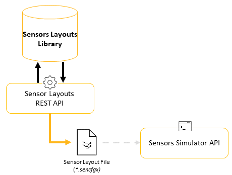

# Sensor Layouts REST API Description

## Introduction

The Sensor Layouts REST API v1 is compatible with 2022 R1 and later versions.

The Sensor Layouts REST API allows you to manage your Sensor Layout Library.

This API offers the same capabilities as the Sensor Layout section of the Sensor Labs desktop application, namely:

-   Upload a packed sensor layout and add it to the library
-   Create a new empty sensor layout
-   Update the sensor layout given by its ID with the information in the body
-   Download a sensor layout to a file with the specified name
-   List all sensor layouts available in the library
-   Read the sensor layout with the given ID
-   Delete the sensor layout from the library
-   Delete all the sensor layouts from the library

Sensor Layouts is a REST API. Built on a client-to-server response logic, this API allows you to easily communicate with the Sensor Modeler application's backends by performing simple API calls in the form of HTTP requests.

To operate Sensors REST API and Sensor Layouts REST API use TCP ports.

-   Sensors API: TCP 5128
-   Sensor Layouts API: TCP 5127
-   Sensor Layout Library: TCP 5101
-   Sensor Library: TCP 5102
-   Sensor Foundry: TCP 5103
-   Sensor Editor: TCP 5104
-   Sensor Layout Editor: TCP 5105

To use Sensor Layouts REST API, you have to select the **AVxcelerate Sensor Labs** feature when you install the AVxcelerate Sensors package.

To access the Sensor Layouts REST API, start the server using the script provided in the *Sensor\_Labs\_API* folder:

-   on Windows: `sensor-labs-api.ps1`
-   on Linux: `sensor-labs-api.sh`

An interactive version of the API documentation, with a Swagger interface, is available when running the script with the \`start-doc\` argument.

The **REFERENCE DOCUMENTATION** provided on the Developer Portal is not testable.

## Resources

The resources that are handled by the endpoints of this API are the sensor layouts in the library.

A sensor layout defines the sensor assets to be mounted on your ego vehicle for simulation in AVxcelerate Sensors Simulator.

For more details about sensor layouts refer to the **Sensor Layout** section in AVxcelerate Sensors Simulator User's Guide.

## Platform overview

The sensor models created using Sensors REST API are the inputs for the creation and edition of Sensor Layouts using the Sensor Layouts REST API.

Once created, a Sensor layout can be downloaded as a packed file \(.sencfgx\) so that it can be set as a resource for simulation in AVxcelerate Sensors Simulator.



Using Sensor Layouts REST API you can develop applications for batch creation of sensor layouts or Sensor Layout Library management automation.

In this API, each sensor layout has a unique identifier that is automatically generated and not editable. To read or update a sensor layout, the sensor layout's identifier is a required input parameter. To get the identifier \(ID\) of all the sensor layouts in your library, you can use the method **GET /avx-sensorlabs/v1/sensorlayouts**. When creating a new sensor layout, the identifier of the created layout is provided in the response.

Both Sensors and Sensor Layouts REST APIs rely on the same server and micro-services.

## Requests

The easiest way to send API requests is using the Swagger UI interactive documentation, however you can also use Curl or Postman.

Here are some request examples.

**GET request**

To list all the sensor layouts available in the library \(with the default parameters\):

Curl

```
curl -X 'GET' \
  'http://localhost:5127/avx-sensorlabs/v1/sensorlayouts' \
  -H 'accept: application/json'
```

Postman

**GET** `http://localhost:5127/avx-sensorlabs/v1/sensorlayouts`

**POST request**

To create an empty sensor layout:

Curl

```
curl -X 'POST' \
    'http://localhost:5127/avx-sensorlabs/v1/sensorlayouts' \
    -H 'accept: application/json' \
    -H 'Content-Type: application/json' \
    -d '{
        "name": "layout name test"
     }'
```

Postman

**POST** `http://localhost:5127/avx-sensorlabs/v1/sensorlayouts`

In the request body, select **Raw \> json**, then define the name of the sensor layout to create, for example:

```
{
  "name": "layout name test"
}
```

**PUT request**

To update a sensor layout with the information in the body:

Curl

```
curl -X 'PUT' \
    'http://localhost:5127/avx-sensorlabs/v1/sensorlayouts/b81927e9-d712-41f8-81f1-15d63a541e37' \
    -H 'accept: application/json' \
    -H 'Content-Type: application/json' \
    -d '{
    "metadata": {
        "name": "MyLayout",
        "manufacturer": "",
        "version": "1.0",
        "comment": "1 camera",
        "vehicleModel": ""
    },
    "root": {
        "nodeName": "Sensor Referential",
        "transform": {
            "position": {
                "x": 40,
                "y": 0,
                "z": 0
        },
            "rotation": {
                "x": 0,
                "y": 0,
                "z": 0
        }
    },
    "sensorInfo": null,
    "children": [
        {
        "nodeName": "camera",
        "transform": {
          "position": {
            "x": 0,
            "y": 0.6427,
            "z": -3.4
          },
          "rotation": {
            "x": 0,
            "y": 0,
            "z": 0
          }
        }
      }    
    ]
    },
    "missingSensorNames": null
}'
```

Postman

**PUT** `http://localhost:5127/avx-sensorlabs/v1/sensorlayouts/b81927e9-d712-41f8-81f1-15d63a541e37`

In the request body, select **Raw \> json**, then define all properties of the sensor layout, for example:

```
{
    "metadata": {
        "name": "MyLayout",
        "manufacturer": "",
        "version": "1.0",
        "comment": "1 camera",
        "vehicleModel": ""
    },
    "root": {
        "nodeName": "Sensor Referential",
        "transform": {
            "position": {
                "x": 40,
                "y": 0,
                "z": 0
        },
            "rotation": {
                "x": 0,
                "y": 0,
                "z": 0
        }
    },
    "sensorInfo": null,
    "children": [
    {
        "nodeName": "camera",
        "transform": {
          "position": {
            "x": 0,
            "y": 0.6427,
            "z": -3.4
          },
          "rotation": {
            "x": 0,
            "y": 0,
            "z": 0
          }
        }
      }
    ]
    },
    "missingSensorNames": null
}
```

**DELETE request**

To delete a sensor layout from the library:

Curl

```
curl -X 'DELETE' \
  'http://localhost:5127/avx-sensorlabs/v1/sensorlayouts/5fc0f2f8-bf84-4bfe-8f70-e6b209377b47' \
  -H 'accept: application/json'
```

Postman

**DELETE** `http://localhost:5127/avx-sensorlabs/v1/sensorlayouts/5fc0f2f8-bf84-4bfe-8f70-e6b209377b47`

## Responses

The **REFERENCE DOCUMENTATION** provides response samples in json format for each endpoint.

Here are the possible response types:

|Response|Description|
|--------|-----------|
|`200 Success`|Success with or without response body.|
|`400 Bad Request`| |
|`404 Not Found`| |

