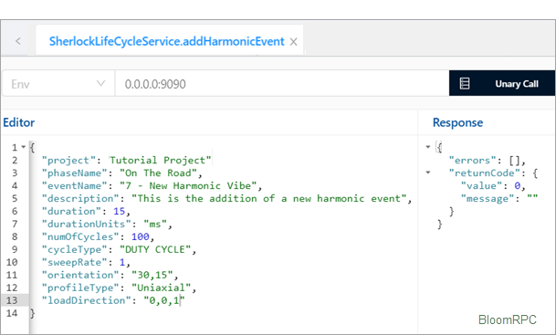

# Sherlock Life Cycle Service- SherlockLifeCycleService.proto

[Click here to return to the main index to Sherlock's APIs.](ch01s02.md "Index to the Sherlock APIs")

The APIs in this section return the list of Life Cycle events for a given
project as well as allow you to define different Life Cycle events and
profiles. Clicking on the active links in the table below will take you to the
selected API.

**Table  1.81. Index to Sherlock Life Cycle Service APIs**

| **Method Name**  | **Request Type** | **Response Type** | **Description** |
| ---------------- | ---------------- | ----------------- | --------------- |
| addHarmonicEvent |                  |                   |                 |
[.AddHarmonicEventRequest](ch01s06.md#sherlock_ug_AddHarmonicEventRequest "AddHarmonicEventRequest")|
[.AddHarmonicEventResponse](ch01s06.md#sherlock_ug_AddHarmonicEventResponse "AddHarmonicEventResponse")| Define and add a new harmonic vibe Life Cycle
event.  
addHarmonicVibeProfiles|
[.AddHarmonicVibeProfilesRequest](ch01s06s02.md#sherlock_ug_AddHarmonicVibeProfilesRequest "AddHarmonicVibeProfilesRequest")|
[.AddHarmonicVibeProfilesResponse](ch01s06s02s04.md "AddHarmonicVibeProfilesResponse")| Define and add new harmonic vibe life
cycle event profiles.  
addRandomVibeProfiles|
[.AddRandomVibeProfilesRequest](ch01s06s06.md#sherlock_ug_AddRandomVibeProfilesRequest "AddRandomVibeProfilesRequest")|
[.AddRandomVibeProfilesResponse](ch01s06s02s03.md "AddHarmonicVibeProfilesRequest.HarmonicVibeProfile.Entry")| Define and add
new random vibe life cycle event profiles.  
addRandomVibeEvent|
[.AddRandomVibeEventRequest](ch01s06s05.md#sherlock_ug_AddRandomVibeEventRequest "AddRandomVibeEventRequest")|
[.AddRandomVibeEventResponse](ch01s06s05.md#sherlock_ug_AddRandomVibeEventRequest "AddRandomVibeEventRequest")| Define and add a new random vibe Life Cycle
event.  
addShockEvent| [.AddShock EventRequest](ch01s06s03.md#sherlock_ug_AddShockEventRequest "AddShockEventRequest")| [.AddShockEventResponse](ch01s06s03s02.md "AddShockEventResponse")| Define and add a new shock Life Cycle event.  
addShockProfiles|
[.AddShockProfilesRequest](ch01s06s04.md#sherlock_ug_AddShockProfilesRequest "AddShockProfilesRequest")| [.AddShockProfilesResponse](ch01s06s04s04.md "AddShockProfilesResponse")| See note A below.  
addThermalEvent|
[.AddThermalEventRequest](ch01s06s07.md#sherlock_ug_AddThermalEventRequest "AddThermalEventRequest")| [.AddThermalEventResponse](ch01s06s07s02.md "AddThermalEventResponse")| Define and add a new thermal Life Cycle event.  
addThermalProfiles|
[.AddThermalProfilesRequest](ch01s06s08.md#sherlock_ug_AddThermalProfilesRequest "AddThermalProfilesRequest")| [.AddThermalProfilesResponse ](ch01s06s08s04.md "AddThermalProfilesResponse")| Define and add new thermal
life cycle event profiles.  
createLifePhase|
[.CreateLifePhaseRequest](ch01s06s09.md#sherlock_ug_CreateLifePhaseRequest "CreateLifePhaseRequest")| [.CreateLifePhaseResponse](ch01s06s09s02.md "CreateLifePhaseResponse")| Define and add a new life phase.  
deleteEvent|
[.DeleteEventRequest](ch01s06s10.md#sherlock_ug_DeleteEventRequest "DeleteEventRequest")| [.ReturnCode](ch01s04s04.md "Return Code")| Request
to delete a life cycle event in a project.  
deletePhase|
[.DeletePhaseRequest](ch01s06s11.md#sherlock_ug_DeletePhaseRequest "DeletePhaseRequest")| [.ReturnCode](ch01s04s04.md "Return Code")| Delete a
life phase for a project  
listAmplUnits|
[.ListAmplUnitsRequest](ch01s06s13.md#sherlock_ug_ListAmplUnitsRequest "ListAmplUnitsRequest")| [.ListAmplUnitsResponse](ch01s06s13s02.md "ListAmplUnitsResponse")| Returns a list of amplitude units when adding a
random vibe profile.  
listDurationUnits|
[.ListDurationUnitsRequest](ch01s06s14.md#sherlock_ug_ListDurationUnitsRequest "ListDurationUnitsRequest")| [.ListDurationUnitsResponse](ch01s06s14s02.md "ListDurationUnitsResponse")| Returns a list of duration units when adding a
Life Cycle event.  
listFreqUnits|
[.ListFreqUnitsRequest](ch01s06s15.md#sherlock_ug_ListFreqUnitsRequest "ListFreqUnitsRequest")| [.ListFreqUnitsResponse](ch01s06s15s02.md "ListFreqUnitsResponse")| Returns a list of frequency units.  
listHarmonicEvents|
[.ListHarmonicEventsRequest](ch01s06s16.md#sherlock_ug_ListHarmonicEventsRequest "ListHarmonicEventsRequest")| [.ListHarmonicEventsResponse](ch01s06s16s02.md "ListHarmonicEventsResponse")| Returns a list of harmonic events defined for a
project.  
listHarmonicProfileTypes| [.ListHarmonicProfileTypes Request](ch01s06s17.md#sherlock_ug_ListHarmonicProfileTypesRequest "ListHarmonicProfileTypesRequest")|
[.ListHarmonicProfileTypesResponse](ch01s06s17s02.md "ListHarmonicProfileTypesResponse")| Returns a list of Harmonic Load Profile
types.  
listLifeCycleEvents|
[.ListLCEventsRequest](ch01s06s14.md#sherlock_ug_ListDurationUnitsRequest "ListDurationUnitsRequest")| [.ListLCEventsResponse](ch01s06s18s02.md "ListLCEventsResponse")| Returns a list of Life Cycle phases and their events
given a Sherlock project directory.  
listLifeCycleStates|
[.ListLCStatesRequest](ch01s06s19.md#sherlock_ug_ListLCStatesRequest "ListLCStatesRequest")| [.ListLCStatesResponse](ch01s06s19s02.md "ListLCStatesResponse")| Returns a list of Life Cycle states.  
listLifeCycleTypes|
[.ListLCTypesRequest](ch01s06s20.md#sherlock_ug_ListLCTypesRequest "ListLCTypesRequest")| [.ListLCTypesResponse](ch01s06s20s02.md "ListLCTypesResponse")| Returns a list of Life Cycle types.  
listRandomVibeProfileTypes|
[.ListRandomVibeProfileTypesRequest](ch01s06s21.md#sherlock_ug_ListRandomVibeProfileTypesRequest "ListRandomVibeProfileTypesRequest")|
[.ListRandomVibeProfileTypesResponse](ch01s06s21s02.md "ListRandomVibeProfileTypesResponse")| Returns a list of random vibe profile
types.  
listRandomVibeEvents|
[.ListRandomVibeEventsRequest](ch01s06s22.md#sherlock_ug_ListRandomVibeEventsRequest "ListRandomVibeEventsRequest")|
[.ListRandomVibeEventsResponse](ch01s06s22s02.md "ListRandomVibeEventsResponse")| Returns a list of random vibe events defined
for a project.  
listShockEvents|
[.ListShockEventsRequest](ch01s06s23.md#sherlock_ug_ListShockEventsRequest "ListShockEventsRequest")| [.ListShockEventsResponse](ch01s06s23s02.md "ListShockEventsResponse")| Returns a list of shock events defined for a
project.  
listShockLoadUnits| [.List ShockLoadUnitsRequest](ch01s06s24.md#sherlock_ug_ListShockLoadUnitsRequest "ListShockLoadUnitsRequest")| [.ListShockLoadUnitsResponse](ch01s06s24s02.md "ListShockLoadUnitsResponse")| Returns a list of Shock Load units.  
listShockPulses|
[.ListShockPulsesRequest](ch01s06s25.md#sherlock_ug_ListShockPulsesRequest "ListShockPulsesRequest")| [.ListShockPulsesResponse](ch01s06s25s02.md "ListShockPulsesResponse")| Returns a list of shock pulses.  
listTempUnits|
[.ListTempUnitsRequest](ch01s06s26.md#sherlock_ug_ListTempUnitsRequest "ListTempUnitsRequest")| [.ListTempUnitsResponse](ch01s06s26s02.md "ListTempUnitsResponse")| Returns a list of temperature units.  
loadHarmonicProfile|
[.LoadHarmonicProfileRequest](ch01s06s27.md#sherlock_ug_LoadHarmonicProfileRequest "LoadHarmonicProfileRequest")|
[.LoadHarmonicProfileResponse](ch01s06s27s03.md "LoadHarmonicProfileResponse")| Loads a harmonic profile from a .dat or .csv
file.  
loadRandomVibeProfile|
[.LoadRandomVibeProfileRequest](ch01s06s28.md#sherlock_ug_LoadRandomVibeProfileRequest "LoadRandomVibeProfileRequest")|
[.LoadRandomVibeProfileResponse](ch01s06s28s03.md "LoadRandomVibeProfileResponse")| Loads a random vibe profile from a .dat or
.csv file.  
loadShockProfileDataset|
[.LoadShockProfileDatasetRequest](ch01s06s29.md#sherlock_ug_LoadShockProfileDatasetRequest "LoadShockProfileDatasetRequest")|
[.LoadShockProfileDatasetResponse](ch01s06s29s03.md "LoadShockProfileDatasetResponse")| Loads a shock profile using dataset from a
.dat or .csv file.  
loadShockProfilePulses|
[.LoadShockProfilePulsesRequest](ch01s06s30.md#sherlock_ug_LoadShockProfilePulsesRequest "LoadShockProfilePulsesRequest")|
[.LoadShockProfilePulsesResponse](ch01s06s30s03.md "LoadShockProfilePulsesResponse")| Loads a shock profile using pulses from a
.dat or .csv file.  
loadThermalProfile|
[.LoadThermalProfileRequest](ch01s06s31.md#sherlock_ug_LoadThermalProfileRequest "LoadThermalProfileRequest")| [.LoadThermalProfile Response](ch01s06s31s03.md "LoadThermalProfileResponse")| Loads a thermal
profile from a .dat or .csv file.

**Note A:** **addShockProfiles** : Define and add new shock life cycle event
profiles. Keep in mind, the Pulse Duration and Load values defined in the
Shock Profile Editor are relative values used solely within the editor to
define the profile shape. A combination of all the primary pulse shapes is
then used to define the pulse profile.

## Add Harmonic Event

Links:

### AddHarmonicEventRequest

Request to define and add a new harmonic vibe Life Cycle event.

**Table  1.82. AddHarmonicEventRequest**

| **Field**     | **Type**                                       | **Label** | **Description**                                                                  |
| ------------- | ---------------------------------------------- | --------- | -------------------------------------------------------------------------------- |
| project       | [string](ch01s11.md "gRPC Scalar Value Types") |           | Sherlock project name.                                                           |
| phaseName     | [string](ch01s11.md "gRPC Scalar Value Types") |           | The name of the Life Cycle phase to add this event to.                           |
| eventName     | [string](ch01s11.md "gRPC Scalar Value Types") |           | Name of the harmonic event.                                                      |
| description   | [string](ch01s11.md "gRPC Scalar Value Types") |           | Description of the harmonic event.                                               |
| duration      | [double](ch01s11.md "gRPC Scalar Value Types") |           | Event duration length.                                                           |
| durationUnits | [string](ch01s11.md "gRPC Scalar Value Types") |           | Event duration length units.                                                     |
| numOfCycles   | [double](ch01s11.md "gRPC Scalar Value Types") |           | Number of cycles defined for this harmonic event.                                |
| cycleType     | [string](ch01s11.md "gRPC Scalar Value Types") |           | The cycle type. For example: "COUNT", "DUTY CYCLE", "PER YEAR", "PER HOUR", etc. |
| sweepRate     | [double](ch01s11.md "gRPC Scalar Value Types") |           | Sweep rate for the harmonic event.                                               |
| orientation   | [string](ch01s11.md "gRPC Scalar Value Types") |           | PCB orientation in the format of azimuth, elevation. Example: 30,15.             |
| profileType   | [string](ch01s11.md "gRPC Scalar Value Types") |           | Harmonic load profile types. Example valid values are "Uniaxial" and "Triaxial". |
| loadDirection | [string](ch01s11.md "gRPC Scalar Value Types") |           | Load direction in the format of x,y,z. Example: 0,0,1.                           |

### AddHarmonicEventResponse

Response from adding a harmonic vibe event.

**Table  1.83. AddHarmonicEventResponse**

| **Field**  | **Type**                                       | **Label** | **Description**          |
| ---------- | ---------------------------------------------- | --------- | ------------------------ |
| returnCode | [ReturnCode](ch01s04s04.md "Return Code")      |           | Status code of response. |
| errors     | [string](ch01s11.md "gRPC Scalar Value Types") | repeated  | List of                  |
validation errors.

### Examples: Add Harmonic Event

#### Proto Request Example

    {
      "project": "Tutorial Project",
      "phaseName": "On The Road",
      "eventName": "7 - New Harmonic Vibe",
      "description": "This is the addition of a new harmonic event",
      "duration": 15,
      "durationUnits": "ms",
      "numOfCycles": 100,
      "cycleType": "DUTY CYCLE",
      "sweepRate": 1,
      "orientation": "30,15",
      "profileType": "Uniaxial",
      "loadDirection": "0,0,1"
    }

#### Request Response

---

#### Python Example

For a Python example, refer to the online [PySherlock Reference](https://sherlock.docs.pyansys.com/version/stable/api/index.md).

* * *

| [Prev](layer-service/ch01s05s19s03.md) | / [Contents](index.md) / [Home](../../index.htm) | [Next](ch01s06s02.md) |
| ------------------------ | ------------------------------------------------ | --------------------- |

