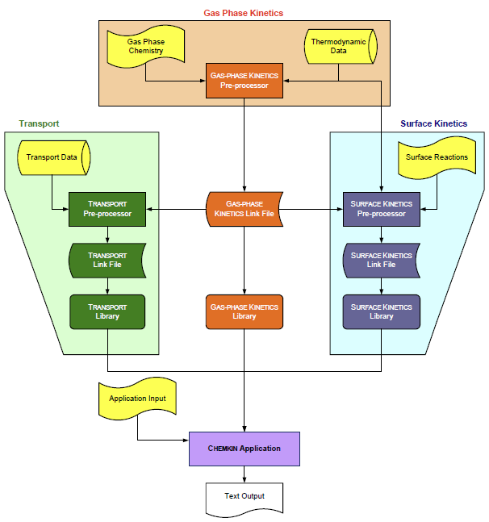

# Structure and Use of the Surface Kinetics Utilities

Using the _Surface Kinetics_ utilities is analogous to using the _Gas-phase
Kinetics_ utilities, and the _Surface Kinetics_ Pre-processor can only be used
after the _Gas-phase Kinetics_ Pre-processor has been executed. The flow of
information from the _Gas-phase Kinetics_ Pre-processor to the Application
program is shown in [Figure 1.3: Relationships between the CHEMKIN Pre- processors and an Application](pgfId-1017373.md#i62358 "Figure 1.3: Relationships between the CHEMKIN Pre-processors and an Application") . A
third set of utilities, which handles gas-phase molecular transport, may or
may not be needed in a particular Application. The Transport utilities are
described in [Structure and Use of the Transport Utilities](pgfId-1021250.md "1.6. Structure and Use of the Transport Utilities").

The _Gas-phase Kinetics_ Pre-processor introduces the chemical elements that
are used in the entire Chemistry Set, whether they are in the gas-phase
reaction mechanism or the surface reaction mechanism. Gas-phase species (which
can appear in surface reactions) are also introduced with the _Gas-phase
Kinetics_ Pre-processor. Thus, if a gas-phase species appears in surface
reactions, they must be included in the input to the _Gas-phase Kinetics_ Pre-
processor, even if there are no gas-phase reactions.

<b>
Figure 1.3: Relationships between the CHEMKIN Pre-processors and an
Application
</b>

Like _Gas-phase Kinetics_ , the _Surface Kinetics_ package is composed of two
software components:

  * _Surface Kinetics_ Pre-processor

  * _Surface Kinetics_ Subroutine Library

As with the _Gas-phase Kinetics_ subroutine library, your own routines or
application programs can call _Surface Kinetics_ subroutines that define the
terms in the equations relating to equation of state, chemical production
rates, and thermodynamics, and then combine the results to define the problem.
The _Surface Kinetics_ subroutines provide information specifically for
surface chemistry on a particular surface material.

The _Surface Kinetics_ Pre-processor first reads the symbolic description of
the surface reaction mechanism and then extracts from a Thermodynamic Database
the appropriate thermodynamic information for the species involved in the
surface reaction mechanism. _Gas-phase Kinetics_ and _Surface Kinetics_ can
share a common database for this purpose. The output of the _Surface Kinetics_
Pre-processor is the _Surface Kinetics_ Linking File, which contains all the
pertinent information on the elements, species, and reactions in the surface
reaction mechanism. Information on gas-phase species is brought in from the
_Gas-phase Kinetics_ Linking File, and thus is duplicated in the two linking
files for efficiency in subsequent data processing.

The _Surface Kinetics_ Linking File is read by an initialization routine in
the _Surface Kinetics_ Subroutine Library (`SKINIT`) that is called from the
Ansys Chemkin application program. The purpose of the initialization is to
populate three data arrays (one integer, one floating point, and one character
data type), which must be allocated by your program, that are then passed into
and used internally by the other subroutines in the _Surface Kinetics_
Subroutine Library.

The _Surface Kinetics_ Subroutine Library has approximately seventy (70)
subroutines that return information on elements, species, reactions,
thermodynamic properties, and chemical production rates. Generally, the input
to these routines will be the state of the gas and the surface--pressure,
temperature, and species composition. The species composition is specified in
terms of gas-phase mole fractions, surface site fractions, and bulk-phase
activities; surface site densities are also input to complete the
specification of the state of the surface.
