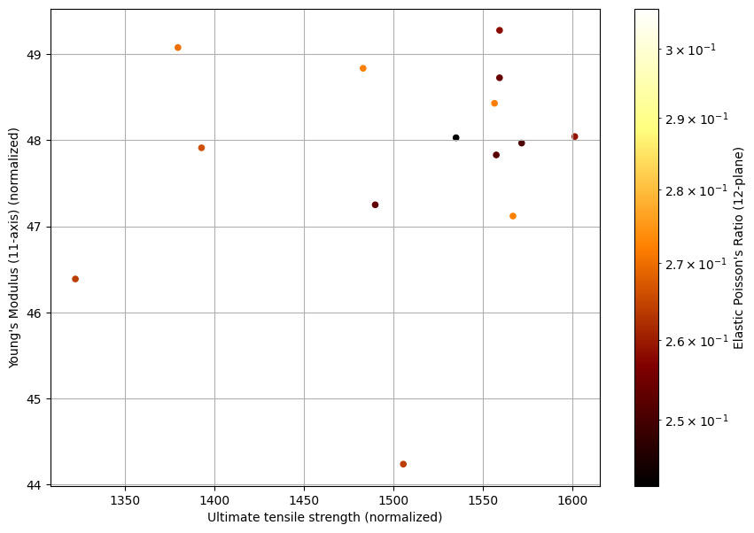

# Exporting data

Export the values of Ultimate tensile strength, Modulus, Baseline fiber volume, and Poisson's ratio for a set of records from the MI Training database.

This example demonstrates:

* Retrieving a list of databases from a Granta MI server
* Browsing the tables of a Granta MI database
* Searching a Granta MI database using the *CriteriaSearch* operation
* Retrieving values for attributes of a record

## Create a Granta MI Session

Import the GRANTA_MIScriptingToolkit package, and create a connection to a Granta MI server.


```python
import GRANTA_MIScriptingToolkit as gdl

session = gdl.GRANTA_MISession('http://my.server.name/mi_servicelayer', autoLogon=True)
```

## Get the Databases

Access the browse service from the session and execute the *GetDatabases* method.


```python
browseService = session.browseService
databases = browseService.GetDatabases().databases

print("Found {0} databases on the Granta MI Server".format(len(databases)))
for d in databases:
    print("Database key: {0.DBKey}, Database name: {0.volumeName}".format(d))
```
*Previous cell output:*
```output
Found 1 databases on the Granta MI Server
Database key: MI_Training, Database name: MI Training
```
Use pandas to display the available databases.


```python
import pandas as pd

df = pd.DataFrame({'DBKey': [db.DBKey for db in databases],
                  'DBName': [db.volumeName for db in databases]})
df
```


<div>
<table border="1" class="dataframe">
  <thead>
    <tr style="text-align: right;">
      <th></th>
      <th>DBKey</th>
      <th>DBName</th>
    </tr>
  </thead>
  <tbody>
    <tr>
      <th>0</th>
      <td>MI_Training</td>
      <td>MI Training</td>
    </tr>
  </tbody>
</table>
</div>


## Get the tables in a database

Use the *GetTables* method from the browse service to see what tables are available in the MI Training database.


```python
dbKey = "MI_Training"

tables = browseService.GetTables(gdl.GetTables(DBKey=dbKey)).tableDetails

print("Found {0} tables in database {1}".format(len(tables), dbKey))
print("Printing the first 5")
for t in tables[:5]:
    print("Table name: {0}".format(t.tableReference.name))
```
*Previous cell output:*
```output
Found 20 tables in database MI_Training
Printing the first 5
Table name: MaterialUniverse
Table name: ProcessUniverse
Table name: Restricted Substances
Table name: Legislations and Lists
Table name: Design Data
```
## Searching a database

Search MI Training for all records in the Tensile Test Data table which have a defined *Young's modulus (11-axis) (normalized)*


```python
table = 'Tensile Test Data'
attribute = "Young's modulus (11-axis) (normalized)"

tableRef = gdl.PartialTableReference(tableName=table)
attrRef = gdl.AttributeReference(name=attribute, DBKey=dbKey, partialTableReference=tableRef)
searchCriterion = gdl.RecordSearchCriterion(searchAttribute=attrRef, existsSearchValue=gdl.ExistsSearchValue())
request = gdl.CriteriaSearch(DBKey=dbKey, searchCriteria=[searchCriterion])

searchResults = session.searchService.CriteriaSearch(request).searchResults
```

Print the *shortName* and *longName* of the first 5 records returned by the search.


```python
df2 = pd.DataFrame({'ShortName': [r.shortName for r in searchResults],
                     'LongName': [r.longName  for r in searchResults]})
df2.head()
```


<div>
<table border="1" class="dataframe">
  <thead>
    <tr style="text-align: right;">
      <th></th>
      <th>ShortName</th>
      <th>LongName</th>
    </tr>
  </thead>
  <tbody>
    <tr>
      <th>0</th>
      <td>LBJ8311A</td>
      <td>S-Glass Unitape S2/SP381, 3M, 0° tension, Spec...</td>
    </tr>
    <tr>
      <th>1</th>
      <td>LBJ6213A</td>
      <td>S-Glass Unitape S2/SP381, 3M, 0° tension, Spec...</td>
    </tr>
    <tr>
      <th>2</th>
      <td>LBJ4211A</td>
      <td>S-Glass Unitape S2/SP381, 3M, 0° tension, Spec...</td>
    </tr>
    <tr>
      <th>3</th>
      <td>LBJ4213A</td>
      <td>S-Glass Unitape S2/SP381, 3M, 0° tension, Spec...</td>
    </tr>
    <tr>
      <th>4</th>
      <td>LBJ6214A</td>
      <td>S-Glass Unitape S2/SP381, 3M, 0° tension, Spec...</td>
    </tr>
  </tbody>
</table>
</div>


## Export data from records

Create attribute references for the attributes you want to export and export data from all records.


```python
attributes = ["Young's Modulus (11-axis) (normalized)", "Ultimate tensile strength (normalized)",
              "Baseline fiber volume", "Elastic Poisson's Ratio (12-plane)"]

attrRefs = [gdl.AttributeReference(name=a, DBKey=dbKey, partialTableReference=tableRef) for a in attributes]
recordRefs = [r.recordReference for r in searchResults]
request = gdl.GetRecordAttributesByRefRequest(recordReferences=recordRefs, attributeReferences=attrRefs)
       
recordData = session.dataExportService.GetRecordAttributesByRef(request).recordData
```

Print the values of the attributes from the first 5 exported records. Note that some records may not have values for
all attributes.


```python
s = [None]*len(df2)
for attribute in attributes:
    for idx, record in enumerate(recordData):
        attrValue = next((x for x in record.attributeValues if x.attributeName == attribute), None)
        s[idx] = attrValue.pointDataType.points[0].value if attrValue else None
    df2[attribute] = s
    
df2.head()
```


<div>
<table border="1" class="dataframe">
  <thead>
    <tr style="text-align: right;">
      <th></th>
      <th>ShortName</th>
      <th>LongName</th>
      <th>Young's Modulus (11-axis) (normalized)</th>
      <th>Ultimate tensile strength (normalized)</th>
      <th>Baseline fiber volume</th>
      <th>Elastic Poisson's Ratio (12-plane)</th>
    </tr>
  </thead>
  <tbody>
    <tr>
      <th>0</th>
      <td>LBJ8311A</td>
      <td>S-Glass Unitape S2/SP381, 3M, 0° tension, Spec...</td>
      <td>48.428779</td>
      <td>1556.643278</td>
      <td>53.473</td>
      <td>0.272</td>
    </tr>
    <tr>
      <th>1</th>
      <td>LBJ6213A</td>
      <td>S-Glass Unitape S2/SP381, 3M, 0° tension, Spec...</td>
      <td>47.911673</td>
      <td>1392.975515</td>
      <td>53.473</td>
      <td>0.266</td>
    </tr>
    <tr>
      <th>2</th>
      <td>LBJ4211A</td>
      <td>S-Glass Unitape S2/SP381, 3M, 0° tension, Spec...</td>
      <td>48.028883</td>
      <td>1535.152318</td>
      <td>53.473</td>
      <td>0.242</td>
    </tr>
    <tr>
      <th>3</th>
      <td>LBJ4213A</td>
      <td>S-Glass Unitape S2/SP381, 3M, 0° tension, Spec...</td>
      <td>48.042673</td>
      <td>1601.486784</td>
      <td>53.473</td>
      <td>0.259</td>
    </tr>
    <tr>
      <th>4</th>
      <td>LBJ6214A</td>
      <td>S-Glass Unitape S2/SP381, 3M, 0° tension, Spec...</td>
      <td>46.387931</td>
      <td>1322.511090</td>
      <td>53.473</td>
      <td>0.264</td>
    </tr>
  </tbody>
</table>
</div>


Create a plot of the exported values


```python
import matplotlib

df2.plot.scatter(x="Ultimate tensile strength (normalized)", y="Young's Modulus (11-axis) (normalized)", loglog=False,
                 c="Elastic Poisson's Ratio (12-plane)", colormap="afmhot", norm=matplotlib.colors.LogNorm(),
                 grid=True, figsize=(10, 7))
```


*Previous cell output:*
```output
<Axes: xlabel='Ultimate tensile strength (normalized)', ylabel="Young's Modulus (11-axis) (normalized)">
```


    

    

