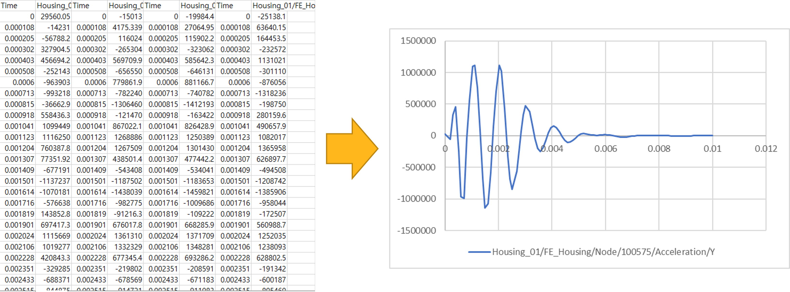

# Example

The following sample code illustrates how to create a simple example.

* The example was created using "Ansys installed path/Motion/Document/Drive Train Models.zip".
* Refer to the 'resultfilereader.py' file in the 'Ansys installed path/Motion/Document/Postprocessor API for Python.zip' file.

## Create a Coordinate System

The Coordinate system can be created from various entities in the result as below, and this example describes how to create the Coordinate System.
* Rigid Body
* FE Node
* Marker
```

# Example_ResultFileReaderAPI_CoordinateSystem.py
from ResultFileReaderAPI import *

# The 'XX' in AWP_ROOTXXX represents the year, like 25 for the year 2025, and the leat 'X' indicates the half of the year,
# where '1' represents the first half and '2' represents the second half.
# For example, in 'AWP_ROOT251' and 'AWP_ROOT252', '25' represents the year 2025, and '1' indicates the first half of the year,
# while '2' indicates the second half.
install_path = os.environ['AWP_ROOTXXX']
filePath = os.path.join(install_path, r'Motion\Document\Drive Train Models\Tutorial_01_Trasmission\Tutorial\Subsystem\Subsystem Drivetrain\GearBox1_improved.dfr')

# Import result file
outputReader = OutputReader(filePath)

# Get Curves
# newName - Specifies the name of the marker.
# parentFullName - Specifies the name of parent.
# Rigid Body
rigid_csys = outputReader.CreateCoordinateSystem("RigidCSYS", "ShaftSet1st_Section_01_1")
# FE Node
fenode_csys = outputReader.CreateCoordinateSystem("NodeCSYS", "Housing_01/FE_Housing/Node/100575")
# Marker
marker_csys = outputReader.CreateCoordinateSystem("MarkerCSYS", "ShaftSet1st_Section_01_1/CM")
# Close
outputReader.Close()
```

## Plot

It is the simplest example of a Python script to print plot data.
* For combinations of paths(Characteristic, Component), refer to Notes in [Getting Started with the Python language](getting_started_operation_api_using_py.md).



```
# Example_ResultFileReader_Plot.py
from ResultFileReaderAPI import *

# The 'XX' in AWP_ROOTXXX represents the year, like 25 for the year 2025, and the leat 'X' indicates the half of the year,
# where '1' represents the first half and '2' represents the second half.
# For example, in 'AWP_ROOT251' and 'AWP_ROOT252', '25' represents the year 2025, and '1' indicates the first half of the year,
# while '2' indicates the second half.
install_path = os.environ['AWP_ROOTXXX']
filePath = os.path.join(install_path, r'Motion\Document\Pre and Post Processor\Model\Result\Suspension.dfr')

# Import result file
outputReader = OutputReader(filePath)

# Get Curves
paths = List[str]() 
paths.Add("Acceleration/Y")

plotParameter = PlotParameters()
plotParameter.Target = "Rack"
plotParameter.Paths = paths

results = outputReader.GetCurves(plotParameter)

f = open(r'D:\result.txt', "w") 
for result in results :
    f.writelines(['Time\t', "Y", '\n'])
    for plotData in result.Value :
        f.writelines([str(plotData.X), '\t', str(plotData.Y), '\n'])
 
f.close()

# Close
outputReader.Close()
```

## Contour Export

Export contour results to a file

* For combinations of paths(Characteristic, Component), refer to Note in [Result File Reader using Python language](getting_started_result_file_reader_using_py.md).

```
# Example_ResultFileReaderAPI_Contour.py
from ResultFileReaderAPI import *

# The 'XX' in AWP_ROOTXXX represents the year, like 25 for the year 2025, and the leat 'X' indicates the half of the year,
# where '1' represents the first half and '2' represents the second half.
# For example, in 'AWP_ROOT251' and 'AWP_ROOT252', '25' represents the year 2025, and '1' indicates the first half of the year,
# while '2' indicates the second half.
install_path = os.environ['AWP_ROOTXXX']
filePath = os.path.join(install_path, r'Motion\Document\Drive Train Models\Tutorial_01_Trasmission\Tutorial\Subsystem\Subsystem Drivetrain\GearBox1_improved.dfr')

# Import result file
outputReader = OutputReader(filePath)

# resultpath - Specifies the file path to export
# mode - Specifies how the operating system should open a file.
# stateids - Specifies the id list of the states to time.
# fullName - Specifies the names of the entities.
# type - Specifies the type of the target for displaying contour(None, FENode, FEElement, FEElementNode, FEMaterial, BeamGroup, Contact, ChainedSystem, Usersubroutine).
# path - Specifies the path of result to save.
# analysisResultType - Specifies the type of analysis result type for displaying contour.
# formatType - Specifies a file format type.

# State ID Array
stateids = outputReader.GetStateIDArray()
target = "Housing_01/FE_Housing"
path = "Velocity/X"

outputReader.ExportContourResultToFile(r'D:\export_contour.txt', FileMode.Create, stateids, target, ContourMappingType.FENode, path, analysisResultType = AnalysisResultType.Dynamics, formatType = FileFormatType.BINARY)

# Close
outputReader.Close()
```

## Vector Export

Export vector results to a file

```
# Example_ResultFileReaderAPI_ExportVectorFile.py
from ResultFileReaderAPI import *

# The 'XX' in AWP_ROOTXXX represents the year, like 25 for the year 2025, and the leat 'X' indicates the half of the year,
# where '1' represents the first half and '2' represents the second half.
# For example, in 'AWP_ROOT251' and 'AWP_ROOT252', '25' represents the year 2025, and '1' indicates the first half of the year,
# while '2' indicates the second half.
install_path = os.environ['AWP_ROOTXXX']
filePath = os.path.join(install_path, r'Motion\Document\Drive Train Models\Tutorial_01_Trasmission\Tutorial\Subsystem\Subsystem Drivetrain\GearBox1_improved.dfr')

# Import result file
outputReader = OutputReader(filePath)

stateids = outputReader.GetStateIDArray()

targets = List[IVectorDisplay]()

# target - Specifies the name of vector displayable entity
# path - Specifies characteristc on vector display

# Create a vector
vector = outputReader.CreateVector("vector", "FJ_Housing", "Base Force")
targets.Add(vector)

outputReader.ExportVectorDisplayToFile(r'D:\ExportVector.txt', stateids, targets, True, True, True, AnalysisResultType.Dynamics)

# Close
outputReader.Close()
```

## Get Vector

Get results from the Vector.

* Refer to the Notes at location [Result File Reader using Python language](getting_started_result_file_reader_using_py.md) for the path(Characteristics) of the vector.

```
# Example_ResultFileReader_Vector.py
from ResultFileReaderAPI import *

# The 'XX' in AWP_ROOTXXX represents the year, like 25 for the year 2025, and the leat 'X' indicates the half of the year,
# where '1' represents the first half and '2' represents the second half.
# For example, in 'AWP_ROOT251' and 'AWP_ROOT252', '25' represents the year 2025, and '1' indicates the first half of the year,
# while '2' indicates the second half.
install_path = os.environ['AWP_ROOTXXX']
filePath = os.path.join(install_path, r'Motion\Document\Drive Train Models\Tutorial_01_Trasmission\Tutorial\Subsystem\Subsystem Drivetrain\GearBox1_improved.dfr')

# Import result file
outputReader = OutputReader(filePath)

# target - Specifies the name of vector displayable entity
# path - Specifies characteristc on vector display
vector = outputReader.GetVector("FJ_Housing", "Base Force")

# Close
outputReader.Close()
```